# 🚂 RailHub32 Firmware


Advanced firmware for ESP32-based model railway control system with WiFi configuration portal, mDNS hostname support, persistent storage, and multi-language web interface.

## 📖 Table of Contents

- [Features](#-features)
- [System Architecture](#-system-architecture)
- [Architecture Documentation](#-architecture-documentation)
- [Hardware Requirements](#-hardware-requirements)
- [Pin Configuration](#-pin-configuration)
- [Quick Start](#-quick-start)
- [Network Access](#-network-access)
- [Web Interface](#-web-interface)
- [API Reference](#-api-reference)
- [Development](#️-development)
- [Troubleshooting](#-troubleshooting)
- [Contributing](#-contributing)

## 🚂 Features

### Core Functionality
- **16 PWM Output Channels** - Control lighting, signals, and other railway accessories with 8-bit resolution
- **WiFi Configuration Portal** - Easy WiFi setup with captive portal interface
- **mDNS Hostname Support** - Access your device by friendly hostname (e.g., `http://railhub32.local`)
- **Station Mode** - Connect to existing WiFi networks
- **Web-Based Interface** - Modern, responsive control panel accessible from any browser
- **Persistent Storage** - Output states, brightness levels, and custom names saved to NVRAM
- **Real-time Control** - Instant response to commands via web interface
- **Custom Output Names** - Editable, persistent names for each output

### Web Interface Features
- **Master Brightness Control** - Adjust all outputs simultaneously
- **Individual Output Control** - Fine-tune each output independently
- **Editable Output Names** - Click any output name to customize it (persists across reboots)
- **Multi-Language Support** - Available in English, German, French, Italian, Chinese, and Hindi
- **Persistent Preferences** - Language and tab selection saved in browser
- **Status Monitoring** - Real-time display of system information
- **Dark Theme** - Professional, easy-on-the-eyes interface design
- **Responsive Design** - Works on desktop, tablet, and mobile devices

### Technical Highlights
- **Asynchronous Web Server** - Non-blocking operation for smooth performance
- **WiFiManager Integration** - ESPAsyncWiFiManager for easy configuration
- **mDNS Service** - Automatic hostname resolution (.local domains)
- **JSON RESTful API** - Clean endpoints for programmatic control
- **PWM Control** - 8-bit brightness resolution (0-255) at 5kHz
- **Low Memory Footprint** - Efficient resource usage (~15% RAM, ~69% Flash)
- **Optimized Logging** - Debug output suppressed for production performance
- **Comprehensive Unit Tests** - 33 automated tests covering GPIO, JSON, configuration, and utilities

## 🏗️ System Architecture

```mermaid
graph TB
    subgraph "ESP32 Device"
        A[ESP32 Controller] --> B[WiFi Manager]
        A --> C[Web Server]
        A --> D[mDNS Service]
        A --> E[PWM Controller]
        A --> F[NVRAM Storage]
        
        B --> G[WiFi Station Mode]
        
        C --> H[REST API]
        C --> I[Web Interface]
        
        E --> J[16 GPIO Outputs]
        
        F --> K[Output States]
        F --> L[Custom Names]
        F --> M[Device Config]
    end
    
    subgraph "User Devices"
        N[Smartphone]
        O[Tablet]
        P[Computer]
    end
    
    subgraph "Network"
        Q[WiFi Router]
        R[mDNS/Bonjour]
    end
    
    N -.->|http://railhub32.local| R
    O -.->|http://192.168.x.x| Q
    P -.->|http://railhub32.local| R
    
    Q --> G
    R --> D
    
    style A fill:#2d3748,stroke:#4299e1,stroke-width:3px
    style C fill:#2d5016,stroke:#68d391,stroke-width:2px
    style D fill:#5a2d82,stroke:#b794f4,stroke-width:2px
    style E fill:#7c2d12,stroke:#fc8181,stroke-width:2px
```

## 📚 Architecture Documentation

Comprehensive architecture documentation is available in the **arc42** subdirectory, following the arc42 architecture documentation template with extensive Mermaid diagrams.

### 📂 Documentation Structure

The arc42 documentation provides detailed insights into the system architecture:

| Section | Description | Key Content |
|---------|-------------|-------------|
| **[01 - Introduction and Goals](arc42/01_introduction_and_goals.md)** | Requirements, quality goals, stakeholders | Business context, target audience, quality objectives |
| **[02 - Constraints](arc42/02_constraints.md)** | Technical, organizational, legal constraints | Hardware limitations, compliance requirements |
| **[03 - Context and Scope](arc42/03_context_and_scope.md)** | System boundaries and interfaces | External dependencies, communication channels |
| **[04 - Solution Strategy](arc42/04_solution_strategy.md)** | Technology decisions and patterns | Architecture approach, key trade-offs |
| **[05 - Building Block View](arc42/05_building_block_view.md)** | Component structure | Module hierarchy, code organization |
| **[06 - Runtime View](arc42/06_runtime_view.md)** | Runtime behavior and scenarios | Boot sequence, WiFi setup, control flows |
| **[07 - Deployment View](arc42/07_deployment_view.md)** | Infrastructure and deployment | Network topology, hardware requirements |
| **[08 - Crosscutting Concepts](arc42/08_crosscutting_concepts.md)** | Security, error handling, configuration | Domain model, security architecture |
| **[09 - Architecture Decisions](arc42/09_architecture_decisions.md)** | Architecture Decision Records (ADRs) | Technology choices, rationale, alternatives |
| **[10 - Quality Requirements](arc42/10_quality_requirements.md)** | Quality scenarios and metrics | Reliability, performance, maintainability |
| **[11 - Risks and Technical Debt](arc42/11_risks_and_technical_debt.md)** | Risk assessment | Technical risks, mitigation strategies |
| **[12 - Glossary](arc42/12_glossary.md)** | Terminology and acronyms | Definitions, abbreviations, references |

### 🎯 Quick Navigation

**For Developers:**
- Start with [Building Block View](arc42/05_building_block_view.md) for code structure
- Review [Runtime View](arc42/06_runtime_view.md) for behavior understanding
- Check [Architecture Decisions](arc42/09_architecture_decisions.md) for technology rationale

**For Architects:**
- Begin with [Solution Strategy](arc42/04_solution_strategy.md) for overview
- Examine [Context and Scope](arc42/03_context_and_scope.md) for system boundaries
- Study [Quality Requirements](arc42/10_quality_requirements.md) for quality goals

**For Project Managers:**
- Read [Introduction and Goals](arc42/01_introduction_and_goals.md) for business context
- Review [Constraints](arc42/02_constraints.md) for limitations
- Check [Risks and Technical Debt](arc42/11_risks_and_technical_debt.md) for project risks

**For Operations:**
- Focus on [Deployment View](arc42/07_deployment_view.md) for infrastructure
- Review [Crosscutting Concepts](arc42/08_crosscutting_concepts.md) for operational concerns
- Check [Troubleshooting](#-troubleshooting) section in this README

### 📊 Visualization

The arc42 documentation includes **50+ Mermaid diagrams** covering:

- **Architecture Diagrams**: Component structure, layering, dependencies
- **Sequence Diagrams**: Boot sequence, WiFi setup, API flows
- **State Machines**: WiFi states, output control, error handling
- **Deployment Diagrams**: Network topology, hardware connections
- **Flowcharts**: Decision trees, error handling, configuration flows
- **Timeline/Gantt**: Development roadmap, performance metrics
- **Class Diagrams**: Domain model, data structures

### 🔍 Key Architectural Highlights

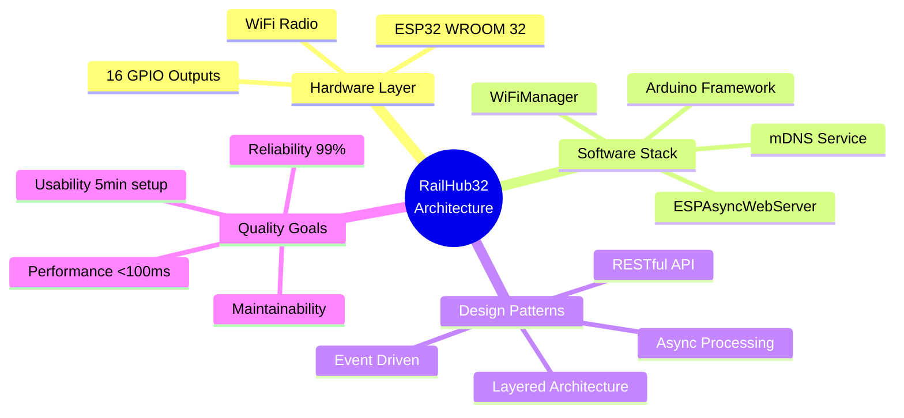

### 📖 Access the Full Documentation

Navigate to the [arc42 README](arc42/README.md) for the complete table of contents and detailed navigation guide.

### Boot Sequence Flow

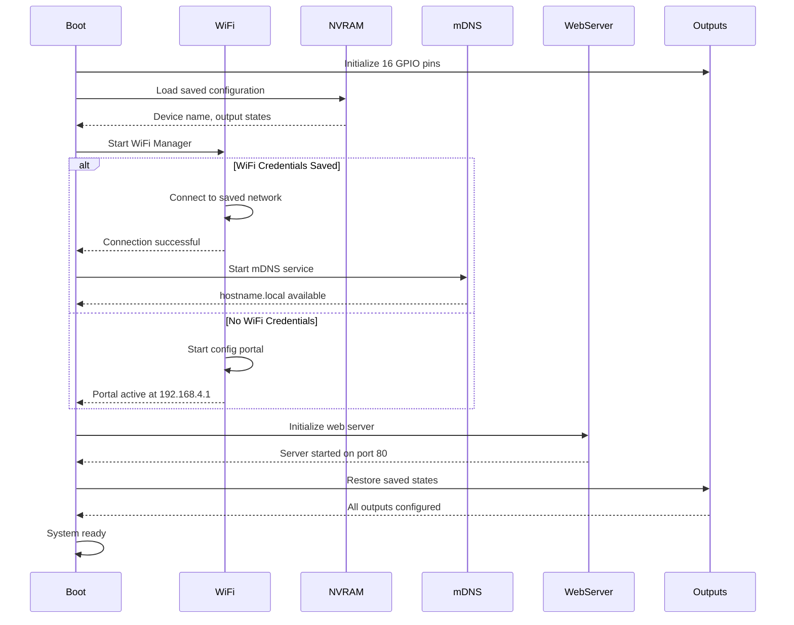

### Data Flow Architecture

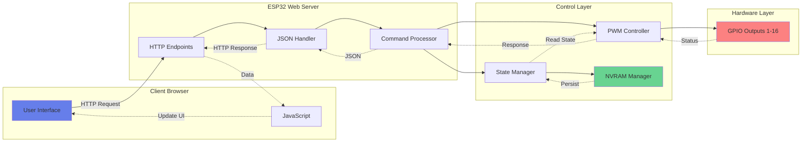

## 📋 Hardware Requirements

- **ESP32 Development Board** (ESP32-D0WD or compatible)
- **Power Supply** - 5V USB or appropriate voltage for your board
- **Output Devices** - LEDs, relays, or other accessories (up to 16)

### Recommended Boards
- ESP32 DevKit v1
- ESP32-WROOM-32
- ESP32-WROVER

## 🔧 Pin Configuration

Default GPIO pins for outputs (configurable in `include/config.h`):

### Pin Assignment Table

| Output # | GPIO Pin | PWM Channel | Default Function | Notes |
|----------|----------|-------------|------------------|-------|
| 1 | GPIO 2 | 0 | Status LED / Output 1 | Built-in LED on most boards |
| 2 | GPIO 4 | 1 | Output 2 | General purpose |
| 3 | GPIO 5 | 2 | Output 3 | General purpose |
| 4 | GPIO 18 | 3 | Output 4 | General purpose |
| 5 | GPIO 19 | 4 | Output 5 | General purpose |
| 6 | GPIO 21 | 5 | Output 6 | General purpose |
| 7 | GPIO 22 | 6 | Output 7 | General purpose |
| 8 | GPIO 23 | 7 | Output 8 | General purpose |
| 9 | GPIO 25 | 8 | Output 9 | DAC1 capable |
| 10 | GPIO 26 | 9 | Output 10 | DAC2 capable |
| 11 | GPIO 27 | 10 | Output 11 | General purpose |
| 12 | GPIO 32 | 11 | Output 12 | ADC1_CH4 capable |
| 13 | GPIO 33 | 12 | Output 13 | ADC1_CH5 capable |
| 14 | GPIO 12 | 13 | Output 14 | ⚠️ Strapping pin |
| 15 | GPIO 13 | 14 | Output 15 | General purpose |
| 16 | GPIO 14 | 15 | Output 16 | General purpose |

### Pin Characteristics

#### ⚡ PWM Capable Pins
All configured pins support 8-bit PWM (0-255) at 5kHz frequency for smooth brightness control.

#### 🔌 Safe Pins for General Use
- **Best choice**: GPIO 4, 5, 18, 19, 21, 22, 23, 25, 26, 27, 32, 33
- These pins are safe for general I/O without boot issues

#### ⚠️ Pins with Special Considerations
- **GPIO 2**: Built-in LED, must be floating or LOW during boot
- **GPIO 12**: Strapping pin - controls flash voltage. Keep LOW during boot
- **GPIO 15**: Strapping pin - affects boot message verbosity

#### 🚫 Pins to Avoid (Not Used in Default Config)
- **GPIO 0**: Boot mode selection (strapping pin)
- **GPIO 1 & 3**: TX/RX - Serial communication
- **GPIO 6-11**: Connected to internal flash (DO NOT USE)
- **GPIO 34-39**: Input only, no PWM support

### Connection Diagram

```
ESP32 DevKit                     External Devices
┌─────────────┐
│             │
│   GPIO 2  ──┼───────────────► LED / Relay 1
│   GPIO 4  ──┼───────────────► LED / Relay 2
│   GPIO 5  ──┼───────────────► LED / Relay 3
│   GPIO 18 ──┼───────────────► LED / Relay 4
│   GPIO 19 ──┼───────────────► LED / Relay 5
│   GPIO 21 ──┼───────────────► LED / Relay 6
│   GPIO 22 ──┼───────────────► LED / Relay 7
│   GPIO 23 ──┼───────────────► LED / Relay 8
│   GPIO 25 ──┼───────────────► LED / Relay 9
│   GPIO 26 ──┼───────────────► LED / Relay 10
│   GPIO 27 ──┼───────────────► LED / Relay 11
│   GPIO 32 ──┼───────────────► LED / Relay 12
│   GPIO 33 ──┼───────────────► LED / Relay 13
│   GPIO 12 ──┼───────────────► LED / Relay 14
│   GPIO 13 ──┼───────────────► LED / Relay 15
│   GPIO 14 ──┼───────────────► LED / Relay 16
│             │
│    GND    ──┼───────────────► Common Ground
│    3V3    ──┼───────────────► Power (low current)
│    VIN    ──┼───────────────► Power Input (5V)
│             │
└─────────────┘
```

### Wiring Notes

**For LEDs:**
```
GPIO Pin → 220Ω Resistor → LED (+) → LED (-) → GND
```

**For Relays:**
```
GPIO Pin → Relay Module Input
GND → Relay Module GND
VIN (5V) → Relay Module VCC
```

**⚠️ Important:**
- Use appropriate current-limiting resistors for LEDs
- For high-current loads, use relay modules or MOSFETs
- ESP32 GPIO pins: 3.3V logic, max 40mA per pin
- Total current for all pins should not exceed 400mA

## 🚀 Quick Start

### 1. Installation

#### Prerequisites
- [PlatformIO](https://platformio.org/) installed
- USB cable for ESP32
- Git (optional)

#### Clone or Download
```bash
git clone https://github.com/Mark-Ortner-NRW/RailWays.git
cd RailWays/firmware/esp32-controller
```

### 2. Configuration

Edit `include/config.h` to customize:

```cpp
// WiFi Configuration Portal
#define WIFIMANAGER_AP_SSID "RailHub32-Setup"     // Configuration portal SSID
#define WIFIMANAGER_AP_PASSWORD "12345678"        // Portal password (min 8 chars)
#define PORTAL_TRIGGER_PIN 0                      // Button to trigger config portal

// Device Configuration
#define DEVICE_NAME "ESP32-Controller-01"
#define MAX_OUTPUTS 16
#define STATUS_LED_PIN 2

// Pin Definitions
#define LED_PINS {2, 4, 5, 18, 19, 21, 22, 23, 25, 26, 27, 32, 33, 12, 13, 14}
```

### 3. Build and Upload

Using PlatformIO CLI:
```bash
platformio run --target upload
```

Using PlatformIO IDE:
- Open project in VS Code
- Click "Upload" button in PlatformIO toolbar

### 4. First-Time WiFi Setup

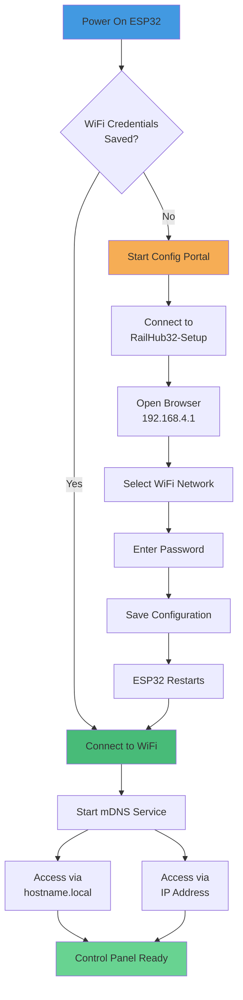

On first boot, the ESP32 automatically enters configuration mode:

1. **Find the Network**: Look for WiFi network `RailHub32-Setup`
2. **Connect**: Use password `12345678`
3. **Configure WiFi**: 
   - Browser should automatically open to http://192.168.4.1
   - If not, manually navigate to http://192.168.4.1
   - Select your WiFi network from the list
   - Enter your WiFi password
   - Optionally customize device name
   - Click Save
4. **Automatic Connection**: ESP32 restarts and connects to your WiFi
5. **mDNS Activated**: Device becomes accessible via hostname

### 5. Using the Control Panel

Once connected to your WiFi network, access the device using either:

**Option 1: Hostname (Recommended)**
```
http://railhub32.local
or
http://[your-device-name].local
```

**Option 2: IP Address**
- Check serial monitor for assigned IP
- Navigate to displayed IP address in browser

**Reconfiguration**: Hold the configuration button (GPIO 0) for 3 seconds to re-enter setup mode

## 🌐 Network Access

### mDNS Hostname Support

The device automatically registers an mDNS hostname based on your device name:

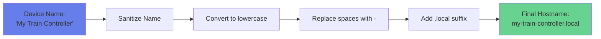

**Examples:**
- Device name: `ESP32-Controller-01` → Hostname: `esp32-controller-01.local`
- Device name: `My Train Controller` → Hostname: `my-train-controller.local`
- Device name: `RailHub32` → Hostname: `railhub32.local`

### Platform Support

| Platform | mDNS Support | Requirements |
|----------|--------------|--------------|
| **iOS/iPadOS** | ✅ Native | None |
| **macOS** | ✅ Native | Built-in Bonjour |
| **Windows** | ✅ With software | Install [Bonjour Print Services](https://support.apple.com/kb/DL999) |
| **Linux** | ✅ With daemon | Install Avahi: `sudo apt-get install avahi-daemon` |
| **Android** | ⚠️ Limited | Use apps like "BonjourBrowser" or "Network Service Discovery" |

### Network Discovery

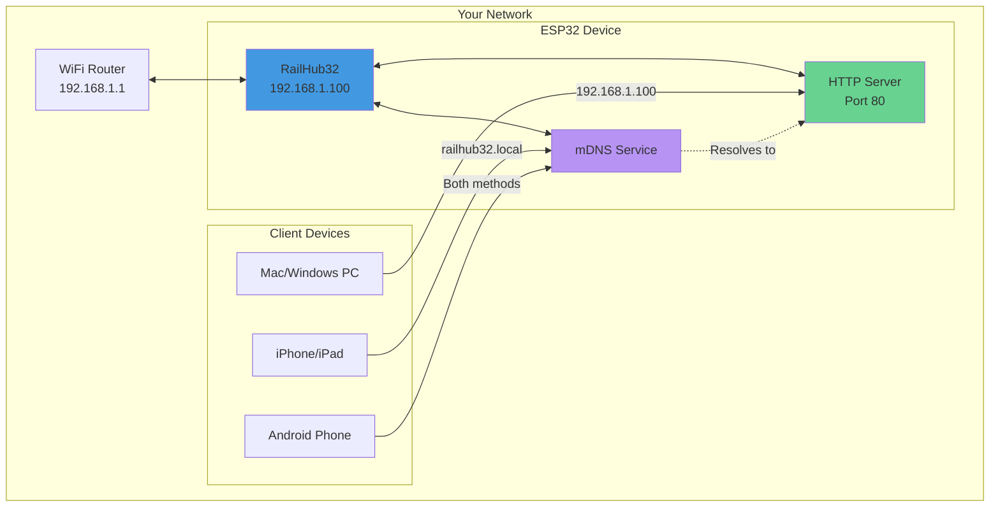

## 📱 Web Interface

### Screenshots

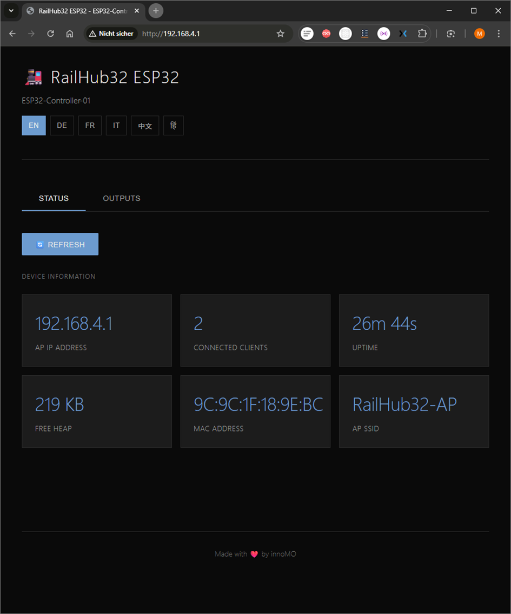

*Status tab showing system information and connected clients*

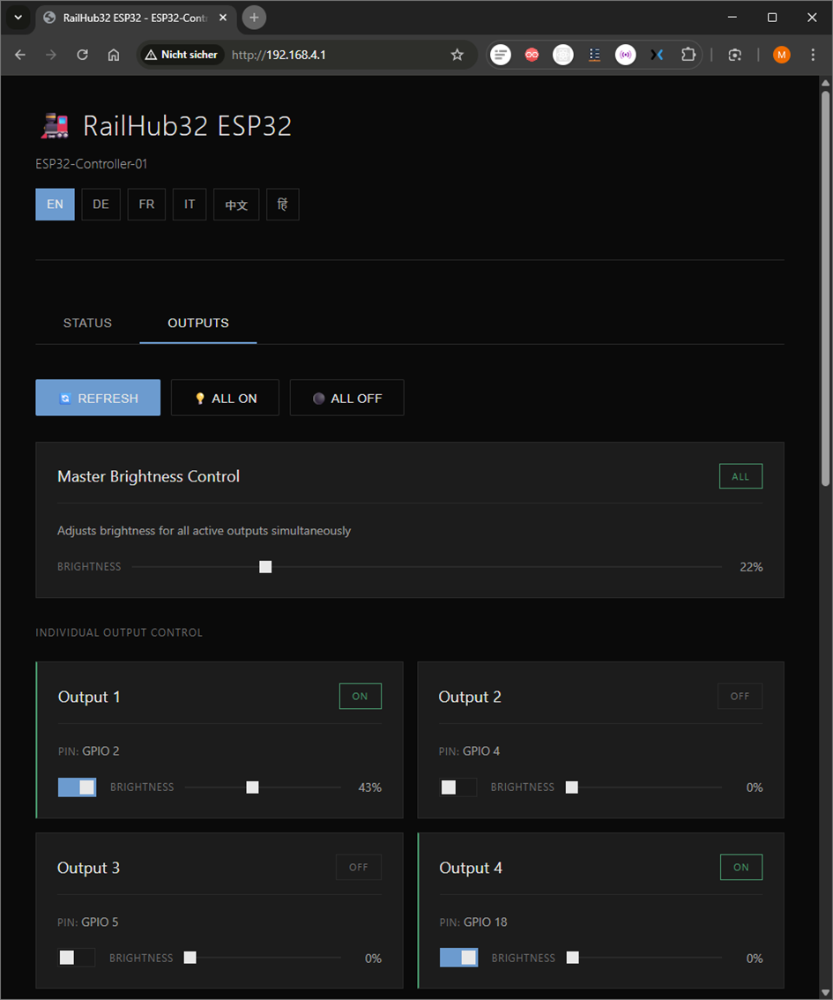

*Outputs tab with master brightness control and individual output controls*

### Status Tab
- AP IP Address
- Connected Clients Count
- System Uptime
- Free Memory
- MAC Address
- AP SSID

### Outputs Tab
- **Master Brightness Control**: Adjust all active outputs at once
- **Individual Controls**: Toggle and adjust each output separately
- **Editable Names**: Click any output name to customize it
  - Custom names persist across reboots
  - Shows default name in selected language if not customized
  - Max 20 characters per name
- **Real-time Updates**: Automatic status refresh every 5 seconds
- **Bulk Controls**: Turn all outputs ON or OFF at once

### Language Support
Select your preferred language from the header:
- 🇬🇧 English (EN) - with "Edit Name", "Save", "Cancel" buttons
- 🇩🇪 German (DE) - mit "Name bearbeiten", "Speichern", "Abbrechen"
- 🇫🇷 French (FR) - avec "Modifier le nom", "Enregistrer", "Annuler"
- 🇮🇹 Italian (IT) - con "Modifica nome", "Salva", "Annulla"
- 🇨🇳 Chinese (中文) - 带有 "编辑名称"、"保存"、"取消"
- 🇮🇳 Hindi (हिं) - "नाम संपादित करें", "सहेजें", "रद्द करें" के साथ

## 🔌 API Reference

### API Architecture

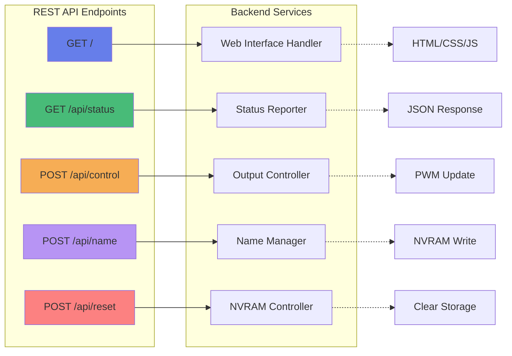

### REST Endpoints

#### Get Status
```http
GET /api/status
```

**Response:**
```json
{
  "macAddress": "9C:9C:1F:18:9E:BC",
  "name": "ESP32-Controller-01",
  "wifiMode": "STA",
  "ip": "192.168.1.100",
  "ssid": "YourWiFiNetwork",
  "apClients": 0,
  "freeHeap": 248576,
  "uptime": 123456,
  "outputs": [
    {
      "pin": 2,
      "active": true,
      "brightness": 75,
      "name": "Station Light"
    },
    {
      "pin": 4,
      "active": false,
      "brightness": 0,
      "name": ""
    }
  ]
}
```

#### Control Output
```http
POST /api/control
Content-Type: application/json

{
  "pin": 2,
  "active": true,
  "brightness": 100
}
```

**Control Flow:**
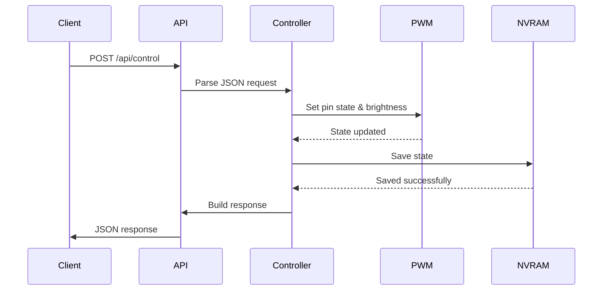

**Response:**
```json
{
  "status": "success",
  "pin": 2,
  "active": true,
  "brightness": 100
}
```

#### Update Output Name
```http
POST /api/name
Content-Type: application/json

{
  "pin": 2,
  "name": "Station Light"
}
```

**Response:**
```json
{
  "success": true
}
```

Updates the custom name for the specified output. Name is stored in NVRAM and persists across reboots.

#### Reset Saved States
```http
POST /api/reset
```

**Response:**
```json
{
  "status": "reset_complete"
}
```

Clears all saved output states from persistent storage (NVRAM).

### Configuration Portal

When in configuration mode, the ESP32 hosts a captive portal:

**Access Point Details:**
- **SSID**: RailHub32-Setup
- **Password**: 12345678
- **IP Address**: 192.168.4.1
- **Gateway**: 192.168.4.1
- **Subnet**: 255.255.255.0
- **Features**: 
  - WiFi network scanning
  - Password-protected setup
  - Custom device name configuration
  - Automatic connection and mDNS setup

## 🛠️ Development

### Project Structure
```
firmware/
├── .gitignore                 # Git ignore rules
├── README.md                  # This file
├── ESTIMATION.md              # Development effort analysis
├── firmware.sln               # Visual Studio solution
├── arc42/                     # Architecture documentation (50+ diagrams)
│   ├── 01_introduction_and_goals.md
│   ├── 02_constraints.md
│   └── ... (12 comprehensive documents)
├── esp32-controller/
│   ├── platformio.ini         # PlatformIO configuration
│   ├── include/
│   │   ├── config.h           # Configuration settings
│   │   └── certificates.h     # SSL certificates (if needed)
│   ├── src/
│   │   └── main.cpp           # Main application (1868 lines)
│   ├── test/                  # Unit test suite (33 tests)
│   │   ├── README.md          # Testing documentation
│   │   ├── test_config/       # Configuration tests (11 tests)
│   │   ├── test_gpio/         # GPIO/PWM tests (5 tests)
│   │   ├── test_json/         # JSON API tests (8 tests)
│   │   └── test_utils/        # Utility tests (9 tests)
│   └── .pio/                  # PlatformIO build artifacts (ignored)
├── ESP32Flasher/              # Windows flasher tool
│   ├── ESP32Flasher.csproj    # C# project file
│   ├── MainForm.cs            # Flasher GUI
│   ├── Program.cs             # Entry point
│   └── bin/                   # Build outputs (ignored)
└── images/                    # Documentation images
```

### Code Architecture

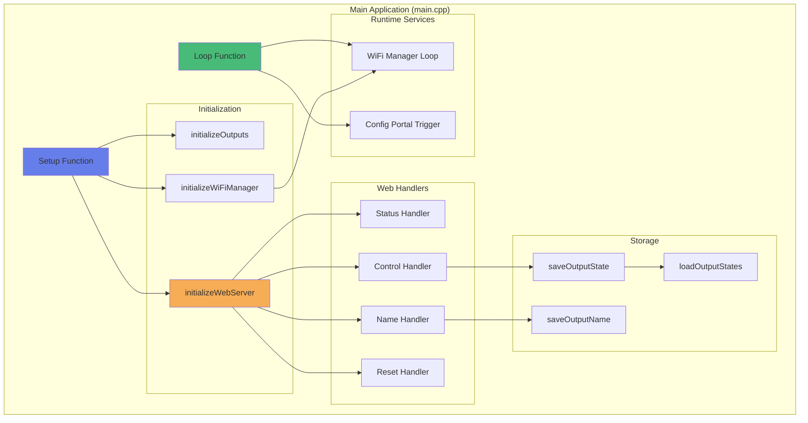

### Dependencies
```ini
[lib_deps]
    ArduinoJson @ 7.4.2           # JSON parsing and serialization
    ESPAsyncWebServer @ 3.6.0     # Asynchronous web server
    AsyncTCP @ 3.3.2              # Asynchronous TCP library
    ESPAsyncWiFiManager @ 0.31.0  # WiFi configuration manager
    ESPmDNS @ 2.0.0               # mDNS hostname support
    Preferences @ 2.0.0           # NVRAM persistent storage
    WiFi @ 2.0.0                  # WiFi management
    Unity @ 2.6.0                 # Unit testing framework (test environments only)
```

### Build Configuration

```ini
[platformio.ini]

# Production environment
[env:esp32dev]
platform = espressif32 @ 6.12.0
board = esp32dev
framework = arduino
monitor_speed = 115200
upload_speed = 921600
upload_port = COM8
build_flags = 
    -DCORE_DEBUG_LEVEL=0                    # Disable debug logging
    -DCONFIG_ARDUHAL_LOG_DEFAULT_LEVEL=0   # Suppress HAL logs

# Test environment (ESP32 hardware)
[env:esp32dev_test]
platform = espressif32
board = esp32dev
framework = arduino
test_framework = unity
test_build_src = no                         # Don't link main.cpp in tests
monitor_speed = 115200
build_flags = 
    -DCORE_DEBUG_LEVEL=3                    # Enable debug for testing
    -DUNIT_TEST
lib_deps = 
    bblanchon/ArduinoJson@^7.0.4
    throwtheswitch/Unity@^2.6.0

# Native test environment (no hardware required)
[env:native]
platform = native
build_flags = 
    -std=c++11
    -DUNIT_TEST
    -DNATIVE_BUILD
lib_deps = 
    bblanchon/ArduinoJson@^7.0.4
```

### Building

```bash
# Clean build
platformio run --target clean

# Build only
platformio run

# Upload
platformio run --target upload

# Upload and monitor
platformio run --target upload --target monitor

# Monitor serial output only
platformio device monitor
```

### Testing

The project includes a comprehensive unit test suite with 33 tests covering all major functionality.

```bash
# Run all tests on ESP32 hardware
platformio test -e esp32dev_test

# Run tests in native environment (faster, no hardware needed)
platformio test -e native

# Run specific test suite
platformio test -e esp32dev_test -f test_gpio
platformio test -e esp32dev_test -f test_json
platformio test -e esp32dev_test -f test_config
platformio test -e esp32dev_test -f test_utils
```

**Test Coverage:**
- **test_config** (11 tests): Configuration validation, WiFi settings, device parameters
- **test_gpio** (5 tests): GPIO pin validation, PWM channel assignment, hardware safety
- **test_json** (8 tests): JSON parsing, API serialization, error handling
- **test_utils** (9 tests): Utility functions, conversions, validation helpers

**Test Environments:**
- `esp32dev_test`: Runs tests on actual ESP32 hardware (recommended for GPIO testing)
- `native`: Runs tests on local machine without hardware (faster for logic testing)

For detailed testing documentation, see [test/README.md](esp32-controller/test/README.md).

### Memory Usage

| Resource | Usage | Available | Percentage |
|----------|-------|-----------|------------|
| **RAM** | 48,208 bytes | 327,680 bytes | 14.7% |
| **Flash** | 905,669 bytes | 1,310,720 bytes | 69.1% |

**Flash Breakdown:**
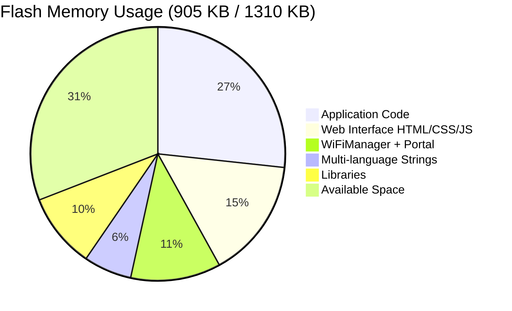

### Development Workflow

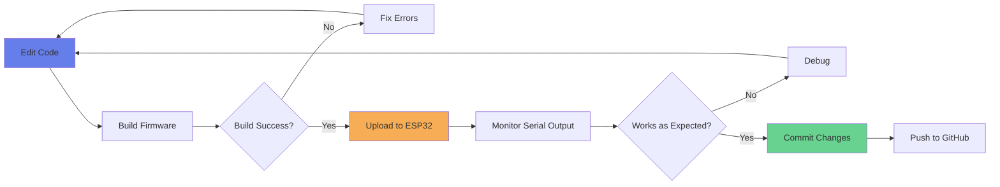

## 🐛 Troubleshooting

### Common Issues Decision Tree

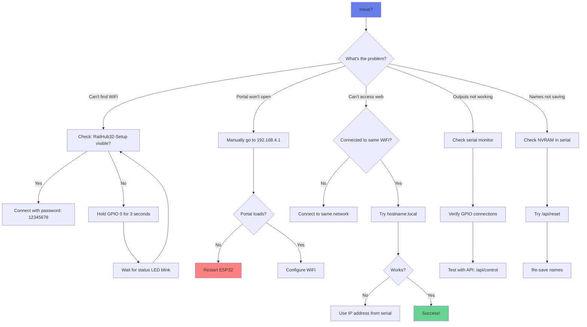

### Cannot Connect to Configuration Portal
- Ensure ESP32 is powered on (status LED should be lit)
- Look for WiFi network named `RailHub32-Setup`
- Password is `12345678` (minimum 8 characters required)
- If portal doesn't auto-open, manually navigate to http://192.168.4.1
- Try forgetting the network and reconnecting
- Check that no other device is monopolizing the AP connection

### Configuration Portal Not Appearing
- Hold the configuration button (GPIO 0) for 3 seconds to trigger portal
- Serial monitor will show portal trigger confirmation
- Status LED will blink rapidly for 1 second as confirmation
- Power cycle the ESP32 if it's stuck
- Verify no saved WiFi credentials are interfering

### Web Interface Not Loading

**Hostname Issues:**
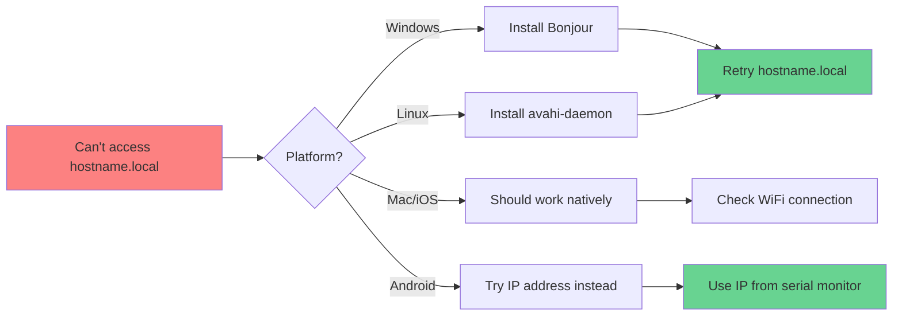

**Solutions:**
- Check serial monitor for the assigned IP address and hostname
- Ensure you're connected to the same WiFi network as the ESP32
- Try both hostname (e.g., `http://railhub32.local`) and IP address
- For Windows: Install Bonjour Print Services for .local domain support
- For Linux: `sudo systemctl start avahi-daemon`
- Clear browser cache and try incognito/private mode
- Try a different browser (Chrome, Firefox, Safari, Edge)
- Verify WiFi connection was successful (check serial output)

### Outputs Not Working
- Verify correct GPIO pin connections
- Check power supply to outputs (ESP32 pins: max 40mA each)
- Use appropriate current-limiting resistors for LEDs
- For high-current loads, use relay modules or MOSFETs
- Review serial monitor for error messages
- Test individual output with API: `POST /api/control`
- Verify PWM initialization in serial output

### Custom Names Not Saving
- Check serial monitor for NVRAM save confirmations
- Look for messages: `"[NVRAM] Saved name for output X: [name]"`
- NVRAM errors on first boot are normal (keys don't exist yet)
- If names don't persist, try clearing storage: `POST /api/reset`
- Maximum name length: 20 characters
- Restart ESP32 after saving to verify persistence

### Upload Fails
```bash
# Windows: Kill any locked processes
Stop-Process -Name "pio" -Force -ErrorAction SilentlyContinue

# Verify COM port
platformio device list

# Try manual boot mode
# Hold BOOT button, press RESET, release BOOT, then upload
```

**Common Solutions:**
- Check USB cable connection (data cable, not charge-only)
- Verify correct COM port in `platformio.ini`
- Press and hold BOOT button on ESP32 during upload
- Stop serial monitor before uploading
- Try reducing upload speed in platformio.ini
- Update USB drivers for CH340/CP2102 chip

### Serial Monitor Shows Errors

**WiFiUdp Errors (Fixed):**
- These are suppressed with `CORE_DEBUG_LEVEL=0`
- If you see them, verify platformio.ini build_flags

**Common Error Messages:**
```
[ERROR] WiFi connection failed    → Check WiFi credentials
[ERROR] NVRAM open failed          → Normal on first boot
[ERROR] JSON deserialization       → Check API request format
[ERROR] Output not found           → Verify GPIO pin number
```

## 📊 Performance

### System Metrics

| Metric | Value | Notes |
|--------|-------|-------|
| **Web Response Time** | < 50ms | Optimized with logging disabled |
| **Command Latency** | < 10ms | From API call to GPIO update |
| **PWM Frequency** | 5 kHz | Smooth brightness control |
| **PWM Resolution** | 8-bit (0-255) | 256 brightness levels |
| **UI Refresh Rate** | 5 seconds | Auto-refresh status |
| **Boot Time** | ~2-3 seconds | To web server ready |
| **WiFi Connect Time** | ~200-500ms | To known network |
| **mDNS Response Time** | < 100ms | Hostname resolution |

### Performance Optimization

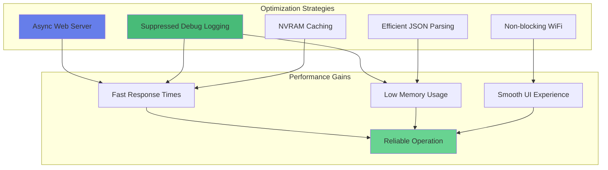

### Resource Usage Over Time

The system maintains stable resource usage:


## 🔐 Security

### Security Architecture

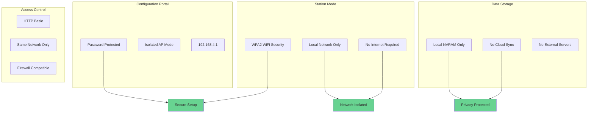

### Security Features

- **Configuration Portal**: Password-protected with 8+ character requirement
- **WiFi Station Mode**: Uses WPA2 encryption from your router
- **Local Operation**: No internet connection required
- **Private Storage**: All data stored locally in device NVRAM
- **No Cloud Dependencies**: Complete privacy - no external servers
- **Network Isolation**: Only accessible from same WiFi network
- **HTTP Protocol**: Port 80 for maximum compatibility

### Security Best Practices

1. **Change Default Password**: Modify `WIFIMANAGER_AP_PASSWORD` in `config.h`
2. **Secure Your WiFi**: Use strong WPA2 password for your network
3. **Network Segmentation**: Consider placing ESP32 on isolated VLAN
4. **Physical Security**: Protect access to GPIO 0 (reset button)
5. **Regular Updates**: Keep firmware updated with latest security patches

### Data Privacy

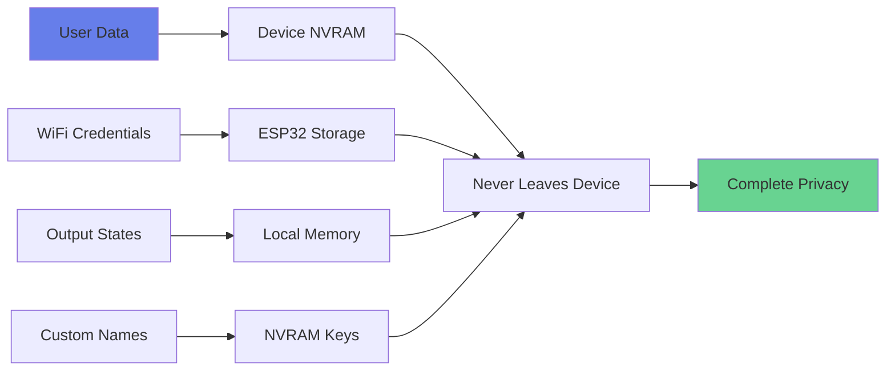

**What's Stored:**
- WiFi credentials (encrypted by ESP32)
- Device name and configuration
- Output states and brightness levels
- Custom output names

**What's NOT Stored:**
- No user accounts or passwords
- No tracking or analytics
- No cloud backups
- No external communication

## 🤝 Contributing

Contributions are welcome! Please feel free to submit a Pull Request.

1. Fork the repository
2. Create your feature branch (`git checkout -b feature/AmazingFeature`)
3. Commit your changes (`git commit -m 'Add some AmazingFeature'`)
4. Push to the branch (`git push origin feature/AmazingFeature`)
5. Open a Pull Request

## 📄 License

This project is licensed under the MIT License - see the LICENSE file for details.

## 👥 Authors

- **Mark Ortner** - *Initial work* - [Mark-Ortner-NRW](https://github.com/Mark-Ortner-NRW)

## 🙏 Acknowledgments

- ESP32 Arduino Framework
- PlatformIO Team
- AsyncWebServer Library
- Model Railway Community

## 📞 Support

- **Issues**: [GitHub Issues](https://github.com/Mark-Ortner-NRW/RailWays/issues)
- **Discussions**: [GitHub Discussions](https://github.com/Mark-Ortner-NRW/RailWays/discussions)

## 🗺️ Roadmap

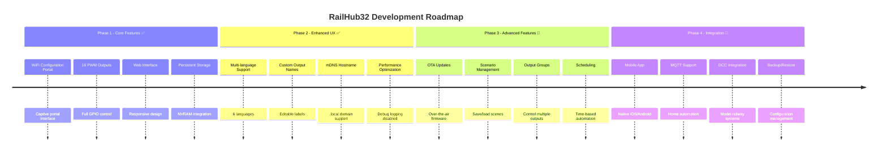

### Completed Features ✅

- [x] WiFi Configuration Portal with captive portal
- [x] 16 PWM output channels with brightness control
- [x] Custom editable output names (persistent)
- [x] Multi-language support (6 languages)
- [x] mDNS hostname support (.local domains)
- [x] Performance optimization (debug output suppressed)
- [x] RESTful JSON API
- [x] Responsive web interface
- [x] NVRAM persistent storage
- [x] Asynchronous web server
- [x] Real-time status monitoring
- [x] Comprehensive unit test suite (33 tests)
- [x] Automated testing on ESP32 hardware and native environments

### In Progress 🚧

- [ ] **OTA (Over-The-Air) Updates**
  - Web-based firmware upload
  - Version management
  - Rollback capability

- [ ] **Scenario/Scene Management**
  - Save current output states as scenes
  - Quick recall of saved configurations
  - Scene scheduling

### Planned Features 📅

**Near Term (Next 2-3 months):**
- [ ] Output Groups/Zones for controlling multiple outputs together
- [ ] Mobile-optimized PWA (Progressive Web App)
- [ ] Advanced scheduling with cron-like syntax
- [ ] Backup/restore configuration to file

**Medium Term (3-6 months):**
- [ ] Native mobile apps (iOS/Android)
- [ ] MQTT integration for home automation
- [ ] WebSocket support for real-time updates
- [ ] Multi-device synchronization

**Long Term (6+ months):**
- [ ] Integration with DCC (Digital Command Control) systems
- [ ] Accessory decoder emulation
- [ ] Advanced animation effects (fading, blinking patterns)
- [ ] Voice control integration (Alexa, Google Home)
- [ ] Cloud backup (optional, privacy-focused)

### Feature Request Process

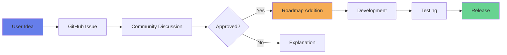

---

**Made with ❤️ for model railway enthusiasts**
