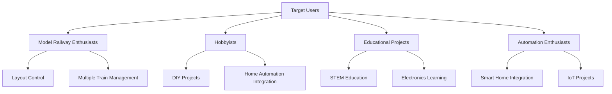
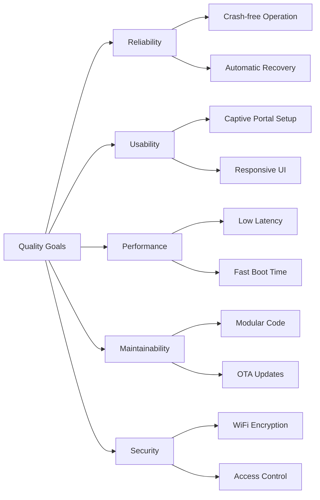
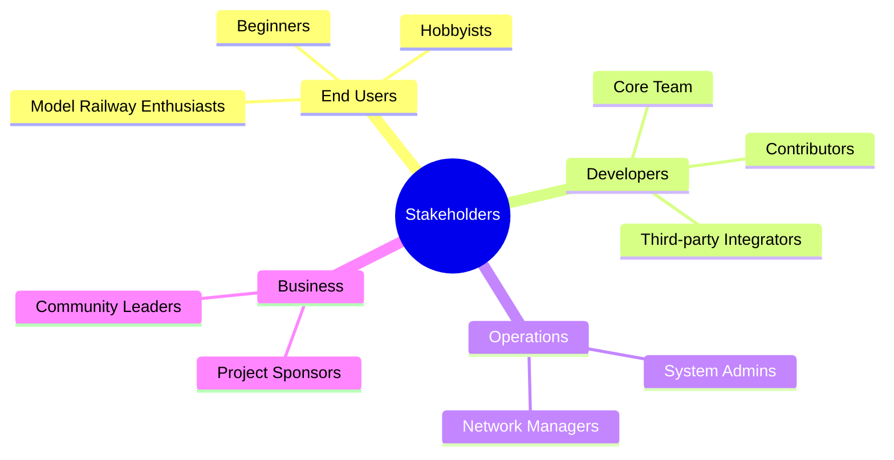
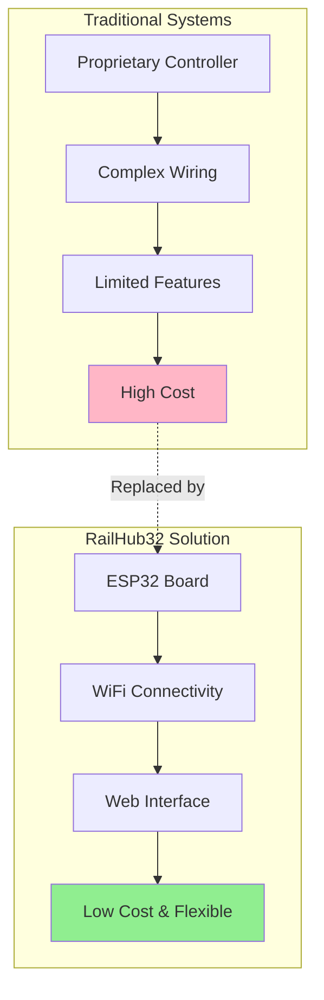
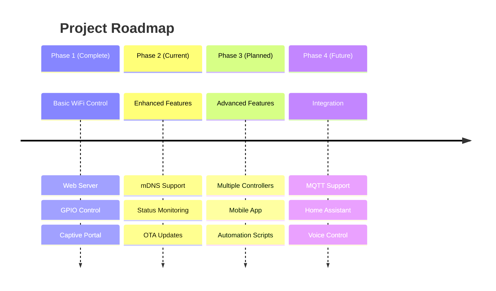
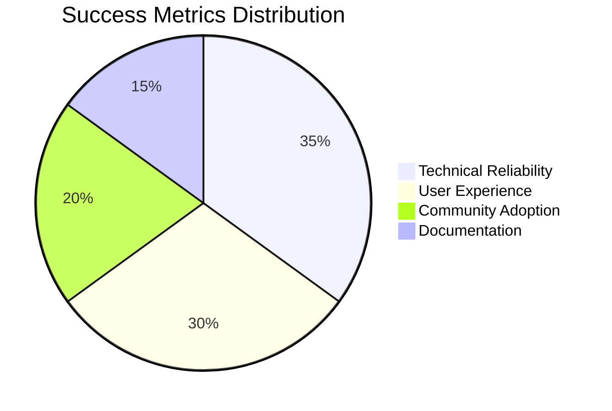

# 1. Introduction and Goals

## 1.1 Requirements Overview

RailHub32 is an ESP32-based model railway control system that provides wireless control and monitoring of model trains through a web-based interface.

### Key Features

- **Wireless Control**: WiFi-based remote control of model railway accessories
- **Web Interface**: Responsive browser-based control panel accessible from any device
- **Easy Setup**: Captive portal for initial WiFi configuration
- **Network Discovery**: mDNS hostname resolution for easy access
- **Real-time Monitoring**: Live status updates of connected accessories
- **Persistent Configuration**: Non-volatile storage of settings and state

### Target Audience

## 1.2 Quality Goals

| Priority | Quality Goal | Description | Metric |
|----------|-------------|-------------|--------|
| 1 | **Reliability** | System must operate continuously without crashes | MTBF > 720 hours |
| 2 | **Usability** | Easy setup and intuitive operation | < 5 min first-time setup |
| 3 | **Performance** | Low latency response to commands | < 100ms command execution |
| 4 | **Maintainability** | Easy to update and extend | Modular architecture |
| 5 | **Security** | Protected against unauthorized access | WPA2/WPA3 encryption |

## 1.3 Stakeholders

| Role | Expectations | Concerns |
|------|-------------|----------|
| **End Users** | Easy setup, reliable operation, intuitive interface | Complexity, technical failures |
| **Developers** | Clear architecture, well-documented code, testability | Technical debt, maintainability |
| **Contributors** | Open source, active development, clear guidelines | Code quality, documentation |
| **Hardware Integrators** | Compatible GPIO interface, stable API | Breaking changes, hardware damage |
| **System Administrators** | Easy deployment, network integration, monitoring | Security, network configuration |

## 1.4 Business Context

### Problem Statement

Traditional model railway control systems often require:
- Proprietary hardware and software
- Complex wiring and installation
- Limited remote access capabilities
- High costs for commercial solutions

### Solution Approach

RailHub32 provides an affordable, open-source alternative using:
- Commodity ESP32 hardware (~$5)
- Standard WiFi connectivity
- Web-based universal interface
- Extensible architecture

## 1.5 Project Goals

### Functional Goals

- ✅ Control up to 16 independent accessories
- ✅ Web-based control interface
- ✅ WiFi configuration via captive portal
- ✅ Persistent state storage
- ✅ mDNS network discovery
- 🔄 Multiple controller coordination (future)
- 🔄 Mobile app integration (future)

### Non-Functional Goals

- ⚡ Boot time < 5 seconds
- 🚀 Command response < 100ms
- 💾 Flash memory usage < 80%
- 📶 WiFi range > 30m indoor
- 🔋 Power consumption < 500mA
- 📊 Uptime > 99.9%

## 1.6 Success Criteria

The project is considered successful when:

1. **Technical Success**
   - System operates reliably for 30+ days without restart
   - All GPIO outputs function correctly under load
   - Web interface loads in < 2 seconds
   - OTA updates complete successfully

2. **User Success**
   - First-time users complete setup in < 5 minutes
   - Users can control accessories without training
   - Positive feedback from community testing
   - Active contributions from developers

3. **Business Success**
   - Open source community adoption
   - Documentation completeness > 90%
   - Active GitHub repository (stars, forks, issues)
   - Integration examples available

