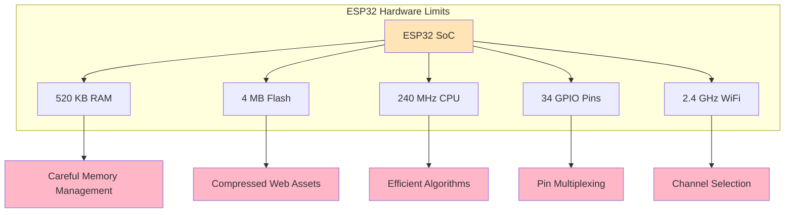
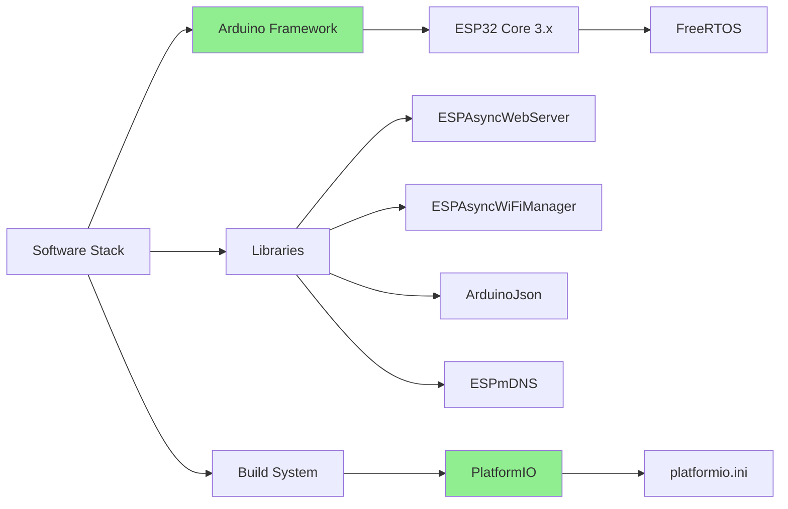
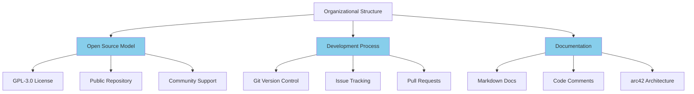
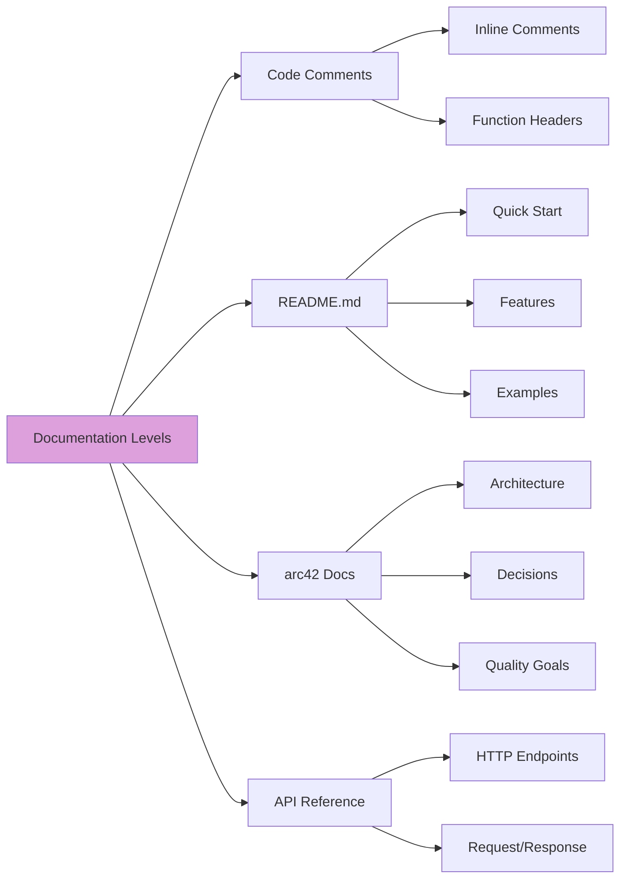
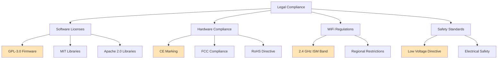
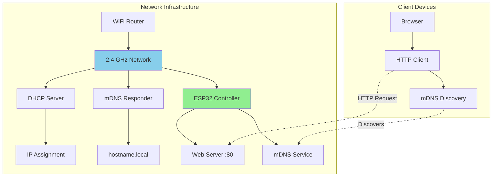
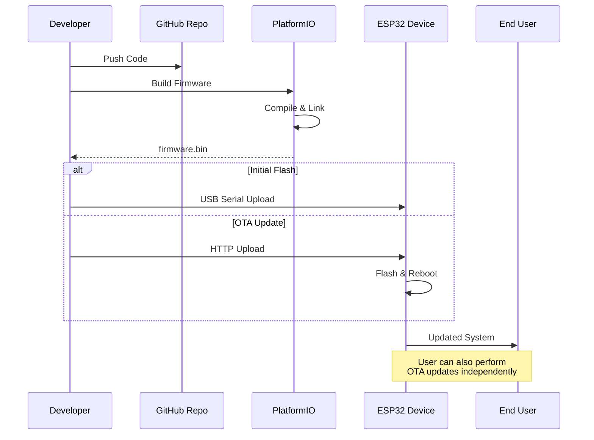
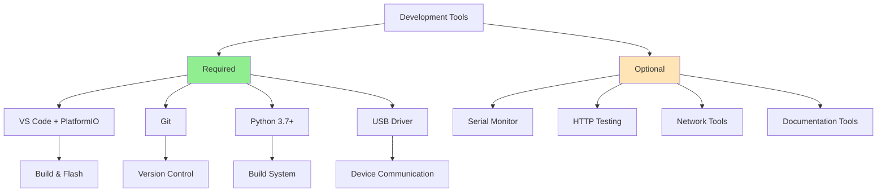

# 2. Architecture Constraints

## 2.1 Technical Constraints

### Hardware Constraints

| Constraint | Description | Impact |
|------------|-------------|--------|
| **ESP32 CPU** | Dual-core Xtensa LX6, 240 MHz | Limited processing power for complex algorithms |
| **RAM** | 520 KB SRAM | Memory-constrained, careful allocation needed |
| **Flash Memory** | 4 MB typical | Limited space for firmware and web assets |
| **GPIO Pins** | 34 pins (subset usable) | Limited I/O expansion, careful pin planning |
| **WiFi** | 2.4 GHz only | No 5 GHz support, potential interference |
| **Power Supply** | 3.3V logic, 5V input | Requires voltage regulation |



### Software Constraints

| Constraint | Description | Rationale |
|------------|-------------|-----------|
| **Arduino Framework** | ESP32 Arduino Core v3.x | Simplicity, community support, extensive libraries |
| **PlatformIO** | Build system and dependency management | Cross-platform, version control, library management |
| **C++** | Programming language | Performance, hardware access, Arduino compatibility |
| **Async Web Server** | ESPAsyncWebServer library | Non-blocking I/O, better performance |
| **No RTOS Tasks** | Single-loop architecture | Simplicity, easier debugging |



## 2.2 Organizational Constraints

### Development Constraints

| Constraint | Description | Impact |
|------------|-------------|--------|
| **Open Source** | GPL-3.0 License | All code must be open, derivatives must share-alike |
| **GitHub Repository** | Version control and collaboration | Public development, issue tracking required |
| **Documentation** | English language, Markdown format | Accessible to international contributors |
| **Code Style** | Arduino/C++ conventions | Consistency, readability for Arduino users |
| **No Commercial Support** | Community-driven project | Reliance on volunteer contributions |



### Team Constraints

- **Team Size**: Small core team + community contributors
- **Time Availability**: Part-time development, volunteer basis
- **Skill Levels**: Mixed experience (beginners to experts)
- **Communication**: Asynchronous, GitHub-based
- **Testing**: Limited dedicated testing resources

## 2.3 Conventions

### Coding Conventions

```cpp
// File naming: lowercase with underscores
// main.cpp, wifi_manager.cpp

// Class naming: PascalCase
class AccessoryController {
    // Member variables: camelCase with m_ prefix
    int m_pinNumber;
    bool m_isActive;
    
    // Methods: camelCase
    void turnOn();
    void turnOff();
    bool getStatus();
};

// Constants: UPPER_CASE
#define MAX_ACCESSORIES 16
const int DEFAULT_TIMEOUT = 5000;

// Function naming: camelCase
void setupWiFiConnection();
void handleWebRequest();
```

### Documentation Conventions

- **Code Comments**: Inline for complex logic, function headers for public APIs
- **Markdown**: All documentation in Markdown format
- **Diagrams**: Mermaid for architecture diagrams
- **README**: User-focused, quick start guide
- **arc42**: Detailed architecture documentation



## 2.4 Legal Constraints

### Licensing

- **Firmware**: GPL-3.0 License
- **Hardware Design**: Open Hardware (if applicable)
- **Third-party Libraries**: Compatible licenses (MIT, Apache 2.0, LGPL)
- **Documentation**: Creative Commons CC-BY-SA 4.0

### Compliance



### Regional Constraints

- **WiFi Channels**: Compliance with regional channel restrictions
- **Transmission Power**: Within legal limits for 2.4 GHz band
- **Certification**: End users responsible for commercial certification
- **Export Control**: No export restrictions on open-source software

## 2.5 Infrastructure Constraints

### Network Requirements

| Requirement | Specification | Constraint |
|-------------|---------------|------------|
| **WiFi Standard** | 802.11 b/g/n | 2.4 GHz only, no 5 GHz |
| **Security** | WPA2/WPA3 | Open networks supported but discouraged |
| **IP Address** | DHCP or Static | Must support DHCP for ease of use |
| **DNS** | mDNS (Bonjour) | Requires mDNS-capable network |
| **Firewall** | HTTP port 80 | Must allow incoming HTTP connections |



### Development Environment

- **IDE**: VS Code with PlatformIO extension
- **Build Tools**: PlatformIO CLI, espressif32 platform
- **Version Control**: Git 2.x+
- **Programming Tools**: USB-to-Serial adapter, ESP32 flash tool
- **Testing**: Web browsers (Chrome, Firefox, Safari)

### Deployment Constraints

- **Flash Method**: USB serial or OTA updates
- **Configuration**: Web interface or WiFi Manager
- **Persistent Storage**: SPIFFS/LittleFS filesystem
- **Backup**: No automatic backup, manual export required
- **Updates**: Manual OTA upload via web interface



## 2.6 Development Tool Constraints

### Required Tools

- **PlatformIO Core**: 6.1.0+
- **ESP32 Platform**: espressif32 @ 6.12.0
- **Arduino Framework**: arduino-esp32 @ 3.20017.241212
- **Python**: 3.7+ (for PlatformIO)
- **Git**: Any recent version

### Optional Tools

- **Serial Monitor**: PlatformIO, Arduino IDE, PuTTY
- **HTTP Testing**: Postman, curl, browser DevTools
- **Network Analysis**: Wireshark, nmap
- **Documentation**: Mermaid CLI, Markdown editors


