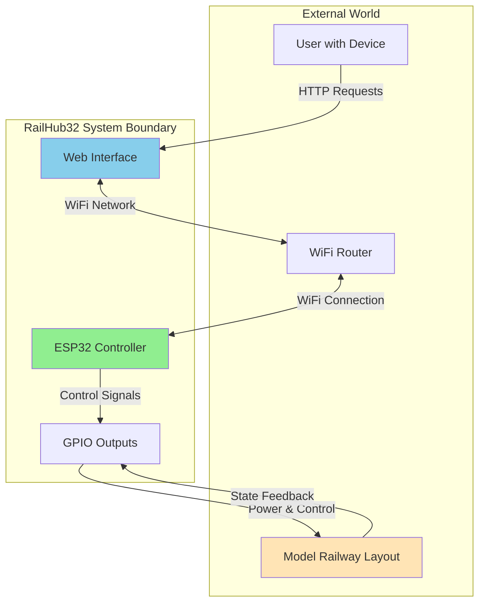
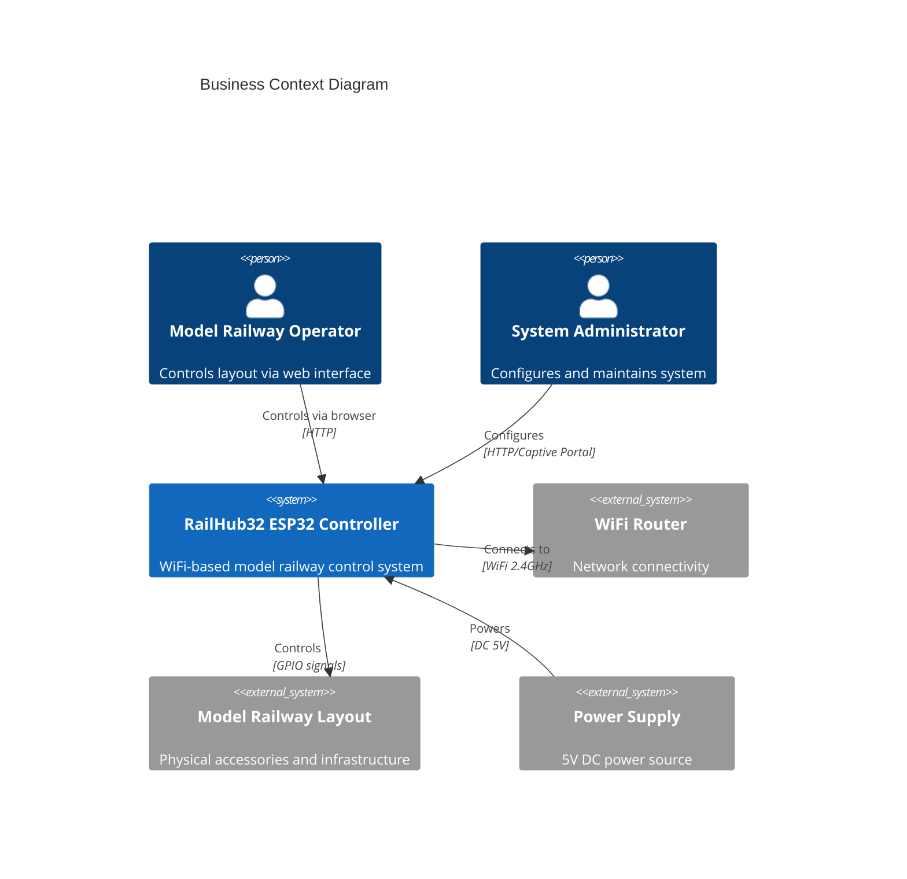
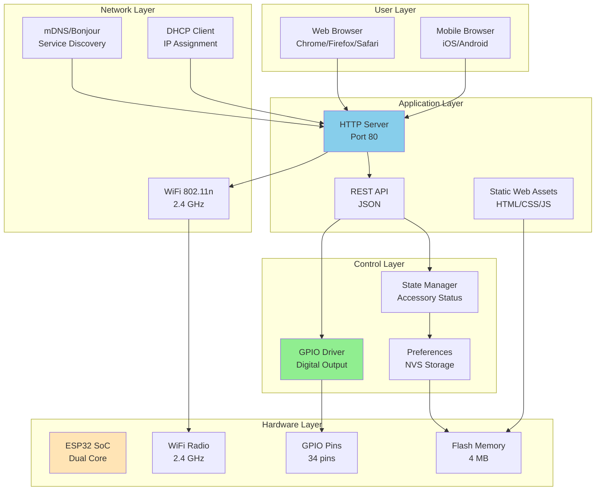
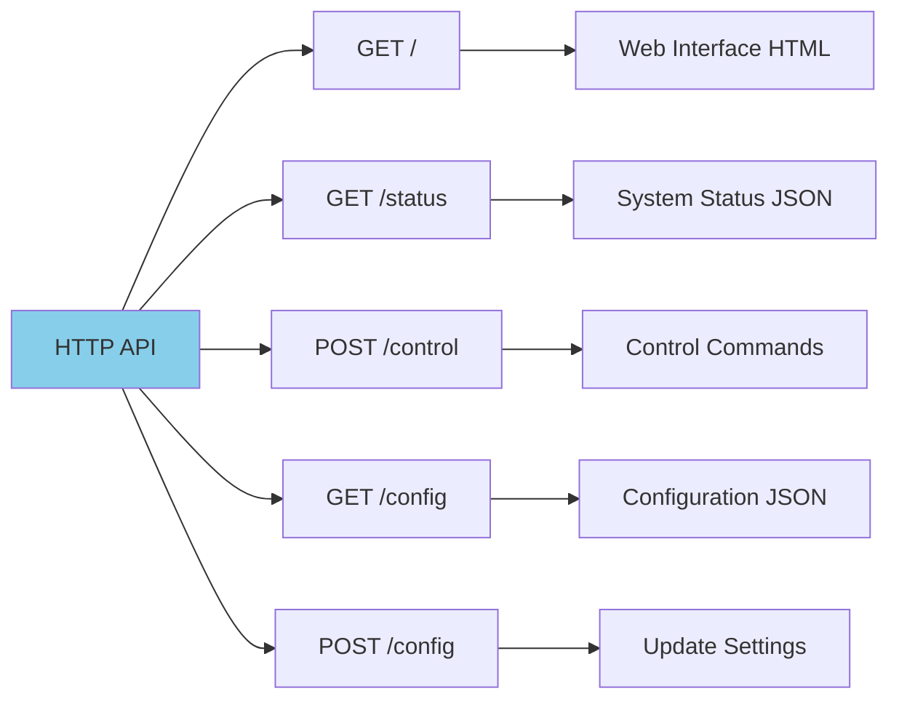
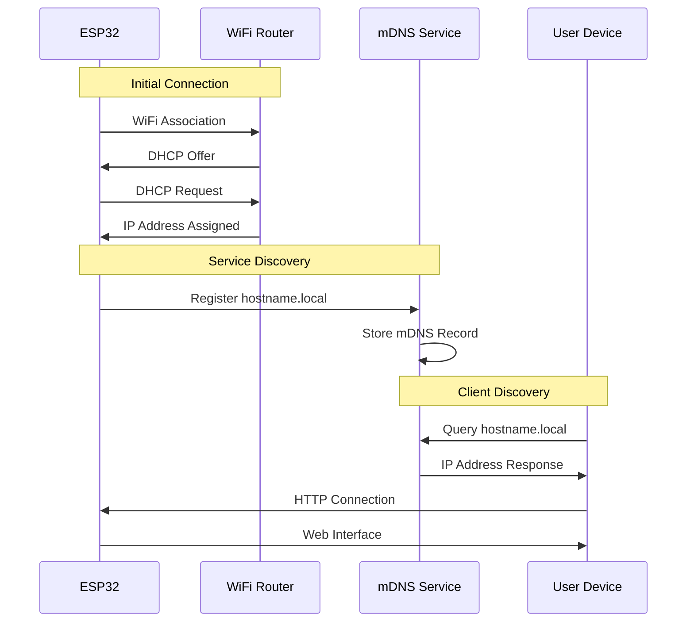
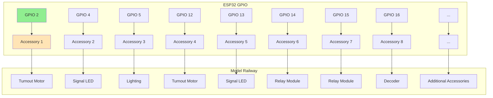
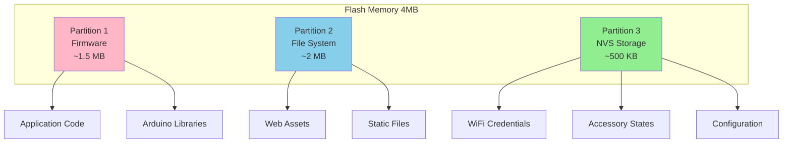
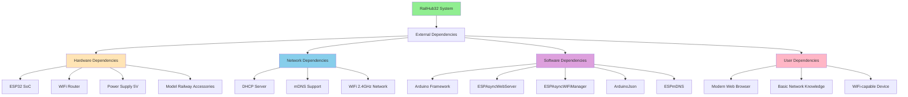
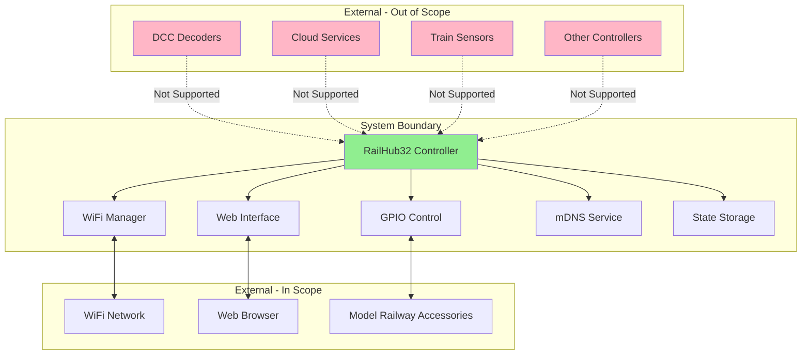

# 3. System Scope and Context

## 3.1 Business Context

### System Overview

RailHub32 operates as a standalone WiFi-connected controller that bridges the gap between digital control interfaces (web browsers) and physical model railway accessories.



### External Entities

| Entity | Description | Interface | Protocol |
|--------|-------------|-----------|----------|
| **User Browser** | Web-based control interface | HTTP Client | HTTP/1.1 |
| **WiFi Router** | Network infrastructure | 802.11 n | WiFi, DHCP, mDNS |
| **Model Railway** | Physical accessories (turnouts, signals, etc.) | GPIO Pins | Digital I/O |
| **Power Supply** | 5V DC power source | Power Jack | DC 5V, 2A |
| **Configuration Device** | Initial WiFi setup | Captive Portal | HTTP |



## 3.2 Technical Context

### System Interfaces



### Interface Specifications

#### 1. HTTP Web Interface

| Property | Specification |
|----------|--------------|
| **Protocol** | HTTP/1.1 |
| **Port** | 80 (standard) |
| **Methods** | GET, POST |
| **Content-Type** | application/json, text/html |
| **Authentication** | None (local network only) |
| **CORS** | Enabled for local access |

**API Endpoints:**



**Request/Response Examples:**

```json
// GET /status
{
  "hostname": "railhub32-controller",
  "ip": "192.168.1.100",
  "uptime": 3600,
  "accessories": [
    {"id": 1, "name": "Turnout 1", "state": true},
    {"id": 2, "name": "Signal A", "state": false}
  ]
}

// POST /control
{
  "accessory": 1,
  "state": true
}

// Response
{
  "success": true,
  "accessory": 1,
  "state": true
}
```

#### 2. WiFi Network Interface



| Property | Specification |
|----------|--------------|
| **Standard** | IEEE 802.11 b/g/n |
| **Frequency** | 2.4 GHz |
| **Security** | WPA2-PSK, WPA3-SAE |
| **IP Mode** | DHCP Client (default), Static optional |
| **Hostname** | Configurable, default: "railhub32-{chipid}" |
| **mDNS** | Enabled, {hostname}.local |

#### 3. GPIO Hardware Interface



| Pin | Function | Voltage | Current | Protection |
|-----|----------|---------|---------|------------|
| GPIO 2-27 | Digital Output | 3.3V | Max 40mA | Current limiting resistors |
| GND | Common Ground | 0V | - | - |
| 5V | Power Supply | 5V | Max 2A | Fuse/overcurrent protection |

**Pin Assignment:**

```cpp
// Default GPIO pin mapping
const int GPIO_PINS[] = {
    2, 4, 5, 12, 13, 14, 15, 16,  // Accessories 1-8
    17, 18, 19, 21, 22, 23, 25, 26 // Accessories 9-16
};

// Signal characteristics
// - Logic HIGH: 3.3V (Accessory ON)
// - Logic LOW: 0V (Accessory OFF)
// - Switching speed: < 1ms
// - Pull-up/down: Configurable per pin
```

#### 4. Storage Interface



| Storage Type | Technology | Capacity | Use Case |
|-------------|------------|----------|----------|
| **Program Flash** | SPI NOR Flash | ~1.5 MB | Firmware binary |
| **File System** | LittleFS/SPIFFS | ~2 MB | Web assets, logs |
| **NVS** | Non-Volatile Storage | ~500 KB | Config, credentials, state |

## 3.3 External Dependencies



### Critical External Systems

| System | Criticality | Failure Impact | Mitigation |
|--------|-------------|----------------|------------|
| **WiFi Router** | High | No remote control, local operation only | Fallback to AP mode |
| **Power Supply** | Critical | Complete system failure | Capacitor backup for clean shutdown |
| **Web Browser** | High | No user interface | Support multiple browsers |
| **mDNS Service** | Medium | Manual IP entry required | Display IP on serial console |
| **Model Railway** | Medium | No physical control | Software still operational |

## 3.4 Context Boundaries

### What the System Does

✅ **In Scope:**
- Control up to 16 digital outputs via WiFi
- Provide web-based user interface
- Store accessory states persistently
- Support WiFi configuration via captive portal
- Advertise services via mDNS
- Respond to HTTP control commands
- Monitor and report system status

### What the System Does NOT Do

❌ **Out of Scope:**
- Analog signal generation or measurement
- DCC (Digital Command Control) protocol
- Battery power operation
- 5 GHz WiFi support
- Bluetooth connectivity
- Train speed control
- Track occupancy detection
- Automatic train routing
- Multi-controller synchronization (current version)
- Cloud connectivity or remote access


