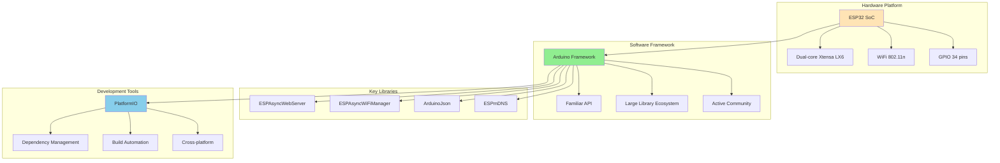
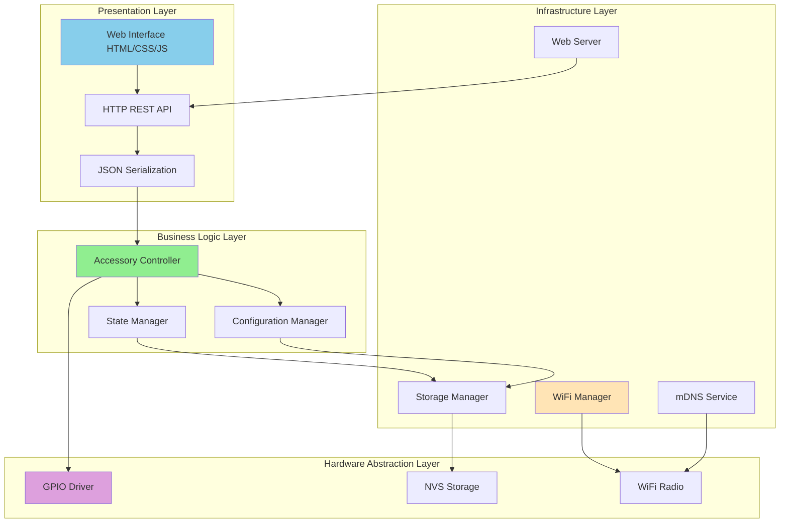
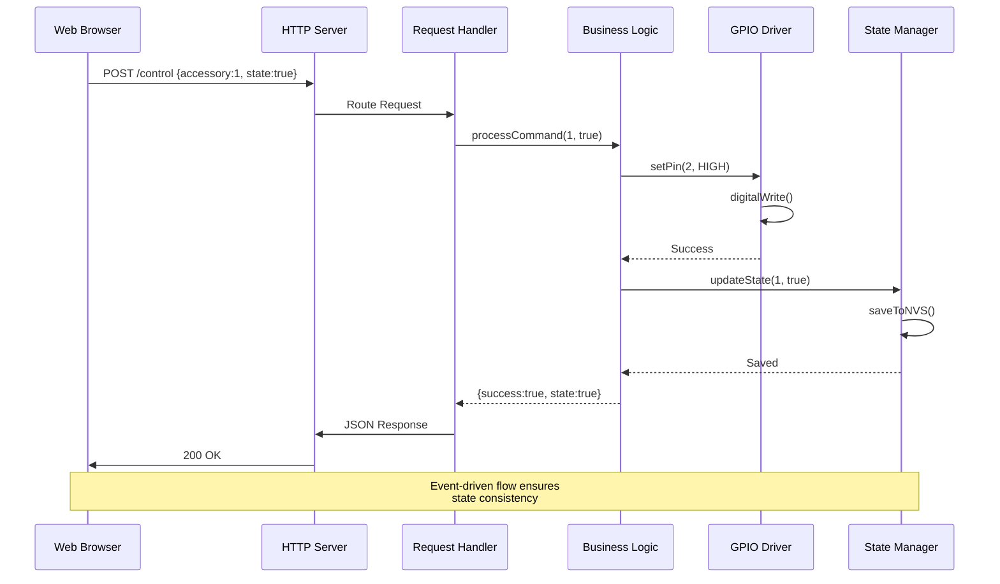
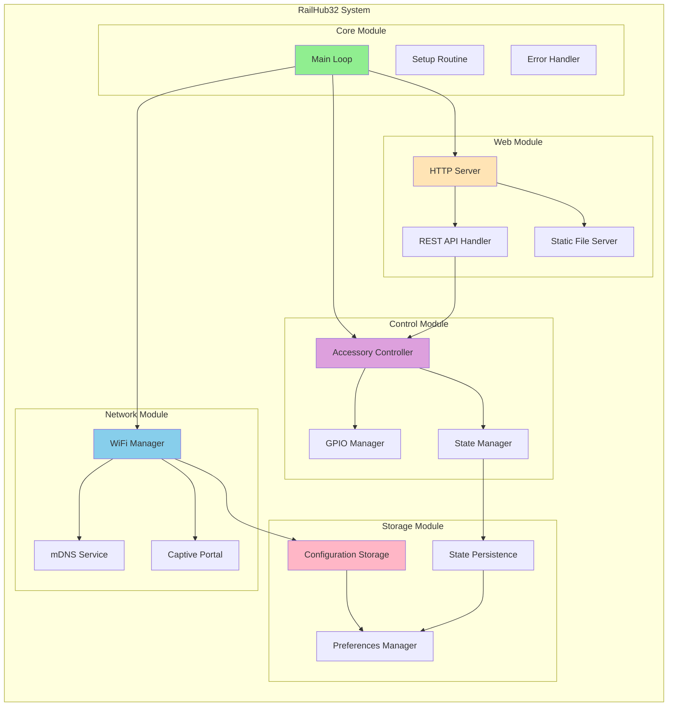
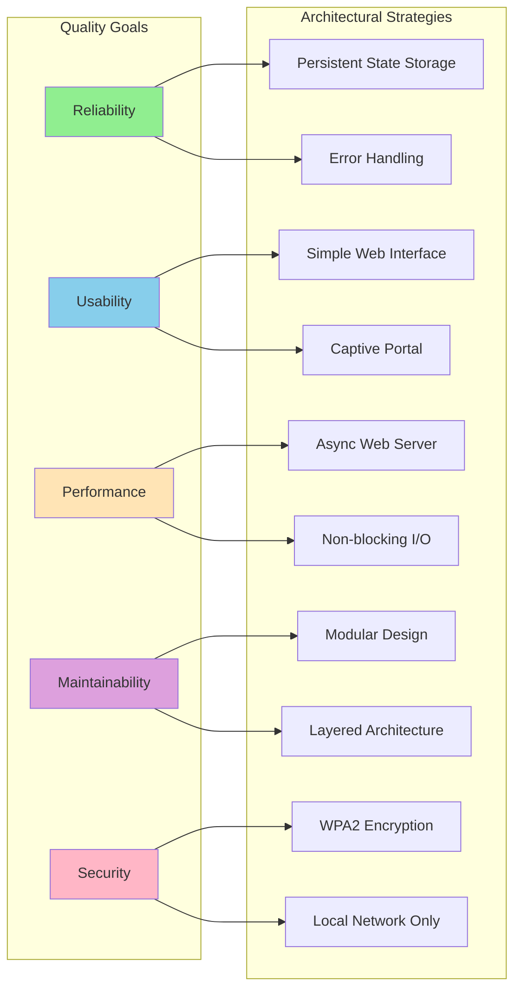
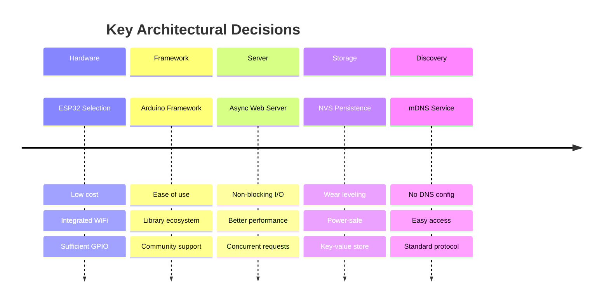
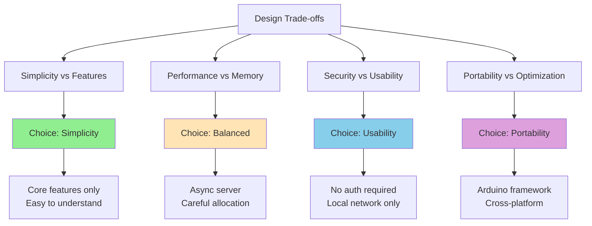

# 4. Solution Strategy

## 4.1 Technology Decisions

### Core Technology Stack

### Technology Selection Rationale

| Technology | Decision | Rationale |
|------------|----------|-----------|
| **ESP32** | ✅ Selected | Low cost (~$5), integrated WiFi, sufficient GPIO, active community |
| **Arduino Framework** | ✅ Selected | Ease of development, extensive libraries, beginner-friendly |
| **ESPAsyncWebServer** | ✅ Selected | Non-blocking I/O, better performance than sync servers |
| **JSON REST API** | ✅ Selected | Simple, human-readable, browser-friendly |
| **mDNS** | ✅ Selected | Easy network discovery, no DNS configuration needed |
| **React/Vue** | ❌ Rejected | Too heavy for ESP32, unnecessary complexity |
| **MQTT** | 🔄 Future | Would enable advanced integrations, planned for v2 |
| **WebSocket** | 🔄 Future | Real-time updates, planned enhancement |

## 4.2 Architectural Patterns

### Layered Architecture

### Event-Driven Architecture

### Key Architectural Patterns

| Pattern | Usage | Benefit |
|---------|-------|---------|
| **Layered Architecture** | Separation of concerns across layers | Maintainability, testability |
| **Repository Pattern** | State management via NVS storage | Abstraction of persistence |
| **Singleton Pattern** | Web server, WiFi manager instances | Resource conservation |
| **Observer Pattern** | State change notifications | Decoupling, extensibility |
| **Command Pattern** | HTTP request handling | Flexibility, undo capability |

## 4.3 Top-Level Decomposition

### System Components

### Component Responsibilities

| Component | Responsibility | Dependencies |
|-----------|----------------|--------------|
| **WiFi Manager** | Network connection, captive portal setup | ESPAsyncWiFiManager, WiFi radio |
| **mDNS Service** | Hostname resolution, service discovery | ESPmDNS, WiFi connection |
| **HTTP Server** | Handle web requests, serve static files | ESPAsyncWebServer |
| **REST API Handler** | Process control commands, return status | ArduinoJson, Accessory Controller |
| **Accessory Controller** | Business logic for accessory control | GPIO Manager, State Manager |
| **GPIO Manager** | Low-level pin control | ESP32 GPIO HAL |
| **State Manager** | Track and persist accessory states | Preferences Manager |
| **Preferences Manager** | NVS read/write operations | ESP32 NVS library |

## 4.4 Quality Goal Achievement

### How Architecture Supports Quality Goals

#### Reliability Strategies

1. **Persistent State Storage**: All accessory states saved to NVS
2. **Watchdog Timer**: Automatic restart on hang
3. **Error Handling**: Graceful degradation on failures
4. **Retry Logic**: WiFi reconnection attempts

#### Usability Strategies

1. **Captive Portal**: Zero-configuration WiFi setup
2. **mDNS Discovery**: Access via hostname.local
3. **Responsive UI**: Mobile-friendly web interface
4. **Clear Feedback**: Visual state indicators

#### Performance Strategies

1. **Async Web Server**: Non-blocking request handling
2. **Efficient JSON**: Minimal payload sizes
3. **Static File Caching**: Reduced server load
4. **Direct GPIO Access**: Low-latency control

#### Maintainability Strategies

1. **Modular Design**: Independent components
2. **Layered Architecture**: Clear separation of concerns
3. **Code Comments**: Inline documentation
4. **Configuration Files**: Centralized settings

#### Security Strategies

1. **WPA2/WPA3**: Encrypted network communication
2. **Local Network Only**: No internet exposure
3. **No Authentication Required**: Trust local network
4. **Input Validation**: Prevent malformed requests

## 4.5 Design Decisions

### Critical Design Decisions

### Decision Records

#### ADR-001: Use Arduino Framework

**Status**: Accepted

**Context**: Need accessible development environment for hobbyist contributors

**Decision**: Use Arduino framework on ESP32 instead of ESP-IDF

**Consequences**:
- ✅ Lower barrier to entry for contributors
- ✅ Extensive library ecosystem
- ✅ Familiar API for Arduino users
- ❌ Less control over low-level features
- ❌ Slightly higher memory overhead

#### ADR-002: Async Web Server

**Status**: Accepted

**Context**: Need responsive web interface with minimal latency

**Decision**: Use ESPAsyncWebServer instead of synchronous alternatives

**Consequences**:
- ✅ Non-blocking request handling
- ✅ Better concurrent request support
- ✅ Lower latency for control commands
- ❌ More complex programming model
- ❌ Larger code footprint

#### ADR-003: No Authentication

**Status**: Accepted (for v1)

**Context**: System operates on trusted local network

**Decision**: No password/authentication required for web interface

**Consequences**:
- ✅ Simplified user experience
- ✅ Faster development
- ✅ No credential management
- ❌ Security risk if network compromised
- 🔄 Consider adding optional auth in v2

#### ADR-004: JSON REST API

**Status**: Accepted

**Context**: Need simple, language-agnostic API

**Decision**: Use JSON for request/response format

**Consequences**:
- ✅ Human-readable format
- ✅ Easy to debug
- ✅ Wide client support
- ✅ Browser-friendly
- ❌ Larger payload than binary protocols
- ❌ Parsing overhead

## 4.6 Trade-offs

### Key Trade-off Decisions

| Trade-off | Choice | Rationale |
|-----------|--------|-----------|
| **Simplicity vs Features** | Simplicity | Easier maintenance, lower barrier to entry |
| **Performance vs Memory** | Performance | Async I/O, but careful memory management |
| **Security vs Usability** | Usability | Local network only, trust assumption |
| **Portability vs Optimization** | Portability | Arduino framework, multiple board support |
| **Flexibility vs Consistency** | Consistency | Standardized API, predictable behavior |

