# 5. Building Block View

## 5.1 Whitebox Overall System

### System Overview

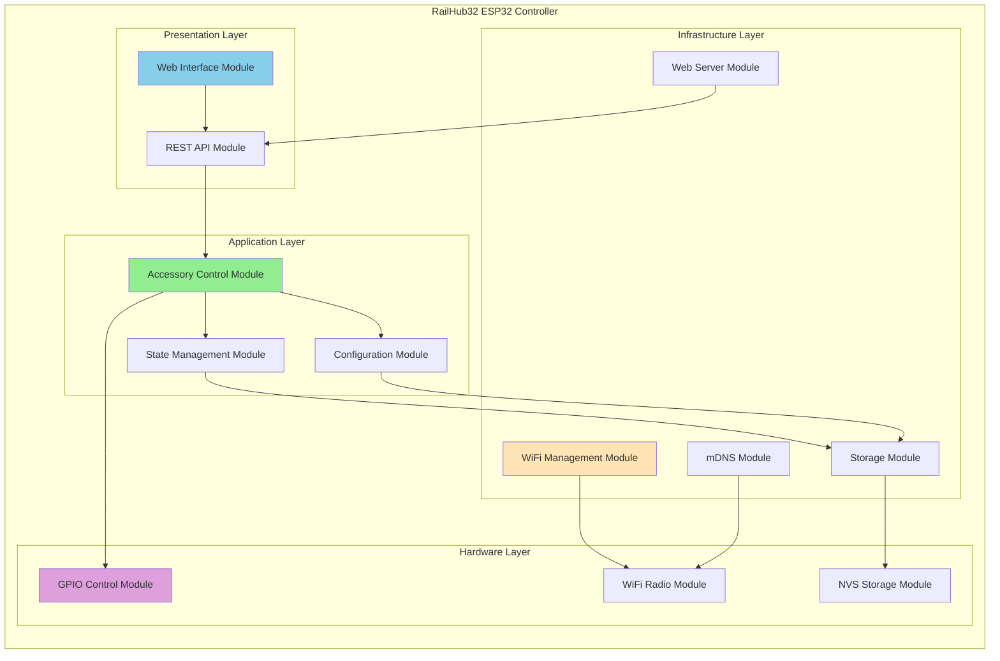

### Top-Level Building Blocks

| Block | Responsibility | Interfaces |
|-------|---------------|------------|
| **Web Interface Module** | Serve HTML/CSS/JS, user interaction | HTTP GET / |
| **REST API Module** | Handle control requests, return status | HTTP GET/POST /api/* |
| **Accessory Control Module** | Business logic for accessory operations | processCommand(), getStatus() |
| **State Management Module** | Track and persist accessory states | updateState(), loadState() |
| **Configuration Module** | Manage system settings | getConfig(), saveConfig() |
| **WiFi Management Module** | Network connectivity, captive portal | connect(), configureAP() |
| **Web Server Module** | HTTP request routing | onRequest(), begin() |
| **mDNS Module** | Service discovery | advertise(), respond() |
| **Storage Module** | File system and NVS operations | read(), write(), persist() |
| **GPIO Control Module** | Low-level pin manipulation | setPin(), readPin() |
| **NVS Storage Module** | Non-volatile storage access | get(), set(), commit() |
| **WiFi Radio Module** | Hardware WiFi operations | scan(), associate() |

### Important Interfaces

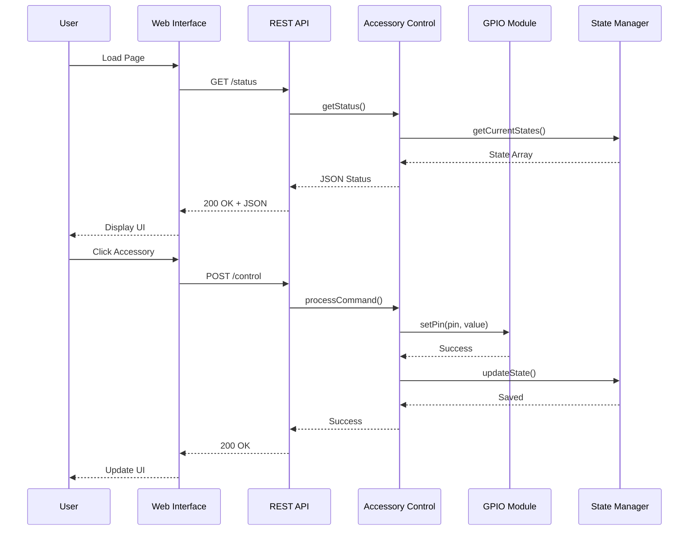

## 5.2 Level 2: Web Server Module

### Whitebox Web Server Module

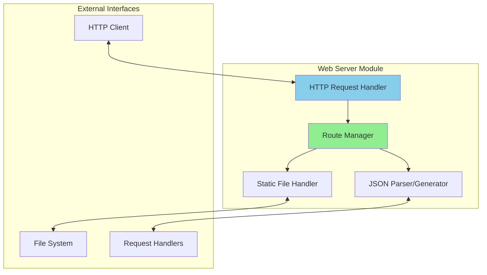

### Building Blocks

| Block | Responsibility | Implementation |
|-------|---------------|----------------|
| **HTTP Request Handler** | Accept and process HTTP connections | ESPAsyncWebServer |
| **Route Manager** | Map URLs to handlers | AsyncWebServer::on() |
| **Static File Handler** | Serve HTML/CSS/JS files | serveStatic() |
| **JSON Parser/Generator** | Serialize/deserialize JSON | ArduinoJson |

### Internal Interfaces

```cpp
// Route registration
server.on("/", HTTP_GET, handleRoot);
server.on("/status", HTTP_GET, handleStatus);
server.on("/control", HTTP_POST, handleControl);
server.on("/config", HTTP_GET, handleGetConfig);
server.on("/config", HTTP_POST, handleSetConfig);

// Static file serving
server.serveStatic("/", SPIFFS, "/www/");

// Error handling
server.onNotFound(handleNotFound);
```

## 5.3 Level 2: Accessory Control Module

### Whitebox Accessory Control Module

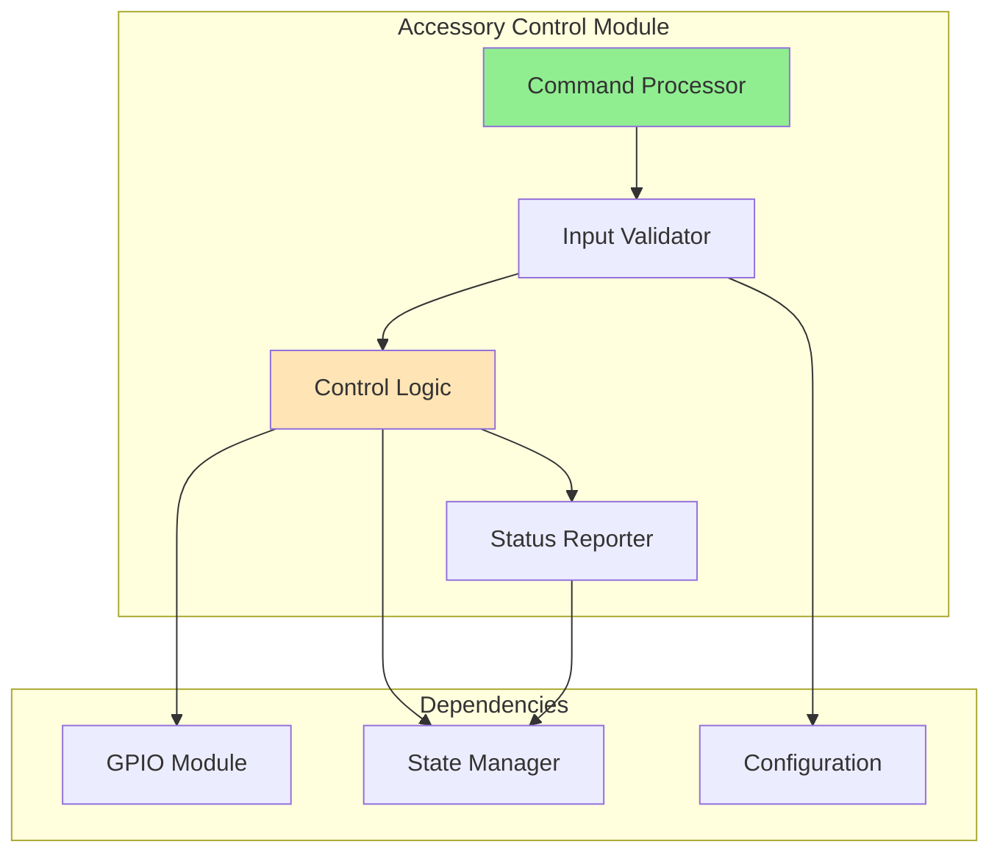

### Building Blocks

| Block | Responsibility | Key Functions |
|-------|---------------|---------------|
| **Command Processor** | Parse and route commands | processCommand(id, state) |
| **Input Validator** | Validate command parameters | validateAccessoryId(), validateState() |
| **Control Logic** | Execute accessory operations | turnOn(), turnOff(), toggle() |
| **Status Reporter** | Generate status information | getAccessoryStatus(), getSystemStatus() |

### Control Flow

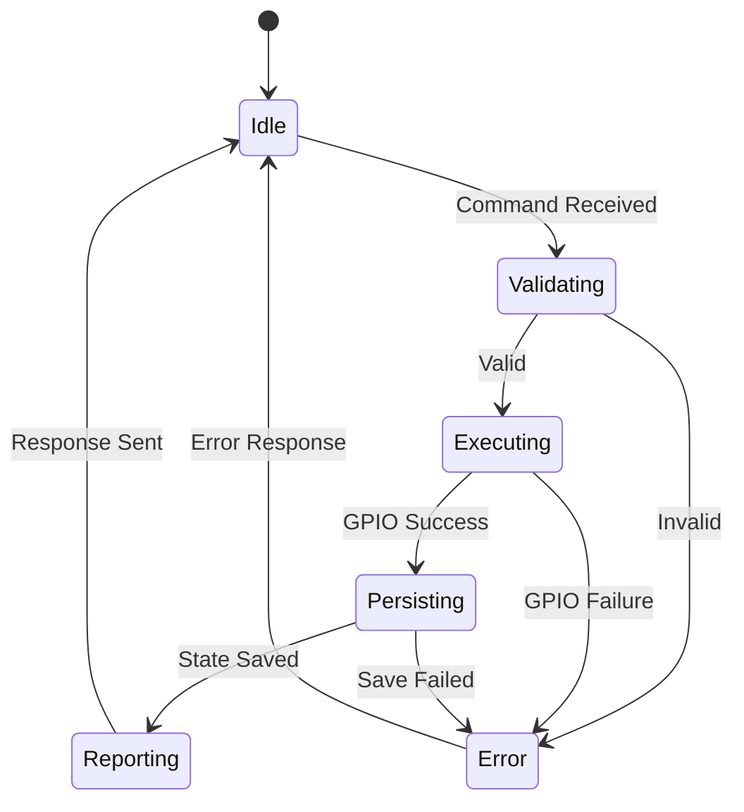

### Implementation Example

```cpp
class AccessoryController {
private:
    GPIOManager& gpio;
    StateManager& state;
    ConfigManager& config;
    
public:
    bool processCommand(int accessoryId, bool newState) {
        // Validate input
        if (!validateAccessoryId(accessoryId)) {
            return false;
        }
        
        // Get GPIO pin for accessory
        int pin = config.getPinForAccessory(accessoryId);
        
        // Execute control
        if (!gpio.setPin(pin, newState)) {
            return false;
        }
        
        // Update state
        state.updateState(accessoryId, newState);
        
        return true;
    }
    
    JsonObject getStatus() {
        JsonObject status;
        status["hostname"] = config.getHostname();
        status["uptime"] = millis() / 1000;
        status["accessories"] = state.getAllStates();
        return status;
    }
};
```

## 5.4 Level 2: WiFi Management Module

### Whitebox WiFi Management Module

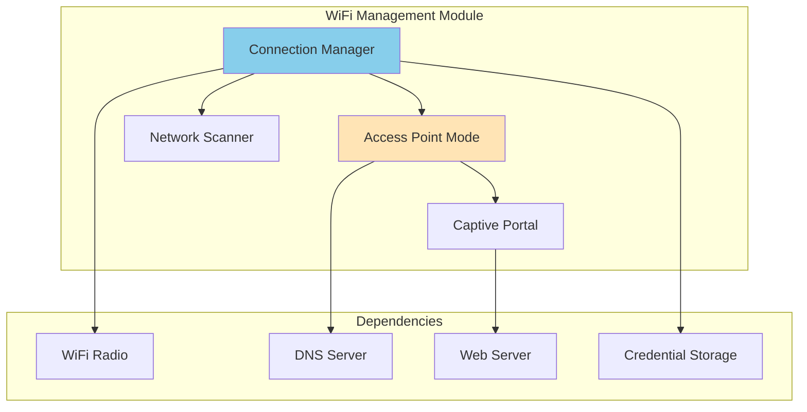

### Building Blocks

| Block | Responsibility | Library |
|-------|---------------|---------|
| **Connection Manager** | Establish and maintain WiFi connection | WiFi.h |
| **Access Point Mode** | Create temporary WiFi network | WiFiAP.h |
| **Captive Portal** | Configuration web interface | ESPAsyncWiFiManager |
| **Network Scanner** | Scan for available networks | WiFi.scanNetworks() |

### Connection State Machine

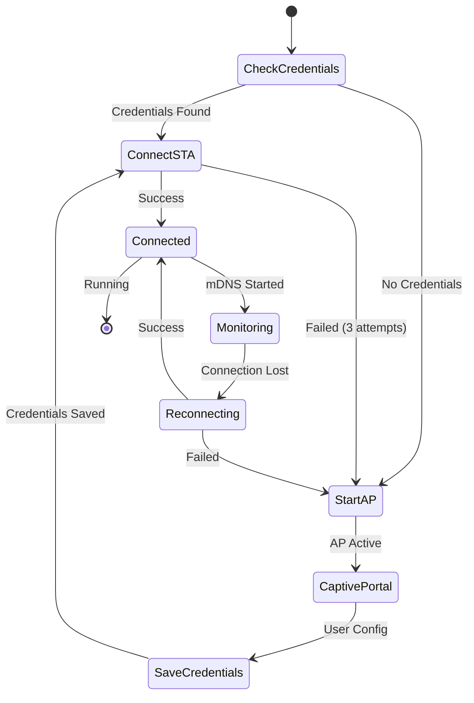

## 5.5 Level 2: State Management Module

### Whitebox State Management Module

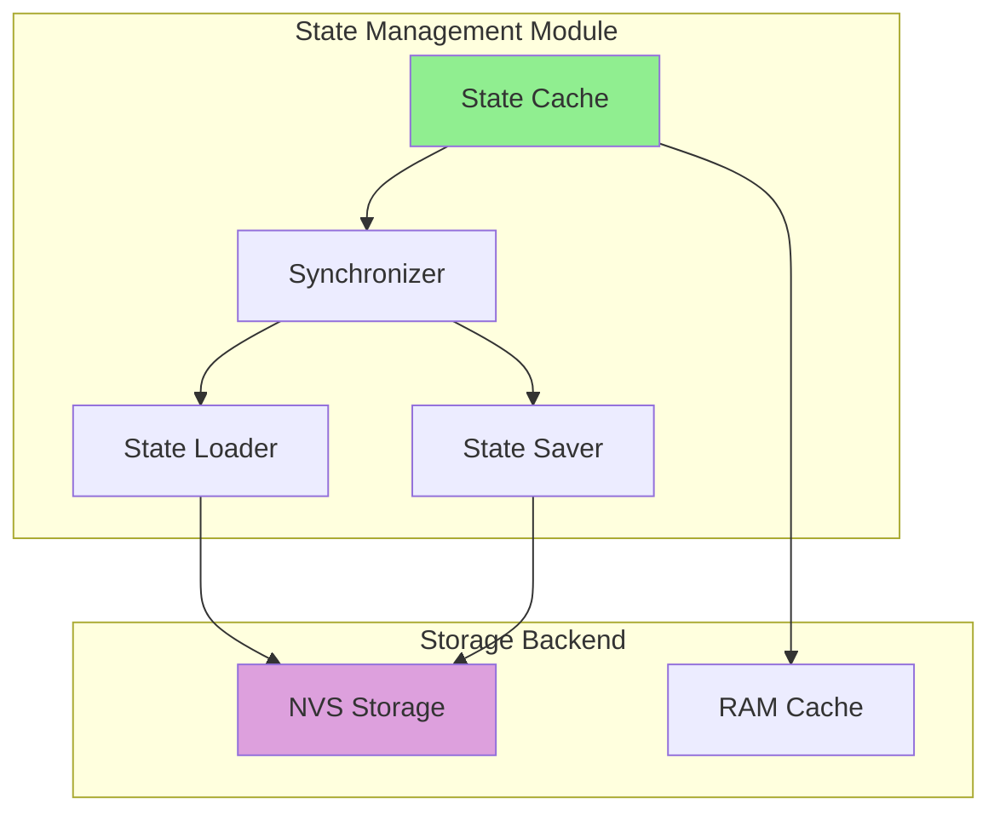

### Building Blocks

| Block | Responsibility | Storage Type |
|-------|---------------|--------------|
| **State Cache** | In-memory state tracking | RAM (fast access) |
| **Synchronizer** | Keep cache and NVS in sync | Coordination logic |
| **State Loader** | Load states from NVS on boot | NVS read operations |
| **State Saver** | Persist states to NVS | NVS write operations |

### State Lifecycle

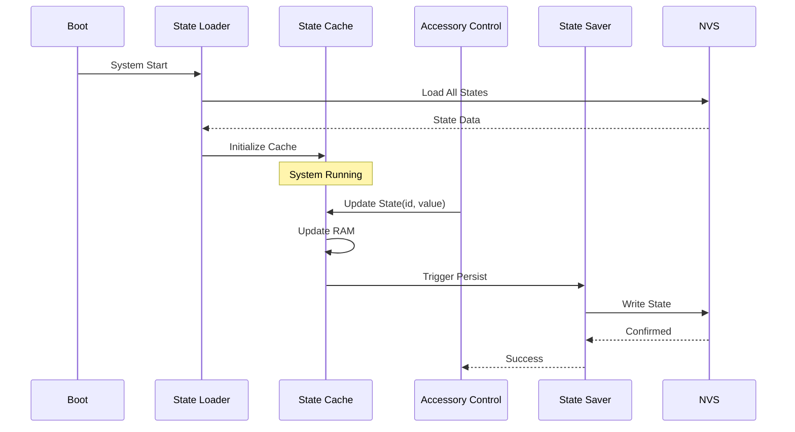

### State Data Structure

```cpp
struct AccessoryState {
    uint8_t id;           // Accessory ID (1-16)
    bool state;           // Current state (ON/OFF)
    uint32_t lastChanged; // Timestamp of last change
    uint8_t pin;          // GPIO pin number
    char name[32];        // Accessory name
};

class StateManager {
private:
    AccessoryState states[MAX_ACCESSORIES];
    Preferences prefs;
    
public:
    void loadStates() {
        prefs.begin("states", false);
        for (int i = 0; i < MAX_ACCESSORIES; i++) {
            String key = "acc_" + String(i);
            states[i].state = prefs.getBool(key.c_str(), false);
        }
        prefs.end();
    }
    
    void updateState(uint8_t id, bool newState) {
        states[id].state = newState;
        states[id].lastChanged = millis();
        
        // Persist to NVS
        prefs.begin("states", false);
        String key = "acc_" + String(id);
        prefs.putBool(key.c_str(), newState);
        prefs.end();
    }
    
    AccessoryState getState(uint8_t id) {
        return states[id];
    }
};
```

## 5.6 Level 2: GPIO Control Module

### Whitebox GPIO Control Module

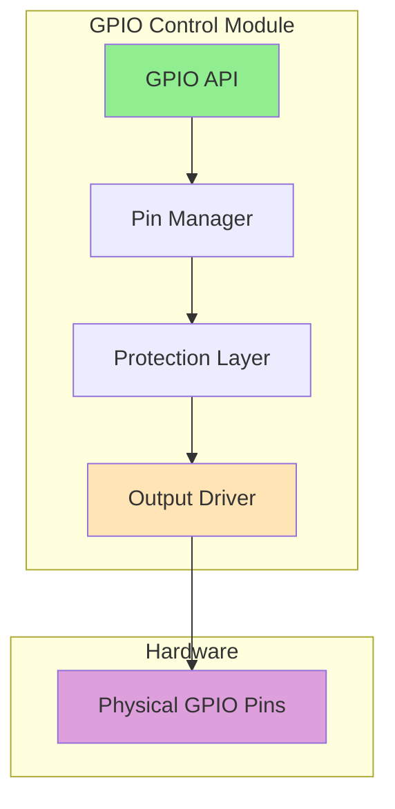

### Building Blocks

| Block | Responsibility | Safety Features |
|-------|---------------|-----------------|
| **GPIO API** | High-level pin operations | Input validation |
| **Pin Manager** | Track pin assignments and modes | Conflict detection |
| **Protection Layer** | Prevent hardware damage | Current limiting, validation |
| **Output Driver** | Low-level hardware control | Direct register access |

### Pin Configuration

```cpp
class GPIOManager {
private:
    struct PinConfig {
        uint8_t pin;
        uint8_t mode;      // INPUT, OUTPUT, INPUT_PULLUP
        bool inUse;
        uint8_t accessoryId;
    };
    
    PinConfig pins[34];    // ESP32 has 34 GPIO pins
    
    const uint8_t ACCESSORY_PINS[16] = {
        2, 4, 5, 12, 13, 14, 15, 16,
        17, 18, 19, 21, 22, 23, 25, 26
    };
    
public:
    void initializePins() {
        for (int i = 0; i < 16; i++) {
            uint8_t pin = ACCESSORY_PINS[i];
            pinMode(pin, OUTPUT);
            digitalWrite(pin, LOW);
            
            pins[pin].pin = pin;
            pins[pin].mode = OUTPUT;
            pins[pin].inUse = true;
            pins[pin].accessoryId = i;
        }
    }
    
    bool setPin(uint8_t pin, bool state) {
        // Validate pin
        if (!isValidPin(pin)) {
            return false;
        }
        
        // Check if pin is in use
        if (!pins[pin].inUse) {
            return false;
        }
        
        // Set pin state
        digitalWrite(pin, state ? HIGH : LOW);
        return true;
    }
    
    bool getPin(uint8_t pin) {
        if (!isValidPin(pin)) {
            return false;
        }
        return digitalRead(pin);
    }
    
private:
    bool isValidPin(uint8_t pin) {
        // Check if pin number is valid for ESP32
        if (pin >= 34) return false;
        
        // Check reserved pins (6-11 used for flash)
        if (pin >= 6 && pin <= 11) return false;
        
        return true;
    }
};
```

### Pin Safety Matrix

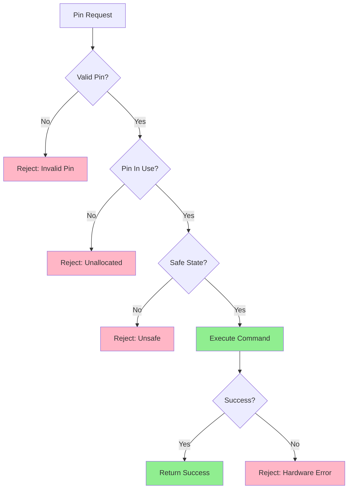

## 5.7 Component Dependencies

### Dependency Graph

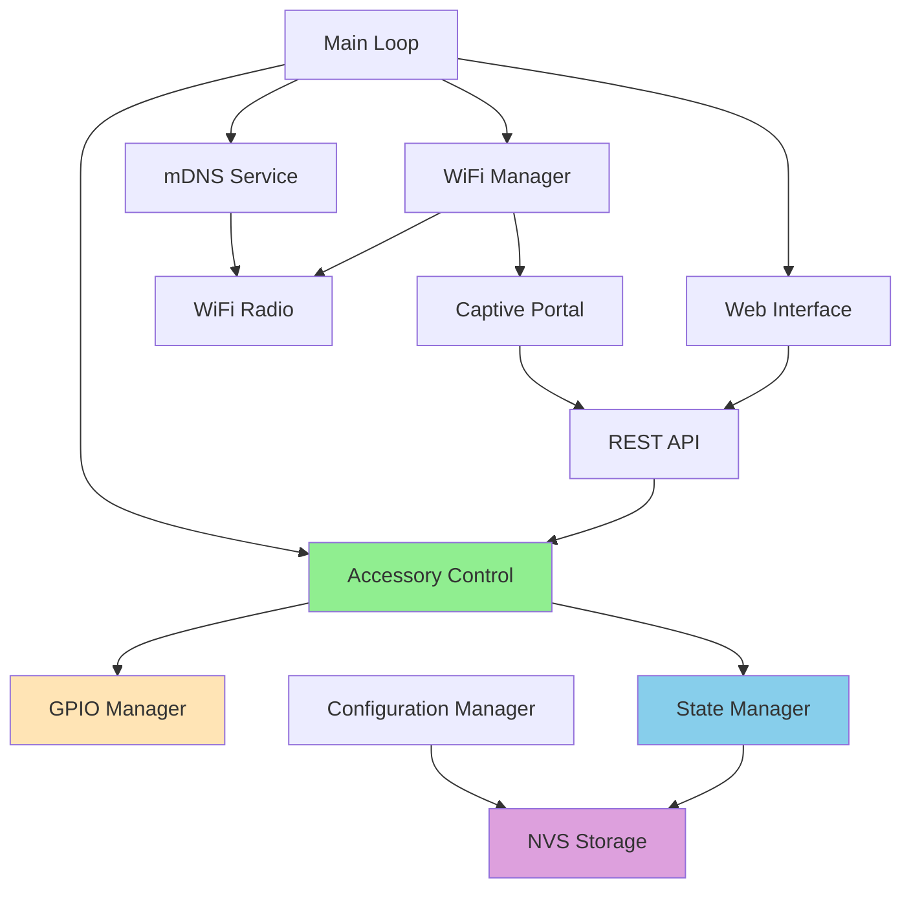

### Cross-Module Communication

| Caller | Callee | Interface Type | Protocol |
|--------|--------|----------------|----------|
| REST API → Accessory Control | Function call | Synchronous | C++ method |
| Accessory Control → GPIO Manager | Function call | Synchronous | C++ method |
| Accessory Control → State Manager | Function call | Synchronous | C++ method |
| State Manager → NVS Storage | Library call | Synchronous | Preferences API |
| WiFi Manager → Captive Portal | Callback | Asynchronous | ESPAsyncWiFiManager |
| Web Interface → REST API | HTTP | Asynchronous | JSON over HTTP |
