# 6. Runtime View

## 6.1 System Boot Sequence

### Complete Boot Flow

```mermaid
sequenceDiagram
    participant HW as Hardware
    participant Boot as Bootloader
    participant Setup as Setup()
    participant WiFi as WiFi Manager
    participant mDNS as mDNS Service
    participant Web as Web Server
    participant GPIO as GPIO Manager
    participant State as State Manager
    participant Loop as Main Loop
    
    HW->>Boot: Power On
    Boot->>Boot: Load Firmware
    Boot->>Setup: Execute setup()
    
    Setup->>GPIO: Initialize Pins
    GPIO->>GPIO: Configure Output Modes
    GPIO-->>Setup: Pins Ready
    
    Setup->>State: Load States from NVS
    State->>State: Read Preferences
    State-->>Setup: States Loaded
    
    Setup->>GPIO: Restore Last States
    GPIO->>GPIO: Set Pin Values
    GPIO-->>Setup: States Restored
    
    Setup->>WiFi: Connect to Network
    WiFi->>WiFi: Try Saved Credentials
    
    alt Credentials Valid
        WiFi->>WiFi: Connect to AP
        WiFi-->>Setup: Connected
    else No Credentials
        WiFi->>WiFi: Start Access Point
        WiFi->>WiFi: Start Captive Portal
        WiFi-->>Setup: AP Mode Active
    end
    
    Setup->>mDNS: Start mDNS Service
    mDNS->>mDNS: Register hostname.local
    mDNS-->>Setup: Service Registered
    
    Setup->>Web: Start Web Server
    Web->>Web: Register Routes
    Web->>Web: Begin Listening :80
    Web-->>Setup: Server Running
    
    Setup-->>Loop: Enter Main Loop
    
    loop Every Iteration
        Loop->>WiFi: Check Connection
        Loop->>Web: Handle Requests
        Loop->>State: Monitor State
    end
```

### Boot Timing


```mermaid
gantt
    title Boot Sequence Timeline
    dateFormat SSS
    axisFormat %L ms
    
    section Hardware
    Power On          :milestone, m1, 000, 0ms
    Bootloader        :boot, 000, 100ms
    
    section Initialization
    GPIO Setup        :gpio, after boot, 50ms
    Load State        :state, after gpio, 100ms
    Restore Outputs   :restore, after state, 50ms
    
    section Network
    WiFi Connect      :wifi, after restore, 2000ms
    mDNS Start        :mdns, after wifi, 100ms
    
    section Services
    Web Server        :web, after mdns, 50ms
    System Ready      :milestone, m2, after web, 0ms
    
    section Total Boot Time: ~2.5 seconds
```

## 6.2 WiFi Configuration Scenario

### First-Time Setup (No Credentials)

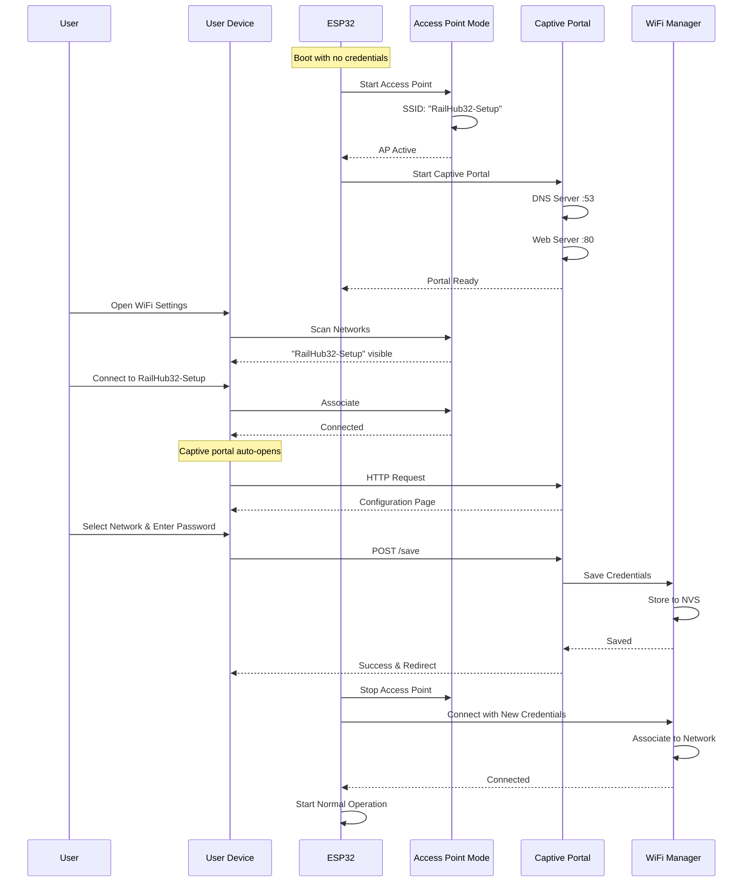
```mermaid
sequenceDiagram
    participant User
    participant Device as User Device
    participant ESP as ESP32
    participant AP as Access Point Mode
    participant Portal as Captive Portal
    participant WiFi as WiFi Manager
    
    Note over ESP: Boot with no credentials
    
    ESP->>AP: Start Access Point
    AP->>AP: SSID: "RailHub32-Setup"
    AP-->>ESP: AP Active
    
    ESP->>Portal: Start Captive Portal
    Portal->>Portal: DNS Server :53
    Portal->>Portal: Web Server :80
    Portal-->>ESP: Portal Ready
    
    User->>Device: Open WiFi Settings
    Device->>AP: Scan Networks
    AP-->>Device: "RailHub32-Setup" visible
    
    User->>Device: Connect to RailHub32-Setup
    Device->>AP: Associate
    AP-->>Device: Connected
    
    Note over Device: Captive portal auto-opens
    
    Device->>Portal: HTTP Request
    Portal-->>Device: Configuration Page
    
    User->>Device: Select Network & Enter Password
    Device->>Portal: POST /save
    Portal->>WiFi: Save Credentials
    WiFi->>WiFi: Store to NVS
    WiFi-->>Portal: Saved
    
    Portal-->>Device: Success & Redirect
    
    ESP->>AP: Stop Access Point
    ESP->>WiFi: Connect with New Credentials
    WiFi->>WiFi: Associate to Network
    WiFi-->>ESP: Connected
    
    ESP->>ESP: Start Normal Operation
```

### WiFi Reconnection Flow

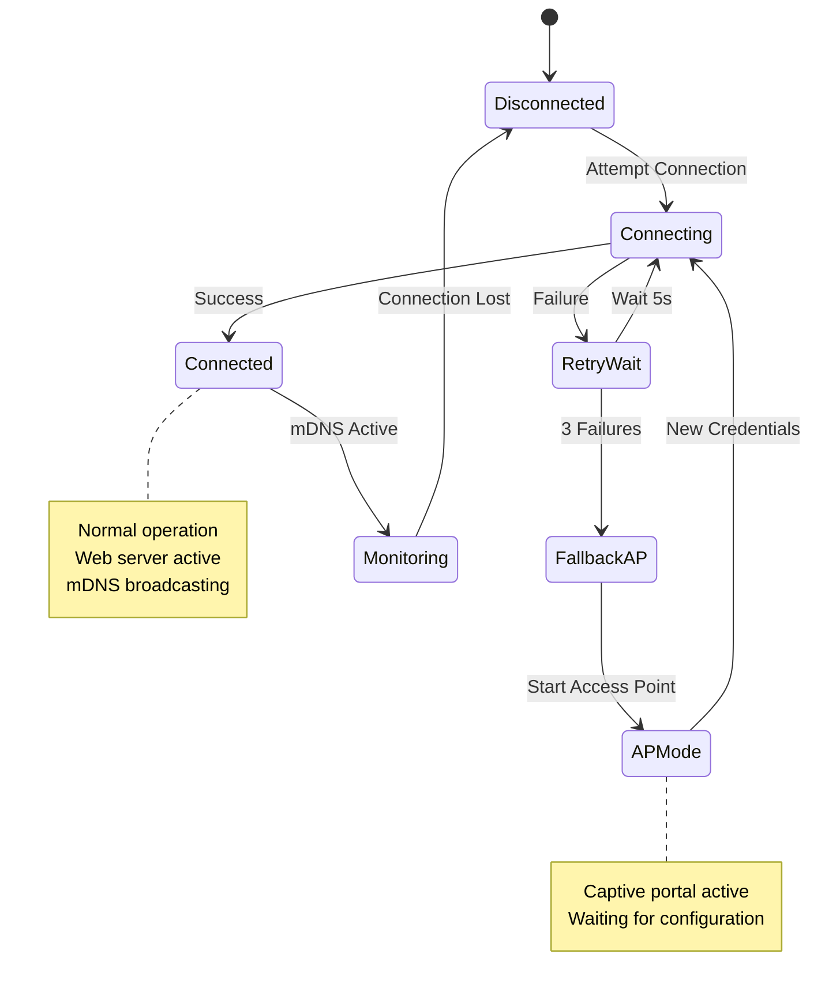
```mermaid
stateDiagram-v2
    [*] --> Disconnected
    Disconnected --> Connecting: Attempt Connection
    Connecting --> Connected: Success
    Connecting --> RetryWait: Failure
    RetryWait --> Connecting: Wait 5s
    RetryWait --> FallbackAP: 3 Failures
    Connected --> Monitoring: mDNS Active
    Monitoring --> Disconnected: Connection Lost
    FallbackAP --> APMode: Start Access Point
    APMode --> Connecting: New Credentials
    
    note right of Connected
        Normal operation
        Web server active
        mDNS broadcasting
    end note
    
    note right of APMode
        Captive portal active
        Waiting for configuration
    end note
```

## 6.3 Accessory Control Scenario

### User Controls Accessory via Web

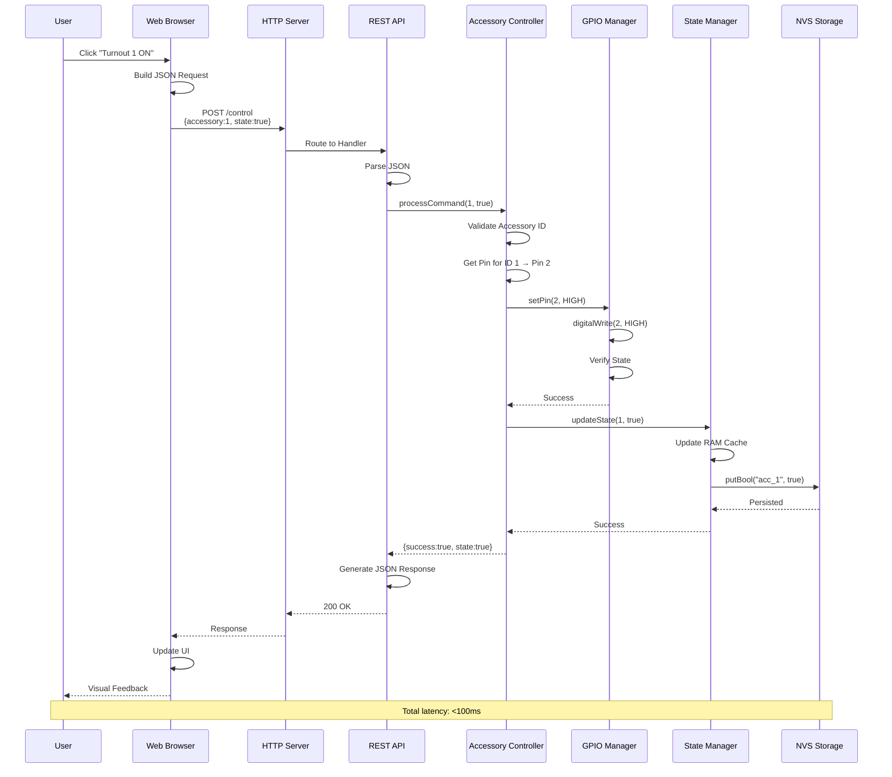
```mermaid
sequenceDiagram
    participant User
    participant Browser as Web Browser
    participant HTTP as HTTP Server
    participant API as REST API
    participant Control as Accessory Controller
    participant GPIO as GPIO Manager
    participant State as State Manager
    participant NVS as NVS Storage
    
    User->>Browser: Click "Turnout 1 ON"
    Browser->>Browser: Build JSON Request
    
    Browser->>HTTP: POST /control<br/>{accessory:1, state:true}
    HTTP->>API: Route to Handler
    
    API->>API: Parse JSON
    API->>Control: processCommand(1, true)
    
    Control->>Control: Validate Accessory ID
    Control->>Control: Get Pin for ID 1 → Pin 2
    
    Control->>GPIO: setPin(2, HIGH)
    GPIO->>GPIO: digitalWrite(2, HIGH)
    GPIO->>GPIO: Verify State
    GPIO-->>Control: Success
    
    Control->>State: updateState(1, true)
    State->>State: Update RAM Cache
    State->>NVS: putBool("acc_1", true)
    NVS-->>State: Persisted
    State-->>Control: Success
    
    Control-->>API: {success:true, state:true}
    API->>API: Generate JSON Response
    API-->>HTTP: 200 OK
    HTTP-->>Browser: Response
    
    Browser->>Browser: Update UI
    Browser-->>User: Visual Feedback
    
    Note over User,NVS: Total latency: <100ms
```

### Multiple Concurrent Requests

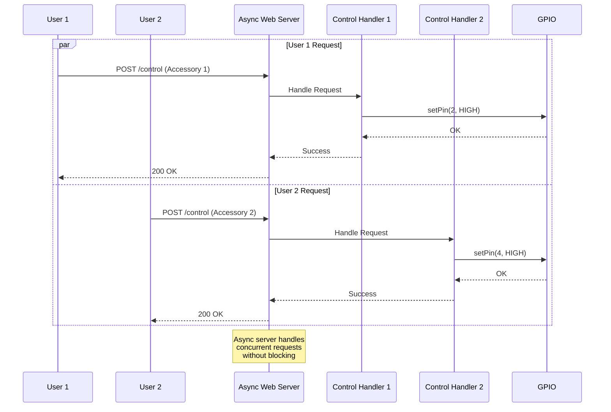
```mermaid
sequenceDiagram
    participant U1 as User 1
    participant U2 as User 2
    participant Server as Async Web Server
    participant C1 as Control Handler 1
    participant C2 as Control Handler 2
    participant GPIO
    
    par User 1 Request
        U1->>Server: POST /control (Accessory 1)
        Server->>C1: Handle Request
        C1->>GPIO: setPin(2, HIGH)
        GPIO-->>C1: OK
        C1-->>Server: Success
        Server-->>U1: 200 OK
    and User 2 Request
        U2->>Server: POST /control (Accessory 2)
        Server->>C2: Handle Request
        C2->>GPIO: setPin(4, HIGH)
        GPIO-->>C2: OK
        C2-->>Server: Success
        Server-->>U2: 200 OK
    end
    
    Note over Server: Async server handles<br/>concurrent requests<br/>without blocking
```

## 6.4 Status Monitoring Scenario

### Client Polls for Status

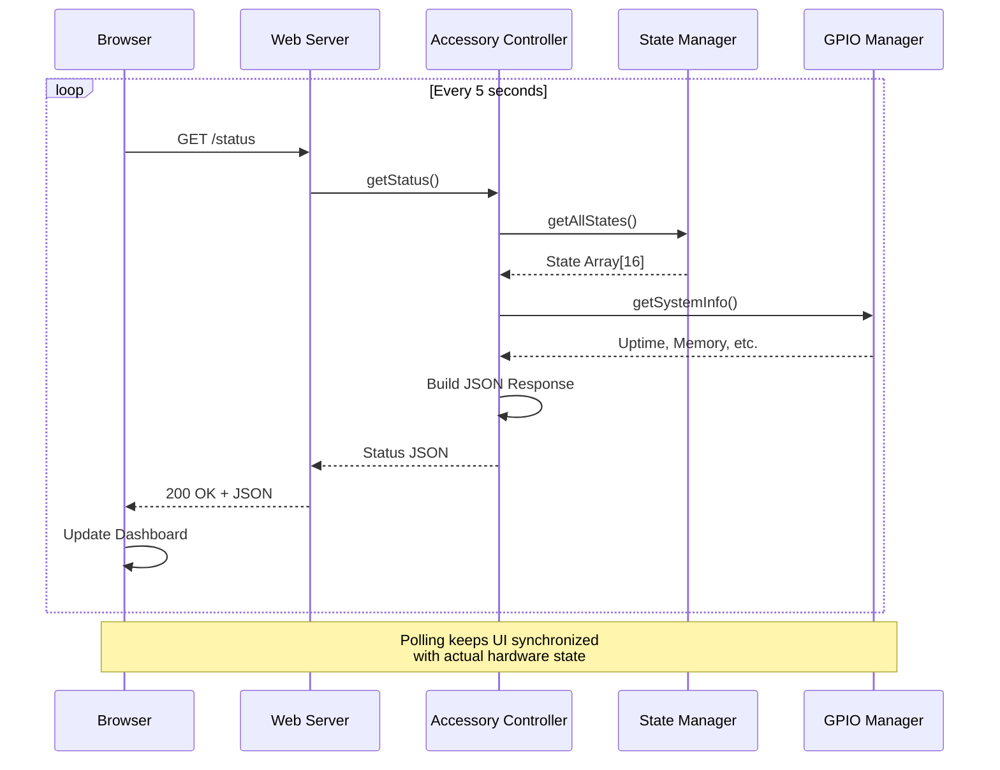
```mermaid
sequenceDiagram
    participant Browser
    participant Server as Web Server
    participant Control as Accessory Controller
    participant State as State Manager
    participant GPIO as GPIO Manager
    
    loop Every 5 seconds
        Browser->>Server: GET /status
        Server->>Control: getStatus()
        
        Control->>State: getAllStates()
        State-->>Control: State Array[16]
        
        Control->>GPIO: getSystemInfo()
        GPIO-->>Control: Uptime, Memory, etc.
        
        Control->>Control: Build JSON Response
        Control-->>Server: Status JSON
        
        Server-->>Browser: 200 OK + JSON
        Browser->>Browser: Update Dashboard
    end
    
    Note over Browser,GPIO: Polling keeps UI synchronized<br/>with actual hardware state
```

### Status Response Format

```json
{
  "hostname": "railhub32-controller",
  "ip": "192.168.1.100",
  "uptime": 3600,
  "freeHeap": 180000,
  "chipId": "A4CF12F1E5AC",
  "accessories": [
    {
      "id": 1,
      "name": "Turnout 1",
      "state": true,
      "pin": 2,
      "lastChanged": 1234567890
    },
    {
      "id": 2,
      "name": "Signal A",
      "state": false,
      "pin": 4,
      "lastChanged": 1234567800
    }
  ]
}
```

## 6.5 Error Handling Scenarios

### Invalid Request Handling

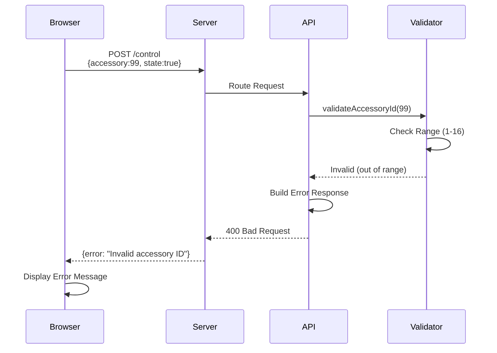
```mermaid
sequenceDiagram
    participant Browser
    participant Server
    participant API
    participant Validator
    
    Browser->>Server: POST /control<br/>{accessory:99, state:true}
    Server->>API: Route Request
    API->>Validator: validateAccessoryId(99)
    Validator->>Validator: Check Range (1-16)
    Validator-->>API: Invalid (out of range)
    
    API->>API: Build Error Response
    API-->>Server: 400 Bad Request
    Server-->>Browser: {error: "Invalid accessory ID"}
    
    Browser->>Browser: Display Error Message
```

### WiFi Connection Failure

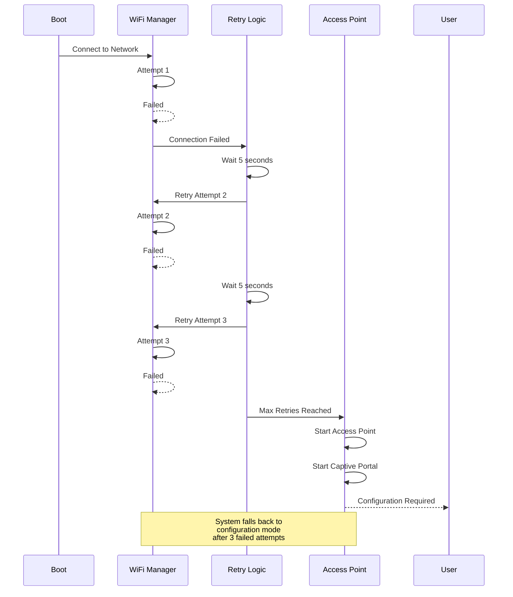
```mermaid
sequenceDiagram
    participant Boot
    participant WiFi as WiFi Manager
    participant Retry as Retry Logic
    participant AP as Access Point
    participant User
    
    Boot->>WiFi: Connect to Network
    WiFi->>WiFi: Attempt 1
    WiFi-->>WiFi: Failed
    
    WiFi->>Retry: Connection Failed
    Retry->>Retry: Wait 5 seconds
    Retry->>WiFi: Retry Attempt 2
    WiFi->>WiFi: Attempt 2
    WiFi-->>WiFi: Failed
    
    Retry->>Retry: Wait 5 seconds
    Retry->>WiFi: Retry Attempt 3
    WiFi->>WiFi: Attempt 3
    WiFi-->>WiFi: Failed
    
    Retry->>AP: Max Retries Reached
    AP->>AP: Start Access Point
    AP->>AP: Start Captive Portal
    AP-->>User: Configuration Required
    
    Note over WiFi,AP: System falls back to<br/>configuration mode<br/>after 3 failed attempts
```

### GPIO Failure Handling

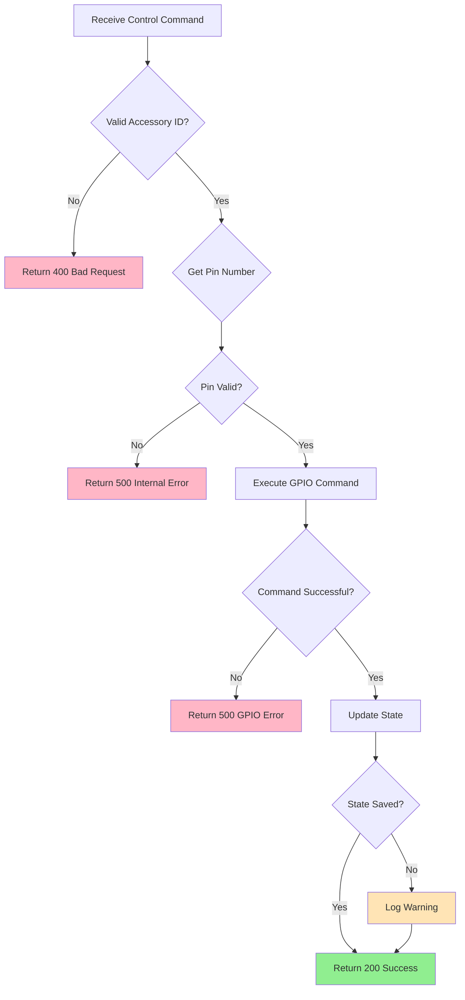
```mermaid
flowchart TD
    A[Receive Control Command] --> B{Valid Accessory ID?}
    B -->|No| E1[Return 400 Bad Request]
    B -->|Yes| C{Get Pin Number}
    
    C --> D{Pin Valid?}
    D -->|No| E2[Return 500 Internal Error]
    D -->|Yes| F[Execute GPIO Command]
    
    F --> G{Command Successful?}
    G -->|No| E3[Return 500 GPIO Error]
    G -->|Yes| H[Update State]
    
    H --> I{State Saved?}
    I -->|No| W[Log Warning]
    I -->|Yes| J[Return 200 Success]
    
    W --> J
    
    style J fill:#90EE90
    style E1 fill:#FFB6C6
    style E2 fill:#FFB6C6
    style E3 fill:#FFB6C6
    style W fill:#FFE4B5
```

## 6.6 State Persistence Scenario

### Save State After Command

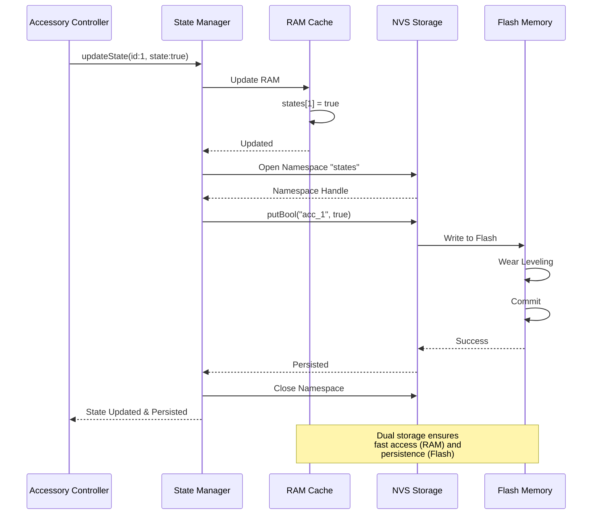
```mermaid
sequenceDiagram
    participant Control as Accessory Controller
    participant State as State Manager
    participant Cache as RAM Cache
    participant NVS as NVS Storage
    participant Flash as Flash Memory
    
    Control->>State: updateState(id:1, state:true)
    
    State->>Cache: Update RAM
    Cache->>Cache: states[1] = true
    Cache-->>State: Updated
    
    State->>NVS: Open Namespace "states"
    NVS-->>State: Namespace Handle
    
    State->>NVS: putBool("acc_1", true)
    NVS->>Flash: Write to Flash
    Flash->>Flash: Wear Leveling
    Flash->>Flash: Commit
    Flash-->>NVS: Success
    NVS-->>State: Persisted
    
    State->>NVS: Close Namespace
    State-->>Control: State Updated & Persisted
    
    Note over Cache,Flash: Dual storage ensures<br/>fast access (RAM) and<br/>persistence (Flash)
```

### Load State on Boot

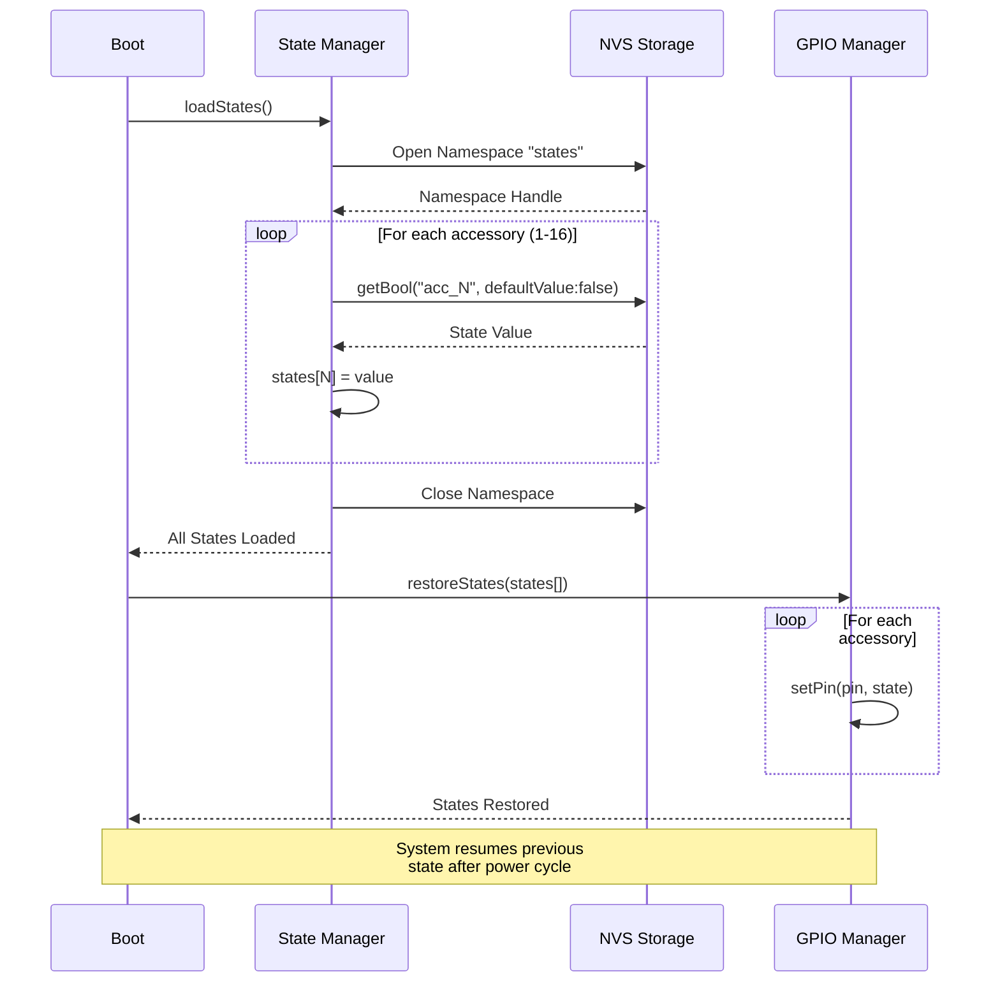
```mermaid
sequenceDiagram
    participant Boot
    participant State as State Manager
    participant NVS as NVS Storage
    participant GPIO as GPIO Manager
    
    Boot->>State: loadStates()
    
    State->>NVS: Open Namespace "states"
    NVS-->>State: Namespace Handle
    
    loop For each accessory (1-16)
        State->>NVS: getBool("acc_N", defaultValue:false)
        NVS-->>State: State Value
        State->>State: states[N] = value
    end
    
    State->>NVS: Close Namespace
    State-->>Boot: All States Loaded
    
    Boot->>GPIO: restoreStates(states[])
    
    loop For each accessory
        GPIO->>GPIO: setPin(pin, state)
    end
    
    GPIO-->>Boot: States Restored
    
    Note over Boot,GPIO: System resumes previous<br/>state after power cycle
```

## 6.7 mDNS Service Discovery

### Client Discovers Controller

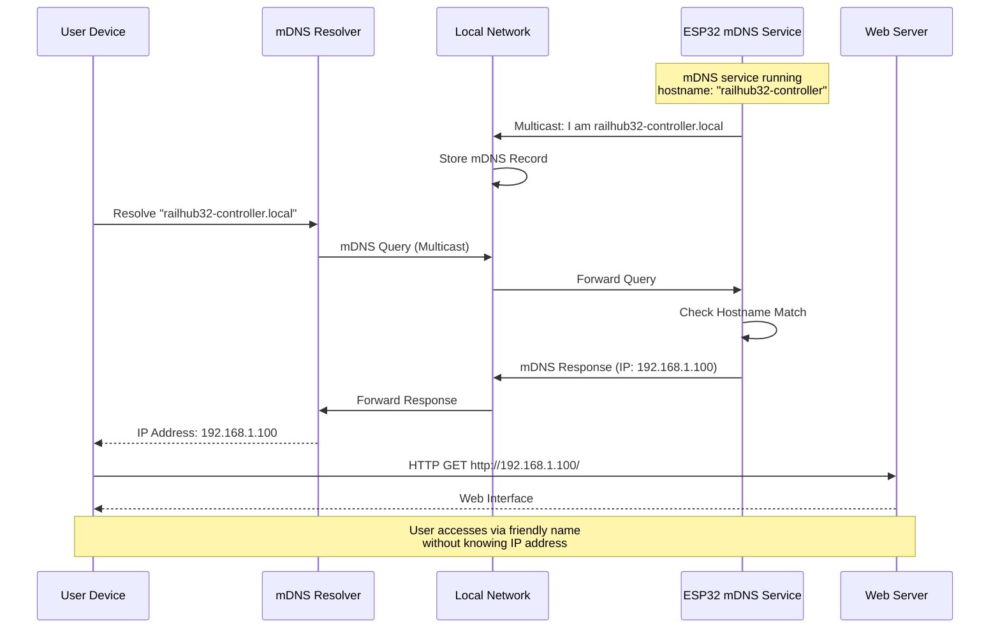
```mermaid
sequenceDiagram
    participant Client as User Device
    participant mDNS as mDNS Resolver
    participant Network as Local Network
    participant ESP as ESP32 mDNS Service
    participant Server as Web Server
    
    Note over ESP: mDNS service running<br/>hostname: "railhub32-controller"
    
    ESP->>Network: Multicast: I am railhub32-controller.local
    Network->>Network: Store mDNS Record
    
    Client->>mDNS: Resolve "railhub32-controller.local"
    mDNS->>Network: mDNS Query (Multicast)
    Network->>ESP: Forward Query
    
    ESP->>ESP: Check Hostname Match
    ESP->>Network: mDNS Response (IP: 192.168.1.100)
    Network->>mDNS: Forward Response
    mDNS-->>Client: IP Address: 192.168.1.100
    
    Client->>Server: HTTP GET http://192.168.1.100/
    Server-->>Client: Web Interface
    
    Note over Client,Server: User accesses via friendly name<br/>without knowing IP address
```

### mDNS Service Advertisement

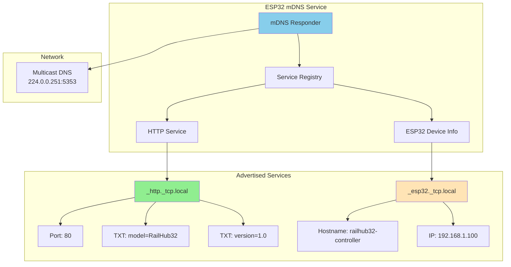
```mermaid
graph TB
    subgraph "ESP32 mDNS Service"
        A[mDNS Responder] --> B[Service Registry]
        B --> C[HTTP Service]
        B --> D[ESP32 Device Info]
    end
    
    subgraph "Advertised Services"
        C --> C1["_http._tcp.local"]
        C1 --> C2[Port: 80]
        C1 --> C3[TXT: model=RailHub32]
        C1 --> C4[TXT: version=1.0]
        
        D --> D1["_esp32._tcp.local"]
        D1 --> D2[Hostname: railhub32-controller]
        D1 --> D3[IP: 192.168.1.100]
    end
    
    subgraph "Network"
        N[Multicast DNS<br/>224.0.0.251:5353]
    end
    
    A --> N
    
    style A fill:#87CEEB
    style C1 fill:#90EE90
    style D1 fill:#FFE4B5
```

## 6.8 Over-The-Air (OTA) Update Scenario

### OTA Update Process

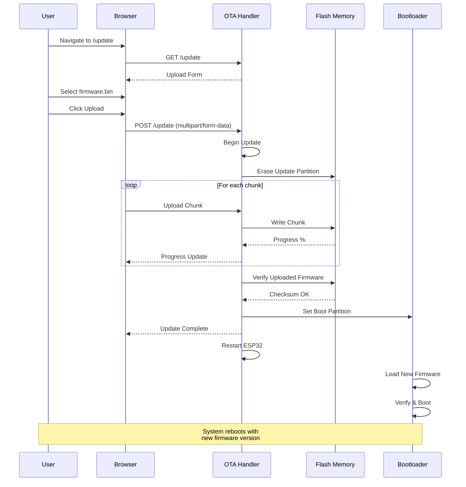
```mermaid
sequenceDiagram
    participant User
    participant Browser
    participant OTA as OTA Handler
    participant Flash as Flash Memory
    participant Boot as Bootloader
    
    User->>Browser: Navigate to /update
    Browser->>OTA: GET /update
    OTA-->>Browser: Upload Form
    
    User->>Browser: Select firmware.bin
    User->>Browser: Click Upload
    
    Browser->>OTA: POST /update (multipart/form-data)
    OTA->>OTA: Begin Update
    OTA->>Flash: Erase Update Partition
    
    loop For each chunk
        Browser->>OTA: Upload Chunk
        OTA->>Flash: Write Chunk
        Flash-->>OTA: Progress %
        OTA-->>Browser: Progress Update
    end
    
    OTA->>Flash: Verify Uploaded Firmware
    Flash-->>OTA: Checksum OK
    
    OTA->>Boot: Set Boot Partition
    OTA-->>Browser: Update Complete
    
    OTA->>OTA: Restart ESP32
    
    Boot->>Boot: Load New Firmware
    Boot->>Boot: Verify & Boot
    
    Note over User,Boot: System reboots with<br/>new firmware version
```

### OTA Update State Machine

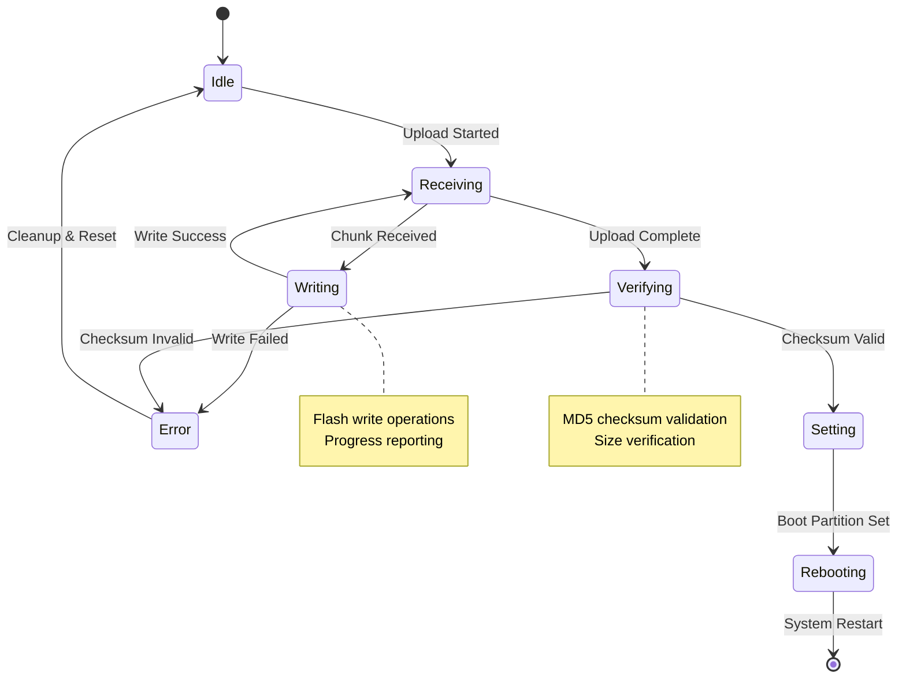
```mermaid
stateDiagram-v2
    [*] --> Idle
    Idle --> Receiving: Upload Started
    Receiving --> Writing: Chunk Received
    Writing --> Receiving: Write Success
    Writing --> Error: Write Failed
    Receiving --> Verifying: Upload Complete
    Verifying --> Setting: Checksum Valid
    Verifying --> Error: Checksum Invalid
    Setting --> Rebooting: Boot Partition Set
    Rebooting --> [*]: System Restart
    Error --> Idle: Cleanup & Reset
    
    note right of Writing
        Flash write operations
        Progress reporting
    end note
    
    note right of Verifying
        MD5 checksum validation
        Size verification
    end note
```

## 6.9 Performance Characteristics

### Response Time Analysis

```mermaid
gantt
    title Typical Request Response Times
    dateFormat SSS
    axisFormat %L ms
    
    section Simple GET
    Network RTT       :net1, 000, 10ms
    Route Lookup      :route1, after net1, 1ms
    Handler Exec      :hand1, after route1, 2ms
    JSON Generation   :json1, after hand1, 3ms
    Response Send     :resp1, after json1, 5ms
    
    section POST Control
    Network RTT       :net2, 000, 10ms
    JSON Parse        :parse2, after net2, 5ms
    Validation        :valid2, after parse2, 2ms
    GPIO Command      :gpio2, after valid2, 1ms
    State Update      :state2, after gpio2, 15ms
    Response          :resp2, after state2, 5ms
    
    section Total Times
    GET: ~20ms, POST: ~40ms
```

### Throughput Capacity

| Operation | Latency | Throughput | Notes |
|-----------|---------|------------|-------|
| **Simple GET** | 20ms | 50 req/s | Status queries |
| **POST Control** | 40ms | 25 req/s | GPIO + state update |
| **Concurrent Requests** | Variable | 10-15 req/s | Async handling |
| **mDNS Query** | 100-200ms | - | First query only |
| **State Persistence** | 15ms | - | NVS write operation |
| **Boot Time** | 2.5s | - | Cold start |
