# 7. Deployment View

## 7.1 Infrastructure Overview

### Physical Deployment

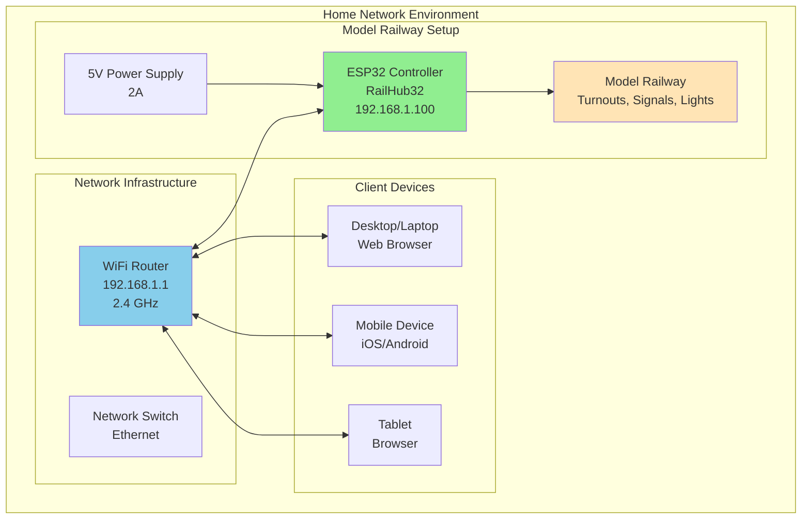

### Deployment Topology

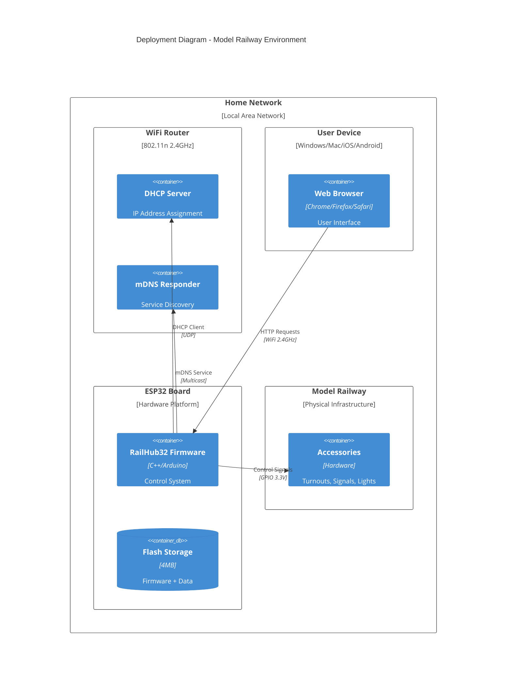

## 7.2 Hardware Requirements

### ESP32 Controller Board

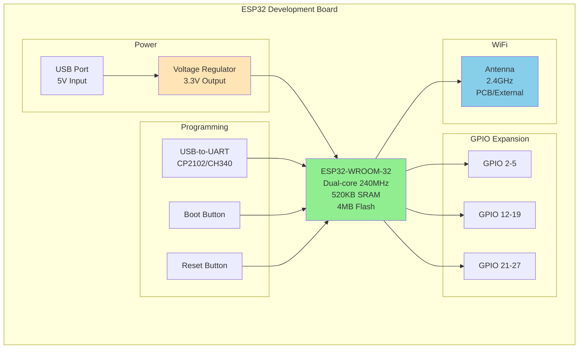

| Component | Specification | Purpose |
|-----------|--------------|---------|
| **Microcontroller** | ESP32-WROOM-32 | Main processor |
| **CPU** | Dual-core Xtensa LX6 @ 240MHz | Application execution |
| **RAM** | 520 KB SRAM | Runtime memory |
| **Flash** | 4 MB SPI Flash | Firmware + data storage |
| **WiFi** | 802.11 b/g/n 2.4GHz | Network connectivity |
| **GPIO** | 34 pins (subset usable) | Accessory control |
| **Power** | 5V USB or VIN, 3.3V regulated | System power |
| **Programming** | USB-to-UART (CP2102/CH340) | Firmware upload |

### Recommended Boards

- **ESP32 DevKitC**: Standard development board, widely available
- **ESP32-WROOM-32**: Core module for custom PCB
- **NodeMCU-32S**: Alternative with similar pinout
- **ESP32-DevKitC-VE**: With external antenna connector

### Power Supply Requirements

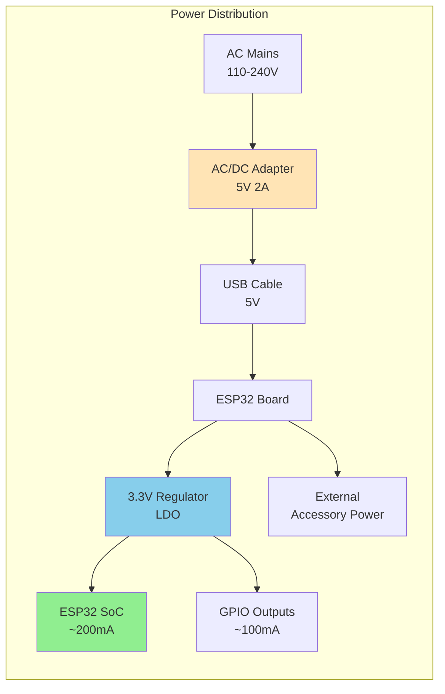

| Component | Voltage | Current | Notes |
|-----------|---------|---------|-------|
| **ESP32 Core** | 3.3V | 80-260mA | Variable with WiFi activity |
| **WiFi TX** | 3.3V | +170mA | Peak during transmission |
| **GPIO Outputs** | 3.3V | Max 40mA per pin | Total max 200mA |
| **Total System** | 5V | 500mA typical | 2A recommended for safety margin |

## 7.3 Network Deployment

### Network Architecture

```mermaid
graph TB
    subgraph "Internet"
        ISP[Internet Service Provider]
    end
    
    subgraph "Home Network - 192.168.1.0/24"
        Router[WiFi Router/Gateway<br/>192.168.1.1]
        
        subgraph "WiFi Clients - 2.4GHz"
            ESP[ESP32 RailHub32<br/>192.168.1.100<br/>railhub32-controller.local]
            Phone[Smartphone<br/>192.168.1.101]
            Laptop[Laptop<br/>192.168.1.102]
        end
        
        subgraph "Wired Clients"
            Desktop[Desktop PC<br/>192.168.1.10]
        end
    end
    
    ISP <--> Router
    Router <-.WiFi 2.4GHz.-> ESP
    Router <-.WiFi.-> Phone
    Router <-.WiFi.-> Laptop
    Router ---|Ethernet| Desktop
    
    Phone -.HTTP.-> ESP
    Laptop -.HTTP.-> ESP
    Desktop -.HTTP.-> ESP
    
    style ESP fill:#90EE90
    style Router fill:#87CEEB
```

### Network Configuration

| Setting | Value | Description |
|---------|-------|-------------|
| **IP Assignment** | DHCP (default) | Automatic IP from router |
| **Static IP** | Optional | Can be configured via router |
| **Subnet** | 192.168.1.0/24 | Typical home network |
| **Gateway** | 192.168.1.1 | Router IP address |
| **DNS** | Router/ISP | Not critical for local operation |
| **Hostname** | railhub32-{chipid} | Configurable, sanitized |
| **mDNS** | {hostname}.local | Automatic service discovery |
| **Port** | 80 (HTTP) | Web server port |

### Firewall Requirements

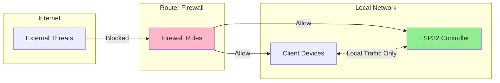

**Firewall Rules:**
- ✅ Allow: Local network → ESP32 port 80 (HTTP)
- ✅ Allow: ESP32 → Router (DHCP, DNS)
- ✅ Allow: mDNS multicast (224.0.0.251:5353)
- ❌ Block: Internet → ESP32 (no port forwarding)
- ❌ Block: ESP32 → Internet (optional, for security)

## 7.4 Software Deployment

### Firmware Installation Methods

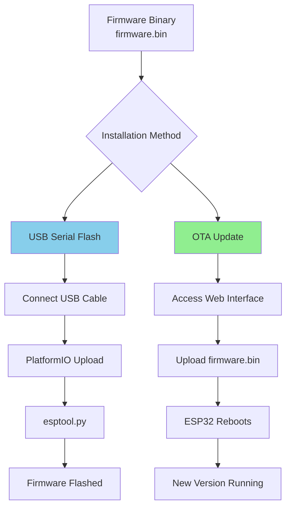

#### Method 1: USB Serial Flash (Initial Setup)

```bash
# Using PlatformIO
pio run --target upload

# Using esptool.py
esptool.py --chip esp32 --port COM8 write_flash 0x10000 firmware.bin

# Using ESP Flash Download Tool (Windows GUI)
# - Select firmware.bin at address 0x10000
# - Click "Start" to flash
```

#### Method 2: Over-The-Air (OTA) Update

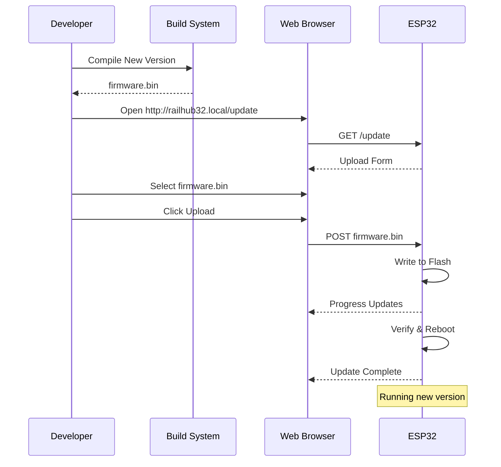

### Deployment Steps

#### Initial Deployment

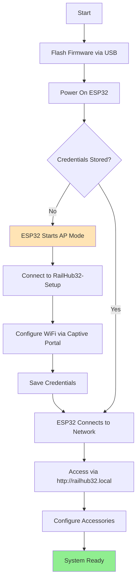

**Step-by-Step:**

1. **Prepare Hardware**
   - Connect ESP32 to computer via USB
   - Install USB drivers if needed (CP2102/CH340)

2. **Flash Firmware**
   ```bash
   cd esp32-controller
   pio run --target upload
   ```

3. **Initial Configuration**
   - ESP32 boots and starts AP mode
   - Connect to WiFi network "RailHub32-Setup"
   - Browser opens captive portal automatically
   - Select home WiFi network and enter password
   - Click "Save"

4. **Verify Deployment**
   - ESP32 connects to home network
   - Find IP address in serial monitor or router
   - Access web interface via mDNS: `http://railhub32-controller.local`

5. **Configure Accessories**
   - Name each accessory (Turnout 1, Signal A, etc.)
   - Test each GPIO output
   - Save configuration

#### Update Deployment

```bash
# Build new firmware
cd esp32-controller
pio run

# Locate firmware binary
# .pio/build/esp32dev/firmware.bin

# Upload via web interface
# http://railhub32.local/update
```

## 7.5 Physical Installation

### Wiring Diagram

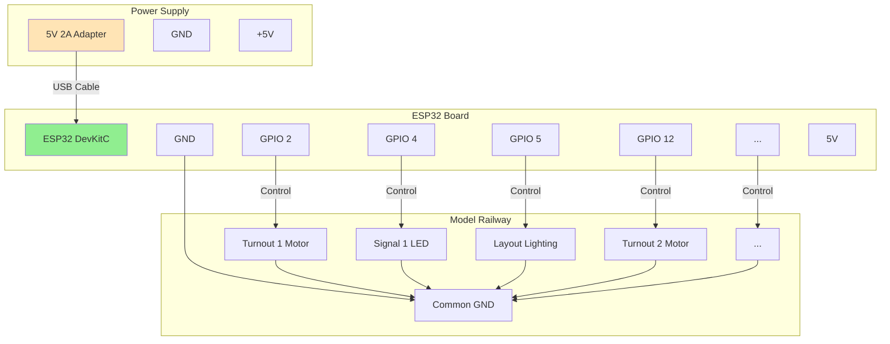

### Installation Checklist

- [ ] **Power Supply**: 5V 2A minimum, quality adapter recommended
- [ ] **USB Cable**: Good quality, short length preferred
- [ ] **Mounting**: Secure ESP32 board away from moisture
- [ ] **GPIO Connections**: Proper gauge wire, soldered or screw terminals
- [ ] **Common Ground**: All accessories share common ground with ESP32
- [ ] **Current Limiting**: Resistors for LEDs, proper drivers for motors
- [ ] **Isolation**: Consider optocouplers for high-voltage accessories
- [ ] **Labels**: Mark all connections for troubleshooting
- [ ] **Cable Management**: Organize wires to prevent shorts
- [ ] **Ventilation**: Ensure adequate cooling for ESP32

### Safety Considerations

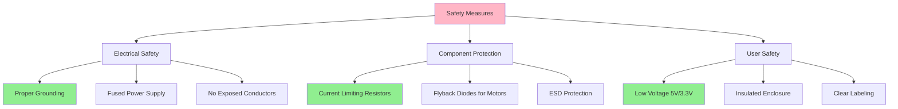

## 7.6 Scaling and Distribution

### Single Controller Deployment

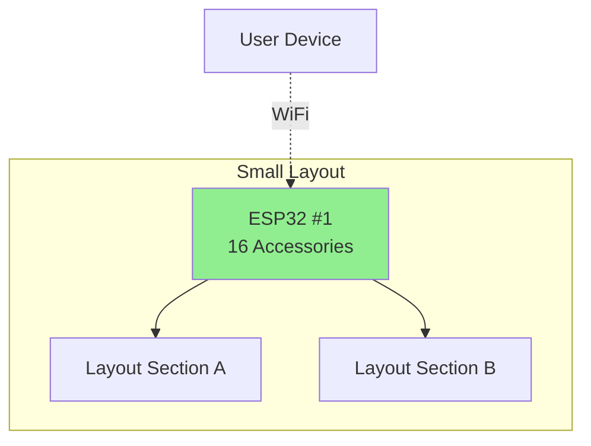

### Multiple Controller Deployment (Future)

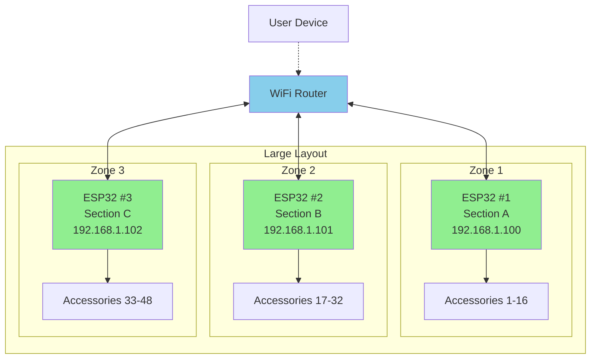

### Multi-Controller Considerations

| Aspect | Current (v1) | Future (v2+) |
|--------|-------------|--------------|
| **Coordination** | Manual, separate interfaces | Synchronized via MQTT |
| **Discovery** | Individual mDNS names | Central controller registry |
| **State Sync** | Independent | Shared state via message bus |
| **Failover** | N/A | Redundancy for critical sections |
| **Scalability** | Up to 16 accessories | Unlimited with multiple units |
