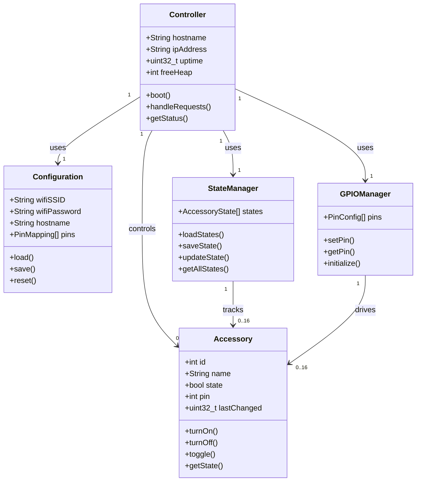
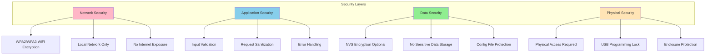
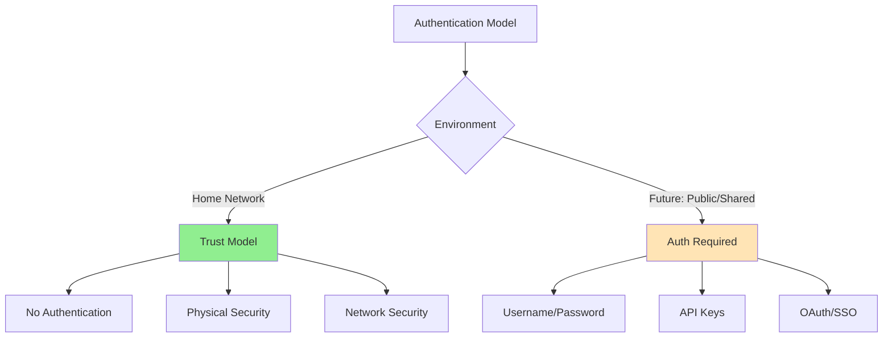
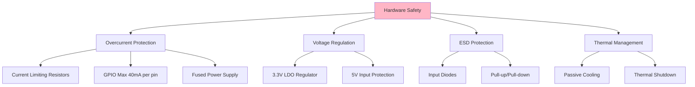
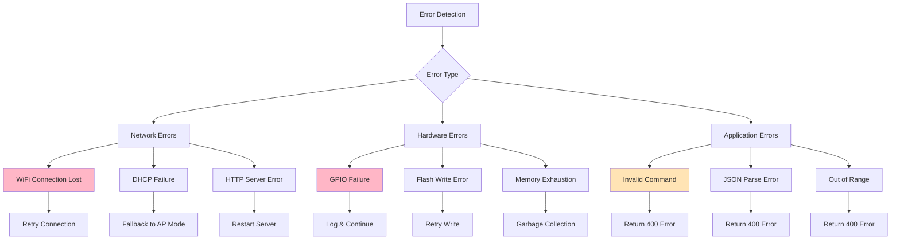
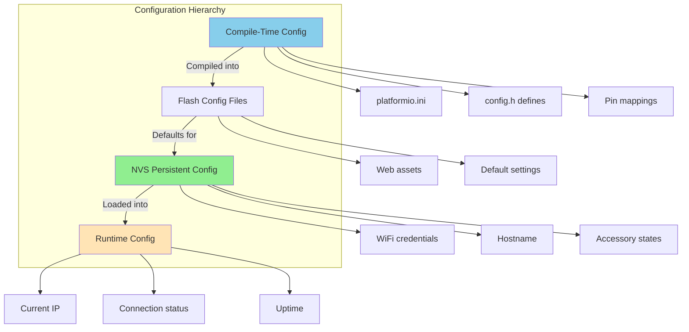
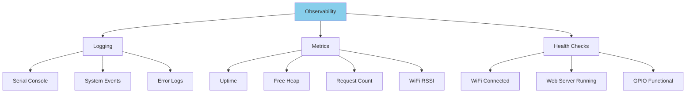
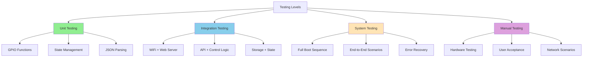
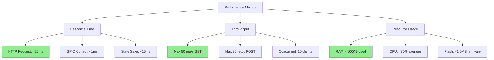
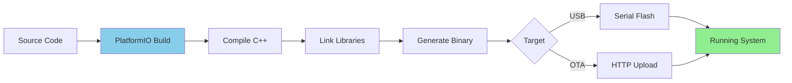

# 8. Cross-cutting Concepts

## 8.1 Domain Model

### Core Domain Entities



### Value Objects and Entities

| Concept | Type | Description |
|---------|------|-------------|
| **Accessory** | Entity | Model railway component (turnout, signal, light) |
| **Controller** | Entity | ESP32 hardware instance |
| **Configuration** | Value Object | System settings (WiFi, hostname, pins) |
| **AccessoryState** | Value Object | Current state of accessory (ON/OFF) |
| **PinMapping** | Value Object | Accessory ID to GPIO pin mapping |
| **Command** | Value Object | User control command (id, state) |
| **Status** | Value Object | System status snapshot |

## 8.2 Security and Safety

### Security Architecture



### Security Principles

#### 1. Network Isolation


**Measures:**
- No port forwarding from internet
- WiFi WPA2/WPA3 encryption mandatory
- mDNS local network only
- No cloud connectivity required

#### 2. Input Validation

```cpp
// Example input validation
bool AccessoryController::validateCommand(JsonObject& cmd) {
    // Validate accessory ID
    if (!cmd.containsKey("accessory")) {
        return false;
    }
    int id = cmd["accessory"];
    if (id < 1 || id > MAX_ACCESSORIES) {
        return false;
    }
    
    // Validate state
    if (!cmd.containsKey("state")) {
        return false;
    }
    if (!cmd["state"].is<bool>()) {
        return false;
    }
    
    return true;
}
```

#### 3. Authentication Model



**Current (v1):**
- ❌ No authentication required
- ✅ Trust local network
- ✅ Physical access implies authorization
- ⚠️ Not suitable for shared networks

**Future (v2+):**
- Basic authentication (username/password)
- API key support for integrations
- Optional OAuth for home automation systems

### Safety Mechanisms

#### Hardware Protection



#### Software Safety

- **Watchdog Timer**: Automatic restart on hang (30s timeout)
- **Error Recovery**: Graceful degradation on component failure
- **State Persistence**: Prevents unexpected state on reboot
- **Input Bounds Checking**: Prevent out-of-range GPIO access

## 8.3 Error and Exception Handling

### Error Handling Strategy



### Error Response Format

```json
{
  "success": false,
  "error": {
    "code": "INVALID_ACCESSORY",
    "message": "Accessory ID must be between 1 and 16",
    "details": {
      "received": 99,
      "min": 1,
      "max": 16
    }
  }
}
```

### Exception Categories

| Category | Severity | Handling Strategy | User Impact |
|----------|----------|-------------------|-------------|
| **Critical** | System halt | Restart ESP32 | Service interruption |
| **Error** | Operation failure | Log & return error | Operation denied |
| **Warning** | Degraded function | Log & continue | Reduced functionality |
| **Info** | Normal operation | Log only | None |

### Logging Levels

```cpp
// Logging configuration
#define LOG_LEVEL_ERROR   1
#define LOG_LEVEL_WARNING 2
#define LOG_LEVEL_INFO    3
#define LOG_LEVEL_DEBUG   4

#if LOG_LEVEL >= LOG_LEVEL_ERROR
  #define LOG_ERROR(msg) Serial.println("[ERROR] " + String(msg))
#else
  #define LOG_ERROR(msg)
#endif

#if LOG_LEVEL >= LOG_LEVEL_WARNING
  #define LOG_WARNING(msg) Serial.println("[WARN] " + String(msg))
#else
  #define LOG_WARNING(msg)
#endif
```

## 8.4 Configuration Management

### Configuration Layers



### Configuration Sources

#### 1. Build-Time Configuration (platformio.ini)

```ini
[env:esp32dev]
platform = espressif32
board = esp32dev
framework = arduino

; Build flags
build_flags = 
    -DCORE_DEBUG_LEVEL=0
    -DMAX_ACCESSORIES=16
    -DWIFI_TIMEOUT=10000
    
; Upload settings
upload_speed = 921600
monitor_speed = 115200
```

#### 2. Source Code Configuration (config.h)

```cpp
// config.h
#ifndef CONFIG_H
#define CONFIG_H

// GPIO Pin Mapping
const int GPIO_PINS[MAX_ACCESSORIES] = {
    2, 4, 5, 12, 13, 14, 15, 16,
    17, 18, 19, 21, 22, 23, 25, 26
};

// Network Configuration
#define DEFAULT_HOSTNAME "railhub32"
#define AP_SSID_PREFIX "RailHub32-Setup"
#define MDNS_ENABLED true

// Timeouts
#define WIFI_CONNECT_TIMEOUT 10000
#define HTTP_REQUEST_TIMEOUT 5000
#define STATE_SAVE_INTERVAL 1000

#endif
```

#### 3. Runtime Configuration (NVS)

```cpp
class ConfigManager {
private:
    Preferences prefs;
    
public:
    void saveWiFiCredentials(String ssid, String password) {
        prefs.begin("wifi", false);
        prefs.putString("ssid", ssid);
        prefs.putString("password", password);
        prefs.end();
    }
    
    void loadWiFiCredentials(String& ssid, String& password) {
        prefs.begin("wifi", true);
        ssid = prefs.getString("ssid", "");
        password = prefs.getString("password", "");
        prefs.end();
    }
    
    void setHostname(String hostname) {
        prefs.begin("config", false);
        prefs.putString("hostname", hostname);
        prefs.end();
    }
};
```

## 8.5 Observability and Monitoring

### Monitoring Strategy



### System Metrics

```cpp
struct SystemMetrics {
    uint32_t uptime;          // Milliseconds since boot
    uint32_t freeHeap;        // Free RAM in bytes
    int8_t wifiRSSI;          // WiFi signal strength (dBm)
    uint32_t requestCount;    // Total HTTP requests
    uint32_t errorCount;      // Total errors
    float cpuTemp;            // CPU temperature (°C)
};

SystemMetrics getMetrics() {
    SystemMetrics metrics;
    metrics.uptime = millis();
    metrics.freeHeap = ESP.getFreeHeap();
    metrics.wifiRSSI = WiFi.RSSI();
    metrics.cpuTemp = temperatureRead();
    return metrics;
}
```

### Health Check Endpoint

```json
GET /health

{
  "status": "healthy",
  "checks": {
    "wifi": {
      "status": "connected",
      "rssi": -45,
      "ip": "192.168.1.100"
    },
    "web_server": {
      "status": "running",
      "requests": 1234
    },
    "memory": {
      "status": "ok",
      "free_heap": 180000,
      "heap_fragmentation": 5
    },
    "storage": {
      "status": "ok",
      "flash_used": 60
    }
  },
  "uptime": 3600
}
```

## 8.6 Testability

### Testing Strategies



### Testability Features

- **Modular Design**: Independent components can be tested in isolation
- **Dependency Injection**: Mock dependencies for unit tests
- **Serial Debugging**: Rich debug output via serial console
- **Test Endpoints**: Special HTTP endpoints for testing (disabled in production)
- **State Inspection**: Ability to dump and inspect internal state

### Mock Infrastructure

```cpp
// Mock GPIO for testing
class MockGPIO : public IGPIOManager {
private:
    bool pinStates[34];
    
public:
    bool setPin(uint8_t pin, bool state) override {
        if (pin >= 34) return false;
        pinStates[pin] = state;
        return true;
    }
    
    bool getPin(uint8_t pin) override {
        if (pin >= 34) return false;
        return pinStates[pin];
    }
    
    // Test helper
    bool getPinState(uint8_t pin) {
        return pinStates[pin];
    }
};
```

## 8.7 Performance and Scalability

### Performance Characteristics



### Scalability Limits

| Resource | Limit | Constraint |
|----------|-------|------------|
| **Accessories** | 16 | GPIO pin availability |
| **Concurrent Clients** | 10-15 | RAM + CPU |
| **Requests/Second** | 25-50 | Async server capacity |
| **State Updates/Sec** | 100 | NVS write speed |
| **WiFi Range** | 30-50m | Hardware limitation |
| **Firmware Size** | 1.5 MB | Flash partition |

### Optimization Techniques

```cpp
// 1. Minimize dynamic allocation
static char buffer[256];  // Reusable buffer

// 2. Use const for string literals
const char* const ERROR_MSG = "Invalid request";

// 3. Efficient JSON serialization
StaticJsonDocument<512> doc;  // Stack allocation, fixed size

// 4. Async operations
server.on("/control", HTTP_POST, [](AsyncWebServerRequest *request){
    // Non-blocking handler
});

// 5. Batch state saves
#define STATE_SAVE_INTERVAL 1000  // Save at most once per second
```

## 8.8 Development and Build Process

### Build Pipeline



### Dependency Management

```ini
; platformio.ini
[env:esp32dev]
lib_deps = 
    ESP Async WebServer @ 3.6.0
    ESPAsyncWiFiManager @ 0.31.0
    ArduinoJson @ 7.3.0
    ESP32 Arduino Core @ 3.x
```

### Versioning Strategy

```cpp
// Version information
#define FIRMWARE_VERSION "1.0.0"
#define BUILD_DATE __DATE__
#define BUILD_TIME __TIME__

String getVersionInfo() {
    return "RailHub32 v" + String(FIRMWARE_VERSION) + 
           " (" + String(BUILD_DATE) + " " + String(BUILD_TIME) + ")";
}
```
