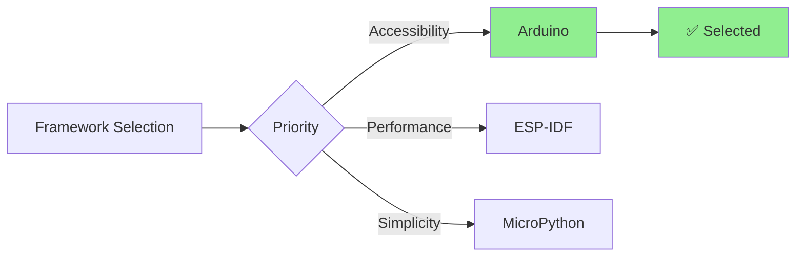
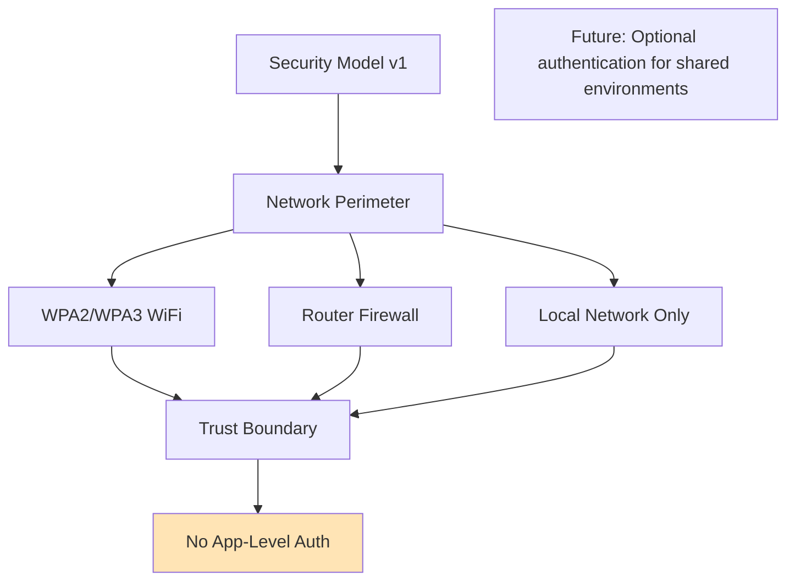
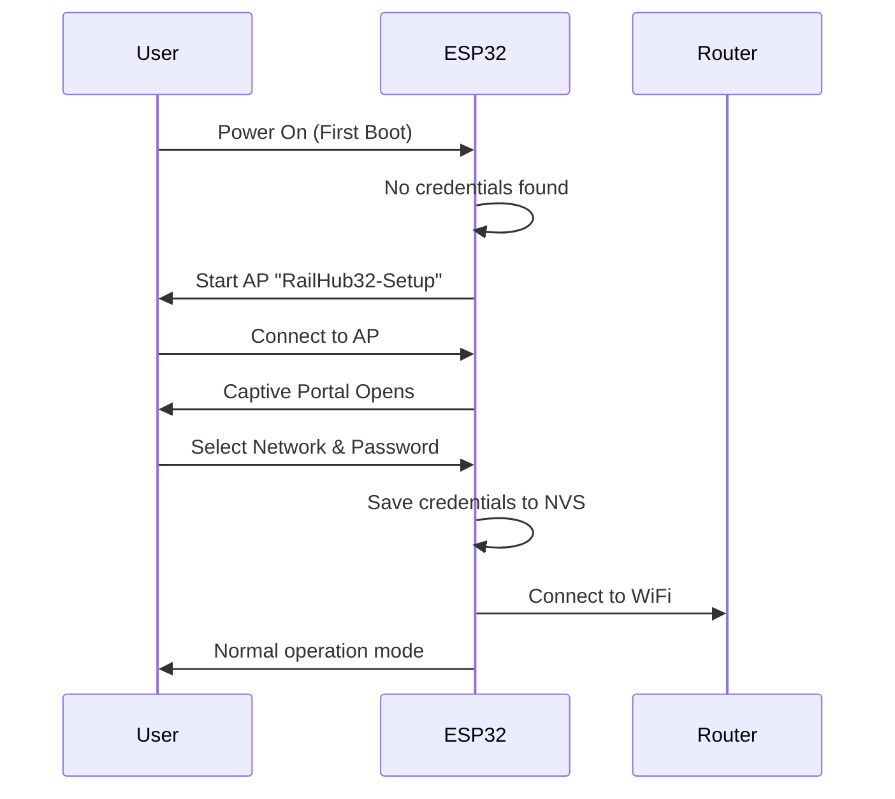
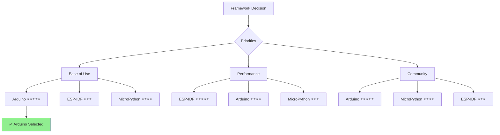

# 9. Architecture Decisions

## 9.1 Decision Log

### ADR-001: ESP32 as Hardware Platform

**Status**: ✅ Accepted

**Context**:
Need to select a microcontroller platform for WiFi-enabled model railway control.

**Decision**:
Use ESP32 (ESP32-WROOM-32) as the hardware platform.

**Alternatives Considered**:
- ESP8266: Lower cost but less GPIO, less RAM
- Arduino + WiFi Shield: More expensive, complex assembly
- Raspberry Pi: Overkill, higher power consumption, higher cost
- STM32 + WiFi module: More complex, less ecosystem support

**Consequences**:
- ✅ Low cost (~$5)
- ✅ Integrated WiFi 802.11n
- ✅ Sufficient GPIO (34 pins)
- ✅ Adequate RAM (520 KB) and Flash (4 MB)
- ✅ Large community and ecosystem
- ✅ Arduino framework support
- ❌ 2.4 GHz only (no 5 GHz)
- ❌ Limited to 40mA per GPIO pin

**Rationale**:
Best balance of cost, capabilities, and ease of development for hobby/DIY projects.

---

### ADR-002: Arduino Framework over ESP-IDF

**Status**: ✅ Accepted

**Context**:
Need to choose development framework for ESP32.

**Decision**:
Use Arduino framework instead of native ESP-IDF.

**Alternatives Considered**:
- ESP-IDF: Native Espressif framework, more control
- MicroPython: Easier for beginners, slower performance
- Lua/NodeMCU: Limited libraries

**Consequences**:
- ✅ Lower barrier to entry for contributors
- ✅ Extensive library ecosystem (1000+ libraries)
- ✅ Familiar API for Arduino developers
- ✅ Quick prototyping and development
- ✅ Cross-platform compatibility
- ❌ Less control over low-level features
- ❌ Slightly larger binary size
- ❌ Some ESP32-specific features abstracted away

**Rationale**:
Accessibility and ease of development outweigh the need for low-level control in this use case.



---

### ADR-003: ESPAsyncWebServer

**Status**: ✅ Accepted

**Context**:
Need HTTP server for web interface and API.

**Decision**:
Use ESPAsyncWebServer library for asynchronous HTTP handling.

**Alternatives Considered**:
- ESP32 WebServer (synchronous): Simpler but blocking
- Custom HTTP server: Too much effort
- Third-party cloud service: Requires internet, privacy concerns

**Consequences**:
- ✅ Non-blocking request handling
- ✅ Better performance with concurrent requests
- ✅ Lower latency for control commands
- ✅ Efficient resource utilization
- ❌ More complex programming model
- ❌ Larger code footprint (~30KB)
- ❌ Requires understanding of async patterns

**Rationale**:
Responsive user experience requires non-blocking I/O, especially when multiple users access the system.

```cpp
// Async vs Sync comparison
// Sync (blocking):
server.handleClient();  // Blocks until request complete

// Async (non-blocking):
server.on("/control", HTTP_POST, handleControl);
// Continues immediately, callback executed when ready
```

---

### ADR-004: JSON REST API

**Status**: ✅ Accepted

**Context**:
Need API format for communication between web interface and controller.

**Decision**:
Use JSON-based REST API over HTTP.

**Alternatives Considered**:
- Binary protocol: More efficient but harder to debug
- XML: Verbose, parsing overhead
- Plain text: Limited structure
- WebSocket: More complex, not needed yet
- MQTT: Requires broker, adds complexity

**Consequences**:
- ✅ Human-readable format
- ✅ Easy to debug with browser tools
- ✅ Language-agnostic (JavaScript, Python, etc.)
- ✅ Well-supported by libraries (ArduinoJson)
- ✅ RESTful principles (GET, POST)
- ❌ Larger payload than binary
- ❌ JSON parsing overhead
- ❌ No real-time push updates (polling required)

**Rationale**:
Simplicity, debuggability, and universal support trump efficiency concerns for this low-traffic application.

---

### ADR-005: No Authentication (v1)

**Status**: ✅ Accepted (with caveats)

**Context**:
Need to decide on access control mechanism for web interface.

**Decision**:
No authentication required for version 1.0 - trust local network.

**Alternatives Considered**:
- Basic HTTP Authentication: Simple username/password
- API Keys: Token-based access
- OAuth: Too complex for local use
- Client certificates: Overkill

**Consequences**:
- ✅ Simple user experience (no login required)
- ✅ Faster development (no credential management)
- ✅ No password management burden
- ✅ Suitable for trusted home networks
- ⚠️ Anyone on network can control system
- ⚠️ Not suitable for shared/public networks
- ⚠️ No audit trail of who did what
- 🔄 Plan to add optional authentication in v2

**Rationale**:
Model railway layouts are typically in home environments with trusted users. Physical access to layout implies authorization.



**Security Recommendations**:
- Use WPA2/WPA3 WiFi encryption
- Do not expose to internet (no port forwarding)
- Consider network segmentation for shared environments
- Physical security of ESP32 device

---

### ADR-006: mDNS for Service Discovery

**Status**: ✅ Accepted

**Context**:
Users need easy way to access controller without knowing IP address.

**Decision**:
Implement mDNS (Bonjour) service discovery with .local hostname.

**Alternatives Considered**:
- Static IP: User must configure, fragile
- Dynamic DNS: Requires internet, complexity
- QR code with IP: Manual scanning, not dynamic
- Broadcast discovery: Custom protocol needed

**Consequences**:
- ✅ Access via friendly name (railhub32.local)
- ✅ Works automatically on most platforms
- ✅ No manual IP configuration
- ✅ Standard protocol (RFC 6762)
- ❌ Requires mDNS support on client (available on most modern OS)
- ❌ May not work on some Android versions
- ❌ Additional RAM usage (~10KB)

**Platform Compatibility**:
- ✅ macOS: Native support
- ✅ iOS: Native support
- ✅ Windows 10+: With Bonjour service
- ✅ Linux: With Avahi daemon
- ⚠️ Android: Hit-or-miss, browser-dependent

**Fallback**: Serial console displays IP address for manual entry.

---

### ADR-007: NVS for State Persistence

**Status**: ✅ Accepted

**Context**:
Need to persist accessory states and configuration across reboots.

**Decision**:
Use ESP32 NVS (Non-Volatile Storage) for persistent data.

**Alternatives Considered**:
- SPIFFS/LittleFS: File-based, more overhead
- EEPROM emulation: Limited size, wear concerns
- External storage (SD card): Additional hardware
- Cloud storage: Requires internet

**Consequences**:
- ✅ Built-in wear leveling
- ✅ Power-fail safe writes
- ✅ Fast read/write operations
- ✅ No file system overhead
- ✅ Namespaces for organization
- ❌ Limited to simple key-value pairs
- ❌ Not suitable for large data
- ❌ ~500 KB usable space

**Use Cases**:
- WiFi credentials
- Hostname configuration
- Accessory states (16 × 1 byte)
- Last known IP address

```cpp
// NVS usage example
Preferences prefs;
prefs.begin("states", false);  // Namespace "states", read-write
prefs.putBool("acc_1", true);   // Save state
bool state = prefs.getBool("acc_1", false);  // Load state
prefs.end();
```

---

### ADR-008: Single-File Architecture (main.cpp)

**Status**: ✅ Accepted (for v1)

**Context**:
Need to organize code structure for maintainability.

**Decision**:
Keep all code in single main.cpp file for version 1.0.

**Alternatives Considered**:
- Multi-file modular structure: Better organization
- Header-only libraries: Reusable components
- Separate library files: More professional

**Consequences**:
- ✅ Simpler for beginners to understand
- ✅ All code visible in one place
- ✅ Faster compilation (single translation unit)
- ✅ Easier to share and deploy
- ❌ Harder to maintain as code grows
- ❌ Limited reusability
- ❌ Namespace pollution
- 🔄 Plan to refactor into modules in v2

**Rationale**:
For initial version, simplicity and accessibility are prioritized. Refactor to modules when complexity warrants it.

---

### ADR-009: Captive Portal for WiFi Setup

**Status**: ✅ Accepted

**Context**:
Users need easy way to configure WiFi credentials without hardcoding.

**Decision**:
Use ESPAsyncWiFiManager captive portal for first-time setup.

**Alternatives Considered**:
- Hardcoded credentials: Not user-friendly
- WPS: Not all routers support
- Bluetooth setup: Additional complexity
- USB serial configuration: Requires computer

**Consequences**:
- ✅ Zero-configuration setup experience
- ✅ Works on any device with WiFi
- ✅ Captive portal auto-opens on most devices
- ✅ List of available networks shown
- ✅ Persistent credentials storage
- ❌ Requires understanding of WiFi networks
- ❌ Some captive portal detection issues on Android

**User Flow**:


---

### ADR-010: PlatformIO as Build System

**Status**: ✅ Accepted

**Context**:
Need build system and dependency manager for development.

**Decision**:
Use PlatformIO instead of Arduino IDE.

**Alternatives Considered**:
- Arduino IDE: Simpler but limited features
- ESP-IDF: Native build system, steeper learning curve
- Make/CMake: Manual dependency management
- Arduino CLI: Command-line only

**Consequences**:
- ✅ Professional development environment
- ✅ Automatic library dependency management
- ✅ Multiple environment support
- ✅ CLI and VS Code integration
- ✅ Advanced features (unit testing, debugging)
- ✅ Reproducible builds
- ❌ Steeper learning curve than Arduino IDE
- ❌ Requires Python installation

**Benefits for Contributors**:
- Consistent build environment
- Automatic dependency resolution
- Easy contribution workflow
- Version-controlled library dependencies

```ini
; platformio.ini defines everything
[env:esp32dev]
platform = espressif32 @ 6.12.0
framework = arduino
lib_deps = 
    ESP Async WebServer @ 3.6.0
    ArduinoJson @ 7.3.0
```

---

## 9.2 Decision Matrix

### Technology Comparison

| Criteria | ESP32 | ESP8266 | Arduino | RPi |
|----------|-------|---------|---------|-----|
| **Cost** | ⭐⭐⭐⭐⭐ $5 | ⭐⭐⭐⭐⭐ $3 | ⭐⭐⭐ $25 | ⭐⭐ $35 |
| **WiFi** | ✅ Built-in | ✅ Built-in | ❌ Shield needed | ✅ Built-in |
| **GPIO** | ⭐⭐⭐⭐⭐ 34 pins | ⭐⭐⭐ 17 pins | ⭐⭐⭐⭐ 20 pins | ⭐⭐⭐⭐⭐ 40 pins |
| **RAM** | ⭐⭐⭐⭐ 520 KB | ⭐⭐⭐ 80 KB | ⭐⭐ 2 KB | ⭐⭐⭐⭐⭐ 1 GB |
| **Power** | ⭐⭐⭐⭐ 500 mA | ⭐⭐⭐⭐⭐ 300 mA | ⭐⭐⭐⭐ 50 mA | ⭐⭐ 2.5 A |
| **Ease of Use** | ⭐⭐⭐⭐ Arduino | ⭐⭐⭐⭐ Arduino | ⭐⭐⭐⭐⭐ Native | ⭐⭐⭐ Linux |
| **Community** | ⭐⭐⭐⭐⭐ Large | ⭐⭐⭐⭐ Large | ⭐⭐⭐⭐⭐ Huge | ⭐⭐⭐⭐ Large |

**Winner**: ESP32 ✅

### Framework Comparison



## 9.3 Future Decisions

### Deferred for v2.0

**Authentication System**
- Status: 🔄 Deferred
- Reason: Not needed for trusted home networks in v1
- Plan: Optional basic auth in v2 for shared environments

**WebSocket Support**
- Status: 🔄 Deferred
- Reason: Polling sufficient for current needs
- Plan: Real-time push updates in v2 for better UX

**MQTT Integration**
- Status: 🔄 Deferred
- Reason: Adds complexity, not essential for standalone use
- Plan: v2 for home automation integration

**Multi-Controller Sync**
- Status: 🔄 Deferred
- Reason: Single controller sufficient for most layouts
- Plan: v2 with message bus for large layouts

**Mobile App**
- Status: 🔄 Deferred
- Reason: Web interface works on mobile browsers
- Plan: Native app for better UX and offline capability

### Under Consideration

**OTA Update UI**
- Current: Manual upload via /update endpoint
- Consideration: User-friendly update interface in web UI

**Accessory Groups**
- Current: Individual control only
- Consideration: Group multiple accessories for simultaneous control

**Scheduled Actions**
- Current: Manual control only
- Consideration: Time-based or event-based automation

**Backup/Restore**
- Current: No backup mechanism
- Consideration: Export/import configuration and states
