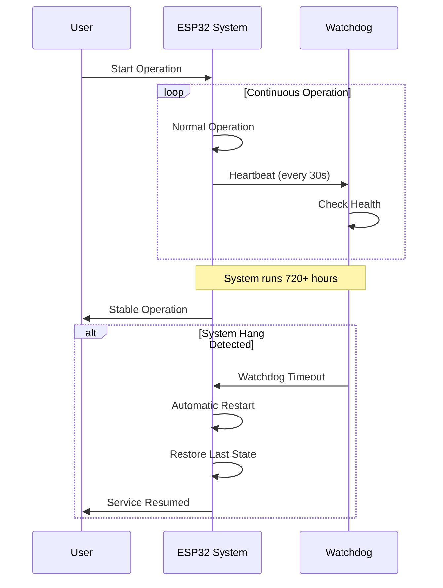
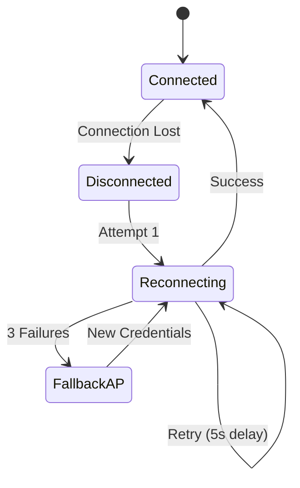
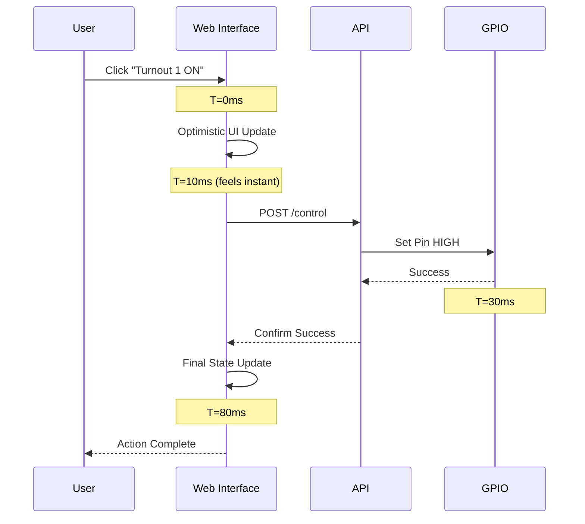
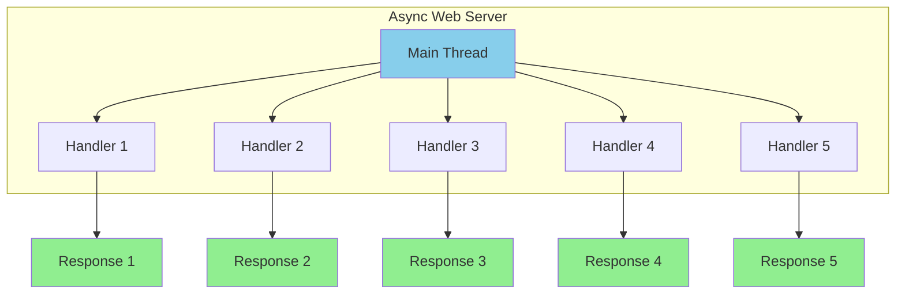
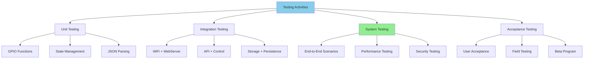
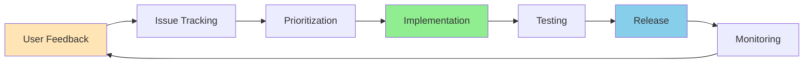

# 10. Quality Requirements

## 10.1 Quality Tree

```mermaid
graph TB
    Q[Quality Requirements] --> Q1[Reliability]
    Q --> Q2[Usability]
    Q --> Q3[Performance]
    Q --> Q4[Maintainability]
    Q --> Q5[Security]
    Q --> Q6[Portability]
    
    Q1 --> Q1A[Continuous Operation]
    Q1 --> Q1B[Error Recovery]
    Q1 --> Q1C[Data Persistence]
    
    Q2 --> Q2A[Easy Setup]
    Q2 --> Q2B[Intuitive Interface]
    Q2 --> Q2C[Clear Feedback]
    
    Q3 --> Q3A[Low Latency]
    Q3 --> Q3B[Fast Boot]
    Q3 --> Q3C[Efficient Resources]
    
    Q4 --> Q4A[Code Quality]
    Q4 --> Q4B[Documentation]
    Q4 --> Q4C[Modularity]
    
    Q5 --> Q5A[Network Security]
    Q5 --> Q5B[Input Validation]
    Q5 --> Q5C[Safe Defaults]
    
    Q6 --> Q6A[Platform Support]
    Q6 --> Q6B[Browser Compat]
    Q6 --> Q6C[Hardware Variants]
    
    style Q fill:#87CEEB
    style Q1 fill:#90EE90
    style Q2 fill:#FFE4B5
    style Q3 fill:#DDA0DD
    style Q4 fill:#FFB6C6
```



## 10.2 Quality Scenarios

### Reliability Scenarios

#### R1: 24/7 Operation



| Aspect | Specification |
|--------|---------------|
| **Stimulus** | System running continuously |
| **Response** | No crashes or hangs |
| **Measure** | MTBF > 720 hours (30 days) |
| **Priority** | 🔴 Critical |

#### R2: Power Failure Recovery

| Aspect | Specification |
|--------|---------------|
| **Stimulus** | Unexpected power loss |
| **Response** | Restore previous state on reboot |
| **Measure** | State restored in < 5 seconds |
| **Priority** | 🟡 High |

```cpp
// State persistence ensures recovery
void setup() {
    stateManager.loadStates();  // Load from NVS
    gpioManager.restoreStates();  // Apply to hardware
    // System resumes where it left off
}
```

#### R3: Network Disconnection

| Aspect | Specification |
|--------|---------------|
| **Stimulus** | WiFi connection lost |
| **Response** | Automatic reconnection attempts |
| **Measure** | Reconnect within 30 seconds, max 3 retries |
| **Priority** | 🟡 High |



### Usability Scenarios

#### U1: First-Time Setup

| Aspect | Specification |
|--------|---------------|
| **Stimulus** | New user powers on device |
| **Response** | Guided WiFi configuration |
| **Measure** | Complete setup in < 5 minutes |
| **Priority** | 🔴 Critical |

**Success Criteria**:
- ✅ Captive portal opens automatically
- ✅ WiFi networks listed clearly
- ✅ Password entry straightforward
- ✅ Success/failure clearly indicated

#### U2: Accessory Control

| Aspect | Specification |
|--------|---------------|
| **Stimulus** | User clicks accessory button |
| **Response** | Immediate visual and physical feedback |
| **Measure** | Response time < 100ms, visual update < 200ms |
| **Priority** | 🟡 High |



#### U3: Error Recovery

| Aspect | Specification |
|--------|---------------|
| **Stimulus** | Invalid user input |
| **Response** | Clear error message with guidance |
| **Measure** | Error message appears < 1 second |
| **Priority** | 🟢 Medium |

**Error Message Guidelines**:
- ✅ Clear, non-technical language
- ✅ Explain what went wrong
- ✅ Suggest corrective action
- ✅ Visual distinction (color, icon)

### Performance Scenarios

#### P1: Command Latency

| Aspect | Specification |
|--------|---------------|
| **Stimulus** | User sends control command |
| **Response** | GPIO state changes |
| **Measure** | End-to-end latency < 100ms |
| **Priority** | 🟡 High |



```mermaid
gantt
    title Command Processing Timeline
    dateFormat SSS
    axisFormat %L ms
    
    section Network
    WiFi RTT         :net, 000, 10ms
    
    section Server
    Route Lookup     :route, after net, 1ms
    JSON Parse       :parse, after route, 5ms
    Validate         :valid, after parse, 2ms
    
    section Hardware
    GPIO Command     :gpio, after valid, 1ms
    
    section Storage
    State Persist    :state, after gpio, 15ms
    
    section Response
    JSON Build       :json, after state, 3ms
    Send Response    :resp, after json, 5ms
    
    Total: 42ms (well within 100ms target)
```

#### P2: Boot Time

| Aspect | Specification |
|--------|---------------|
| **Stimulus** | Power on or reset |
| **Response** | System fully operational |
| **Measure** | Boot time < 5 seconds |
| **Priority** | 🟢 Medium |

**Boot Sequence Breakdown**:
- Hardware boot: 100ms
- WiFi connection: 2000ms (variable)
- State restoration: 100ms
- Web server start: 50ms
- mDNS registration: 100ms
- **Total**: ~2.5 seconds typical

#### P3: Concurrent Users

| Aspect | Specification |
|--------|---------------|
| **Stimulus** | 5 users access system simultaneously |
| **Response** | All requests handled without blocking |
| **Measure** | Response time < 200ms for all users |
| **Priority** | 🟢 Medium |



### Maintainability Scenarios

#### M1: Code Comprehension

| Aspect | Specification |
|--------|---------------|
| **Stimulus** | New developer reads codebase |
| **Response** | Understands architecture and can contribute |
| **Measure** | Comprehension in < 2 hours |
| **Priority** | 🟡 High |

**Supporting Elements**:
- ✅ arc42 architecture documentation
- ✅ Inline code comments
- ✅ README with quick start
- ✅ Mermaid diagrams for visualization
- ✅ Clear naming conventions

#### M2: Feature Addition

| Aspect | Specification |
|--------|---------------|
| **Stimulus** | Add new API endpoint |
| **Response** | Implementation without breaking existing features |
| **Measure** | < 4 hours for simple endpoint |
| **Priority** | 🟢 Medium |

```cpp
// Adding new endpoint is straightforward
server.on("/new-feature", HTTP_GET, [](AsyncWebServerRequest *request){
    // Implementation here
    request->send(200, "application/json", "{\"status\":\"ok\"}");
});
```

#### M3: Bug Fix

| Aspect | Specification |
|--------|---------------|
| **Stimulus** | Bug reported with stack trace |
| **Response** | Locate, fix, and test bug |
| **Measure** | < 2 hours for typical bug |
| **Priority** | 🟡 High |

**Debugging Tools**:
- Serial console logging
- HTTP request inspection
- State dump endpoints
- GPIO state monitoring

### Security Scenarios

#### S1: Local Network Attack

| Aspect | Specification |
|--------|---------------|
| **Stimulus** | Malicious device on local network |
| **Response** | Limit attack surface |
| **Measure** | No unauthorized control possible |
| **Priority** | 🟡 High |

**Mitigations**:
- ✅ Input validation on all endpoints
- ✅ No authentication bypass
- ✅ Rate limiting (planned)
- ✅ No command injection vulnerabilities

#### S2: Malformed Request

| Aspect | Specification |
|--------|---------------|
| **Stimulus** | Invalid JSON or out-of-range parameters |
| **Response** | Reject request without crash |
| **Measure** | 400 Bad Request returned |
| **Priority** | 🔴 Critical |

```cpp
// Input validation example
if (!request->hasParam("accessory") || !request->hasParam("state")) {
    request->send(400, "application/json", 
        "{\"error\":\"Missing required parameters\"}");
    return;
}

int id = request->getParam("accessory")->value().toInt();
if (id < 1 || id > MAX_ACCESSORIES) {
    request->send(400, "application/json", 
        "{\"error\":\"Accessory ID out of range\"}");
    return;
}
```

#### S3: WiFi Security

| Aspect | Specification |
|--------|---------------|
| **Stimulus** | Network traffic interception attempt |
| **Response** | WiFi encryption protects traffic |
| **Measure** | WPA2/WPA3 encryption enforced |
| **Priority** | 🔴 Critical |

### Portability Scenarios

#### P1: Browser Compatibility

| Aspect | Specification |
|--------|---------------|
| **Stimulus** | User accesses from different browsers |
| **Response** | Consistent functionality and appearance |
| **Measure** | Works on 95% of modern browsers |
| **Priority** | 🟡 High |

**Supported Browsers**:
- ✅ Chrome/Edge (Chromium) 90+
- ✅ Firefox 88+
- ✅ Safari 14+
- ✅ Mobile Chrome (Android)
- ✅ Mobile Safari (iOS)

#### P2: ESP32 Board Variants

| Aspect | Specification |
|--------|---------------|
| **Stimulus** | User has different ESP32 board variant |
| **Response** | Code compiles and runs with minimal changes |
| **Measure** | < 5 configuration changes required |
| **Priority** | 🟢 Medium |

**Compatible Boards**:
- ESP32-WROOM-32
- ESP32-WROVER
- ESP32 DevKitC
- NodeMCU-32S
- TTGO T-Display (with pin adjustments)

## 10.3 Quality Measures

### Reliability Metrics

| Metric | Target | Measurement Method |
|--------|--------|-------------------|
| **MTBF** | > 720 hours | Extended runtime testing |
| **Crash Recovery** | < 5 seconds | Watchdog reset timing |
| **State Persistence** | 100% | Power cycle testing |
| **WiFi Reconnection** | > 95% | Network disruption tests |

### Usability Metrics

| Metric | Target | Measurement Method |
|--------|--------|-------------------|
| **Setup Time** | < 5 minutes | User testing with novices |
| **Error Rate** | < 5% | Task completion studies |
| **User Satisfaction** | > 4/5 | Post-use surveys |
| **Learning Curve** | < 30 minutes | Time to first successful control |

### Performance Metrics

| Metric | Target | Measurement Method |
|--------|--------|-------------------|
| **Command Latency** | < 100ms | HTTP timing measurements |
| **Boot Time** | < 5 seconds | Serial console timestamps |
| **Memory Usage** | < 200KB RAM | ESP.getFreeHeap() |
| **CPU Utilization** | < 30% average | Task profiling |
| **Throughput** | > 25 req/s | Load testing |

### Maintainability Metrics

| Metric | Target | Measurement Method |
|--------|--------|-------------------|
| **Code Comments** | > 20% | Static analysis |
| **Function Length** | < 50 lines avg | Code metrics |
| **Cyclomatic Complexity** | < 10 per function | Static analysis |
| **Documentation Coverage** | > 90% | Manual review |

### Security Metrics

| Metric | Target | Measurement Method |
|--------|--------|-------------------|
| **Input Validation** | 100% endpoints | Code review |
| **Vulnerability Scan** | 0 high/critical | Security scanning |
| **WiFi Encryption** | WPA2+ only | Connection testing |
| **Attack Surface** | Minimal | Threat modeling |

## 10.4 Quality Assurance Activities

### Testing Strategy



### Code Quality Checks

- **Static Analysis**: PlatformIO check
- **Code Review**: All PRs reviewed by maintainer
- **Style Guide**: Consistent formatting (clang-format)
- **Memory Profiling**: Heap usage monitoring
- **Performance Profiling**: Execution time analysis

### Continuous Improvement



**Feedback Channels**:
- GitHub Issues
- Community Forum
- User Surveys
- Beta Testing Program
- Serial Console Logs
