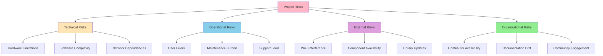
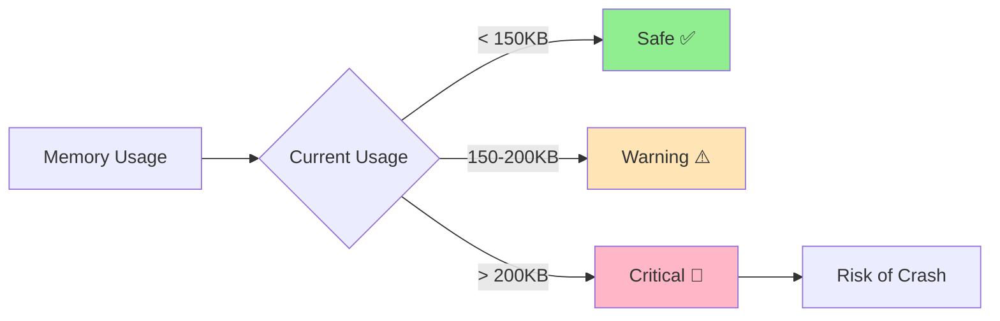
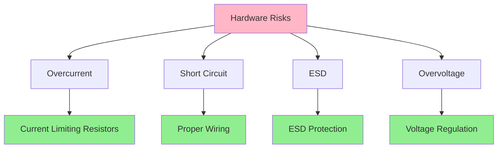
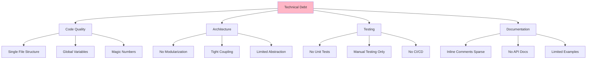
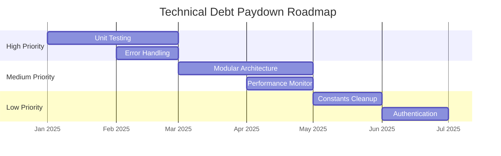
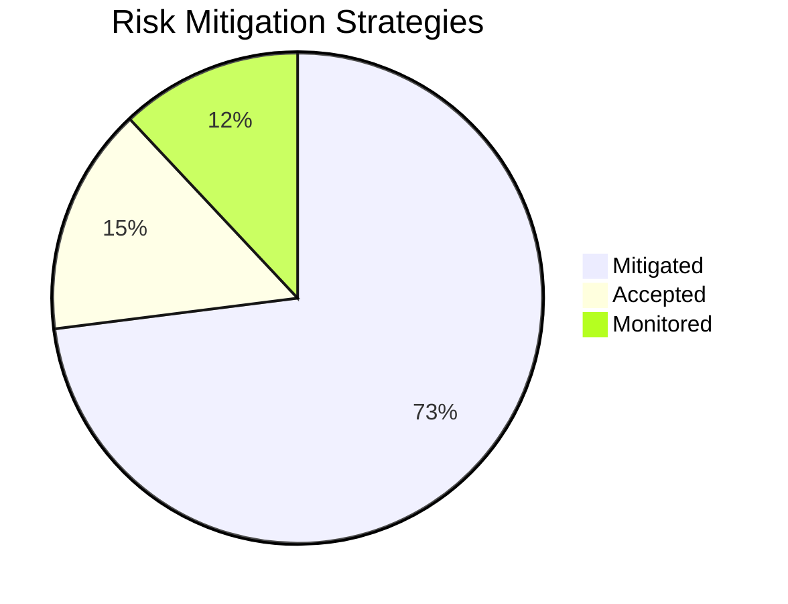

# 11. Risks and Technical Debt

## 11.1 Risk Assessment

### Risk Overview



## 11.2 Technical Risks

### T1: ESP32 Memory Limitations

| Risk | Impact | Probability | Severity |
|------|--------|-------------|----------|
| **Description** | Running out of RAM during operation | Medium | High |
| **Impact** | System crashes, unstable operation | 🔴 Critical |
| **Probability** | 🟡 Medium (30%) |
| **Risk Level** | 🔴 High |



**Mitigation Strategies**:
- ✅ Static memory allocation where possible
- ✅ Minimize dynamic string operations
- ✅ Use `StaticJsonDocument` instead of `DynamicJsonDocument`
- ✅ Monitor heap usage with `ESP.getFreeHeap()`
- ✅ Implement memory usage warnings in status endpoint
- 🔄 Consider heap fragmentation monitoring

**Contingency**:
- Reduce web asset size (compress HTML/CSS/JS)
- Implement dynamic buffer pooling
- Add memory cleanup routines

---

### T2: WiFi Reliability

| Risk | Impact | Probability | Severity |
|------|--------|-------------|----------|
| **Description** | WiFi disconnections, interference, poor signal | High | Medium |
| **Impact** | Loss of remote control capability | 🟡 High |
| **Probability** | 🟡 Medium (40%) |
| **Risk Level** | 🟡 Medium-High |

**Causes**:
- Microwave ovens (2.4 GHz interference)
- Distance from router
- Obstacles (walls, metal)
- Network congestion
- Router firmware issues

**Mitigation Strategies**:
- ✅ Automatic reconnection logic (3 retries)
- ✅ Fallback to AP mode for reconfiguration
- ✅ WiFi signal strength monitoring
- 🔄 Consider external antenna option
- 🔄 Implement WiFi channel selection

```cpp
// WiFi monitoring
void monitorWiFi() {
    static unsigned long lastCheck = 0;
    if (millis() - lastCheck > 10000) {  // Every 10s
        if (WiFi.status() != WL_CONNECTED) {
            LOG_WARNING("WiFi disconnected, attempting reconnect");
            WiFi.reconnect();
        }
        
        int rssi = WiFi.RSSI();
        if (rssi < -80) {
            LOG_WARNING("Weak WiFi signal: " + String(rssi) + " dBm");
        }
        
        lastCheck = millis();
    }
}
```

---

### T3: Flash Memory Wear

| Risk | Impact | Probability | Severity |
|------|--------|-------------|----------|
| **Description** | NVS flash wear from excessive writes | Low | Medium |
| **Impact** | Loss of configuration, state persistence failure | 🟢 Medium |
| **Probability** | 🟢 Low (10%) |
| **Risk Level** | 🟢 Low |

**Flash Endurance**:
- NVS: ~100,000 write cycles per sector
- Wear leveling: Distributes writes across sectors
- State updates: Potentially frequent

**Mitigation Strategies**:
- ✅ NVS built-in wear leveling
- ✅ Debounce state saves (max 1/second)
- ✅ Only write on actual state change
- ✅ Batch multiple changes

```cpp
// Debounced state saving
class StateManager {
private:
    unsigned long lastSave = 0;
    const unsigned long SAVE_INTERVAL = 1000;  // 1 second
    bool pendingSave = false;
    
public:
    void updateState(int id, bool state) {
        // Update in-memory state immediately
        states[id] = state;
        pendingSave = true;
    }
    
    void loop() {
        if (pendingSave && (millis() - lastSave > SAVE_INTERVAL)) {
            persistToNVS();  // Batch write
            pendingSave = false;
            lastSave = millis();
        }
    }
};
```

---

### T4: Concurrent Request Handling

| Risk | Impact | Probability | Severity |
|------|--------|-------------|----------|
| **Description** | Race conditions with simultaneous requests | Medium | Low |
| **Impact** | Inconsistent state, unexpected behavior | 🟢 Low-Medium |
| **Probability** | 🟢 Low (20%) |
| **Risk Level** | 🟢 Low |

**Scenarios**:
- Multiple users toggle same accessory simultaneously
- State read during write operation
- GPIO conflicts

**Mitigation Strategies**:
- ✅ Async web server handles concurrency
- ✅ Atomic GPIO operations
- ⚠️ No mutex protection currently (not critical for GPIO writes)
- 🔄 Consider implementing request queuing for future versions

---

### T5: Library Breaking Changes

| Risk | Impact | Probability | Severity |
|------|--------|-------------|----------|
| **Description** | Dependency updates break compatibility | Medium | Medium |
| **Impact** | Build failures, runtime bugs | 🟡 Medium |
| **Probability** | 🟡 Medium (30%) |
| **Risk Level** | 🟡 Medium |

**Dependencies**:
- ESP32 Arduino Core
- ESPAsyncWebServer
- ESPAsyncWiFiManager
- ArduinoJson
- ESPmDNS

**Mitigation Strategies**:
- ✅ Pin library versions in platformio.ini
- ✅ Semantic versioning constraints
- ✅ Test before upgrading major versions
- 🔄 Automated dependency update testing

```ini
; platformio.ini - pinned versions
lib_deps = 
    ESP Async WebServer @ ^3.6.0  # Allow patch updates
    ArduinoJson @ ^7.3.0           # Allow minor updates
    ESPAsyncWiFiManager @ 0.31.0   # Exact version
```

## 11.3 Operational Risks

### O1: User Misconfiguration

| Risk | Impact | Probability | Severity |
|------|--------|-------------|----------|
| **Description** | Incorrect WiFi setup, wrong GPIO assignments | High | Low |
| **Impact** | System inaccessible or non-functional | 🟡 Medium |
| **Probability** | 🔴 High (50%) |
| **Risk Level** | 🟡 Medium |

**Common Errors**:
- Wrong WiFi password
- Incorrect network selection
- GPIO pin conflicts
- Unsupported hardware

**Mitigation Strategies**:
- ✅ Captive portal with network scanning
- ✅ Password visibility toggle
- ✅ Fallback to AP mode after failed attempts
- ✅ Serial console for troubleshooting
- 📝 Comprehensive documentation
- 🔄 Web-based configuration validation

---

### O2: Hardware Damage

| Risk | Impact | Probability | Severity |
|------|--------|-------------|----------|
| **Description** | GPIO overcurrent, short circuits, ESD | Medium | High |
| **Impact** | ESP32 board damage, replacement needed | 🔴 Critical |
| **Probability** | 🟡 Medium (25%) |
| **Risk Level** | 🔴 High |



**Mitigation Strategies**:
- ✅ Documentation: GPIO current limits (40mA max)
- ✅ Recommend current-limiting resistors
- ✅ Proper grounding guidance
- ⚠️ No hardware overcurrent protection
- 🔄 Consider optocoupler isolation
- 📝 Safety warnings in documentation

---

### O3: Support and Maintenance Burden

| Risk | Impact | Probability | Severity |
|------|--------|-------------|----------|
| **Description** | Volume of support requests exceeds capacity | Medium | Low |
| **Impact** | Slow response, community frustration | 🟢 Low |
| **Probability** | 🟡 Medium (35%) |
| **Risk Level** | 🟢 Low-Medium |

**Mitigation Strategies**:
- ✅ Comprehensive documentation (README + arc42)
- ✅ FAQ section
- ✅ Community forum for peer support
- ✅ Issue templates on GitHub
- 🔄 Automated responses for common issues
- 🔄 Video tutorials

## 11.4 External Risks

### E1: Component Supply Chain

| Risk | Impact | Probability | Severity |
|------|--------|-------------|----------|
| **Description** | ESP32 shortage, price increases | Low | Medium |
| **Impact** | Project adoption delayed | 🟢 Medium |
| **Probability** | 🟢 Low (15%) |
| **Risk Level** | 🟢 Low |

**Recent Context**:
- 2021-2022: Global chip shortage affected ESP32 availability
- Prices fluctuated from $3-$15 per unit
- Current: Supply stabilized

**Mitigation Strategies**:
- ✅ Support multiple ESP32 variants
- ✅ Open-source allows flexibility
- 🔄 Document alternative boards
- 🔄 Consider ESP32-C3, ESP32-S3 variants

---

### E2: Platform Changes (Arduino/PlatformIO)

| Risk | Impact | Probability | Severity |
|------|--------|-------------|----------|
| **Description** | Breaking changes in Arduino framework or PlatformIO | Low | High |
| **Impact** | Build failures, need for significant refactoring | 🟡 High |
| **Probability** | 🟢 Low (10%) |
| **Risk Level** | 🟢 Low-Medium |

**Mitigation Strategies**:
- ✅ Pin framework versions
- ✅ Document build environment
- ✅ Maintain legacy compatibility branches
- 🔄 Automated build testing

## 11.5 Technical Debt

### Current Technical Debt



### TD1: Single-File Architecture

**Status**: 🟡 Medium Debt

**Description**:
All code in `main.cpp` (~1000+ lines) instead of modular structure.

**Impact**:
- Harder to navigate
- Limited reusability
- Merge conflicts
- Testing difficulties

**Refactoring Plan** (v2.0):
```
esp32-controller/
  src/
    main.cpp
    network/
      wifi_manager.cpp
      mdns_service.cpp
    web/
      web_server.cpp
      api_handler.cpp
    control/
      accessory_controller.cpp
      gpio_manager.cpp
    storage/
      state_manager.cpp
      config_manager.cpp
```

**Effort**: 🔴 High (20-40 hours)
**Priority**: 🟡 Medium

---

### TD2: No Unit Testing

**Status**: 🔴 High Debt

**Description**:
No automated testing framework, only manual hardware testing.

**Impact**:
- Regression risk
- Refactoring fear
- Longer validation cycles

**Refactoring Plan**:
- Add PlatformIO unit test framework
- Mock hardware dependencies (GPIO, WiFi)
- Test core logic (state management, validation)
- CI/CD integration

**Effort**: 🔴 High (40+ hours)
**Priority**: 🟡 Medium

---

### TD3: No Authentication

**Status**: 🟡 Medium Debt (by design for v1)

**Description**:
No access control on web interface.

**Impact**:
- Security risk on untrusted networks
- Not suitable for shared environments

**Refactoring Plan** (v2.0):
- Optional HTTP Basic Auth
- Configurable enable/disable
- Remember credentials in browser
- API key support for integrations

**Effort**: 🟢 Low-Medium (10-20 hours)
**Priority**: 🟢 Low (deferred by design)

---

### TD4: Magic Numbers and Hardcoded Values

**Status**: 🟢 Low Debt

**Description**:
Some hardcoded values instead of named constants.

```cpp
// Before (technical debt)
if (id < 1 || id > 16) return false;

// After (refactored)
const int MIN_ACCESSORY_ID = 1;
const int MAX_ACCESSORY_ID = 16;
if (id < MIN_ACCESSORY_ID || id > MAX_ACCESSORY_ID) return false;
```

**Effort**: 🟢 Low (2-4 hours)
**Priority**: 🟢 Low

---

### TD5: Limited Error Handling

**Status**: 🟡 Medium Debt

**Description**:
Basic error handling, no comprehensive error recovery strategies.

**Impact**:
- Unclear error messages
- Potential crash scenarios not handled
- Limited diagnostic information

**Refactoring Plan**:
- Standardized error codes
- Error logging framework
- Graceful degradation paths
- User-friendly error messages

**Effort**: 🟡 Medium (15-25 hours)
**Priority**: 🟡 Medium

---

### TD6: No Performance Monitoring

**Status**: 🟢 Low Debt

**Description**:
Limited runtime performance metrics.

**Current State**:
- Basic uptime, free heap
- No request timing
- No performance trends

**Refactoring Plan**:
- Add request latency tracking
- Memory usage trends
- WiFi quality metrics
- Performance dashboard

**Effort**: 🟢 Low (5-10 hours)
**Priority**: 🟢 Low

## 11.6 Technical Debt Roadmap



## 11.7 Risk Mitigation Summary

| Risk Category | Count | Mitigation Coverage | Residual Risk |
|---------------|-------|-------------------|---------------|
| **Technical** | 5 | 80% | 🟡 Medium |
| **Operational** | 3 | 70% | 🟡 Medium |
| **External** | 2 | 60% | 🟢 Low |
| **Overall** | 10 | 73% | 🟡 Medium |

### Risk Response Strategy



**Key Actions**:
1. ✅ Implement memory monitoring and alerts
2. ✅ Improve WiFi reconnection robustness
3. 🔄 Add unit testing framework
4. 🔄 Refactor to modular architecture
5. 📝 Enhance documentation and examples
6. 🔄 Create troubleshooting guide
7. 🔄 Set up CI/CD pipeline
