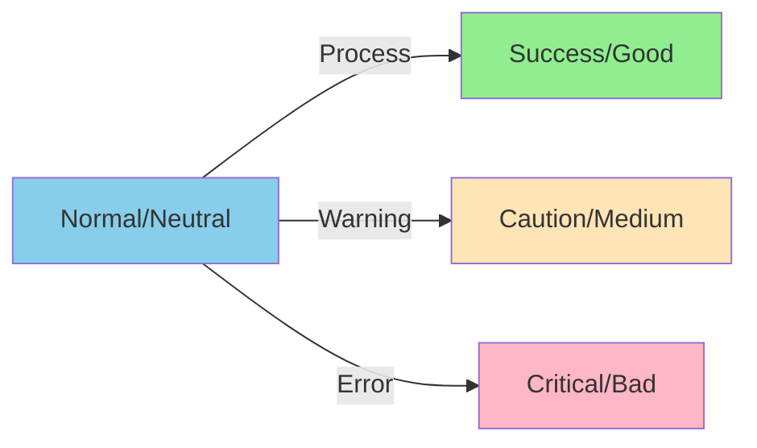

# 12. Glossary

## A

**Access Point (AP)**
- WiFi mode where ESP32 creates its own network for client connections
- Used for initial configuration via captive portal
- Default SSID: "RailHub32-Setup"

**Accessory**
- Physical model railway component (turnout, signal, light, etc.)
- Controlled via GPIO outputs
- Can be in ON or OFF state

**arc42**
- Template for software architecture documentation
- Provides structured approach to documenting system architecture
- Used for this documentation

**Arduino Framework**
- Simplified C++ framework for embedded development
- Provides abstraction layer over hardware
- Large library ecosystem

**ArduinoJson**
- C++ library for JSON serialization/deserialization
- Used for API request/response handling
- Supports both static and dynamic allocation

**Asynchronous (Async)**
- Non-blocking programming model
- Allows concurrent request handling without blocking
- Used by ESPAsyncWebServer

## B

**Bonjour**
- Apple's implementation of mDNS
- Allows service discovery on local networks
- See also: mDNS

**Boot Sequence**
- Series of initialization steps when ESP32 powers on
- Includes hardware init, WiFi connection, state restoration
- Typically takes 2-5 seconds

## C

**Captive Portal**
- WiFi configuration interface that auto-opens in browser
- Activated when ESP32 has no saved credentials
- Allows network selection and password entry

**C++**
- Programming language used for firmware
- Object-oriented, compiled language
- Provides low-level hardware access

**CPU (Central Processing Unit)**
- ESP32 has dual-core Xtensa LX6 @ 240 MHz
- Runs FreeRTOS operating system
- Executes application code

## D

**DHCP (Dynamic Host Configuration Protocol)**
- Automatic IP address assignment
- ESP32 acts as DHCP client by default
- Obtains IP from WiFi router

**DCC (Digital Command Control)**
- Standard protocol for model train control
- NOT implemented in RailHub32
- Future consideration for integration

## E

**ESP32**
- Microcontroller with integrated WiFi/Bluetooth
- Manufactured by Espressif Systems
- Heart of the RailHub32 controller

**ESP32-WROOM-32**
- Specific ESP32 module variant
- Includes 4MB flash memory
- PCB antenna included

**ESPAsyncWebServer**
- Asynchronous HTTP server library for ESP32
- Handles multiple concurrent connections
- Non-blocking request processing

**ESPAsyncWiFiManager**
- Library for WiFi configuration via captive portal
- Manages credentials storage
- Fallback to AP mode on connection failure

**ESPmDNS**
- ESP32 library for mDNS service
- Allows hostname.local resolution
- Advertises HTTP service

**ESD (Electrostatic Discharge)**
- Static electricity that can damage electronics
- ESP32 has some built-in protection
- Proper grounding recommended

## F

**Firmware**
- Software running on ESP32 hardware
- Compiled binary uploaded to flash memory
- Current version: ~1.5 MB

**Flash Memory**
- Non-volatile storage on ESP32
- Typically 4 MB
- Stores firmware, file system, and NVS data

**FreeRTOS**
- Real-time operating system running on ESP32
- Manages tasks and resources
- Abstracted by Arduino framework

## G

**GPIO (General Purpose Input/Output)**
- Configurable digital pins on ESP32
- 34 pins total, subset usable for accessories
- 3.3V logic level, max 40mA per pin

**Gantt Chart**
- Visual timeline diagram
- Used in documentation to show boot sequence
- Created with Mermaid

## H

**Heap**
- Dynamic memory allocation area in RAM
- ESP32 has ~300 KB free heap typically
- Monitored to prevent memory exhaustion

**HTTP (Hypertext Transfer Protocol)**
- Communication protocol for web traffic
- ESP32 runs HTTP server on port 80
- Used for API and web interface

**Hostname**
- Network name for ESP32 device
- Default: "railhub32-{chipid}"
- Accessible via mDNS as hostname.local

## I

**I/O (Input/Output)**
- See GPIO
- Refers to data transfer to/from hardware

**IP Address**
- Network address assigned to ESP32
- Typically 192.168.x.x for home networks
- Obtained via DHCP or configured statically

## J

**JSON (JavaScript Object Notation)**
- Text-based data format
- Used for API requests and responses
- Human-readable and language-agnostic

```json
{
  "accessory": 1,
  "state": true
}
```

## L

**Latency**
- Time delay between command and execution
- Target: < 100ms for control commands
- Includes network, processing, and GPIO time

**LittleFS**
- File system for ESP32 flash storage
- Successor to SPIFFS
- Stores web assets

**LDO (Low-Dropout Regulator)**
- Voltage regulator converting 5V to 3.3V
- Provides power to ESP32 core
- Typically AMS1117-3.3 on dev boards

## M

**mDNS (Multicast DNS)**
- Service discovery protocol
- Allows .local hostname resolution
- No DNS server required

**Mermaid**
- Markdown-based diagram syntax
- Used extensively in this documentation
- Generates flowcharts, sequence diagrams, etc.

**MQTT (Message Queuing Telemetry Transport)**
- Lightweight messaging protocol
- NOT implemented in v1
- Planned for v2 home automation integration

**MTBF (Mean Time Between Failures)**
- Reliability metric
- Target: > 720 hours (30 days)
- Measured through extended runtime testing

## N

**NVS (Non-Volatile Storage)**
- ESP32 key-value storage system
- Persistent across reboots
- Built-in wear leveling

**Network**
- WiFi infrastructure for connectivity
- 2.4 GHz 802.11 b/g/n only
- Requires WPA2/WPA3 security

## O

**OTA (Over-The-Air)**
- Wireless firmware update mechanism
- Upload via web interface
- No USB cable required

**Optocoupler**
- Electrical isolation component
- Separates ESP32 from high-voltage circuits
- Recommended for safety (not included)

## P

**Pin**
- Physical connector on ESP32 board
- See GPIO
- Assigned to specific accessories

**PlatformIO**
- Cross-platform build system for embedded
- Manages dependencies and builds
- IDE integration with VS Code

**platformio.ini**
- Configuration file for PlatformIO
- Defines board, platform, libraries
- Version-controlled for reproducibility

**Pull-up/Pull-down Resistor**
- Resistor that sets default pin state
- Prevents floating inputs
- Configurable in software

## R

**RailHub32**
- Name of this ESP32 controller project
- Combines "Rail" (railway) with "Hub" (central controller)
- "32" refers to ESP32 platform

**RAM (Random Access Memory)**
- Volatile memory for runtime data
- ESP32 has 520 KB SRAM
- Monitored to prevent exhaustion

**REST (Representational State Transfer)**
- Architectural style for APIs
- Uses HTTP methods (GET, POST)
- Stateless request/response

**RSSI (Received Signal Strength Indicator)**
- WiFi signal strength measurement
- Measured in dBm (negative values)
- < -80 dBm is weak signal

## S

**Serial Console**
- Debug output via USB connection
- Baud rate: 115200
- Shows boot messages, errors, logs

**SPIFFS (SPI Flash File System)**
- Legacy file system for ESP32
- Replaced by LittleFS in newer projects
- Used for web asset storage

**SSID (Service Set Identifier)**
- WiFi network name
- User selects during captive portal setup
- Stored in NVS

**State**
- Current ON/OFF condition of accessory
- Persisted to NVS for power-cycle recovery
- Tracked in RAM for fast access

**Static IP**
- Fixed IP address (vs DHCP)
- Can be configured if needed
- DHCP preferred for ease of use

## T

**Throughput**
- Number of requests processed per time unit
- Target: 25-50 req/s depending on operation
- Limited by async server capacity

**Turnout**
- Model railway track switch
- Common accessory type
- Controlled via GPIO output

## U

**Uptime**
- Time since last boot/restart
- Measured in milliseconds (millis())
- Reported in status endpoint

**USB-to-UART**
- Chip converting USB to serial (UART)
- Common: CP2102, CH340
- Required for programming and serial console

## V

**Voltage Regulator**
- See LDO
- Converts 5V input to 3.3V logic level

**VS Code**
- Visual Studio Code editor
- Recommended IDE with PlatformIO extension
- Free and open-source

## W

**Watchdog Timer**
- Hardware timer that resets system on hang
- Timeout: ~30 seconds
- Prevents indefinite hang states

**Web Interface**
- Browser-based control panel
- HTML/CSS/JavaScript
- Responsive design for mobile

**WiFi**
- Wireless networking standard
- ESP32 supports 2.4 GHz 802.11 b/g/n
- No 5 GHz support

**WPA2/WPA3**
- WiFi security protocols
- Encryption for wireless traffic
- WPA2 minimum recommended

**Wear Leveling**
- Flash memory management technique
- Distributes writes to prevent wear-out
- Built into NVS

## X

**Xtensa LX6**
- CPU architecture of ESP32
- Dual-core @ 240 MHz
- RISC-based instruction set

## Acronyms Quick Reference

| Acronym | Full Name |
|---------|-----------|
| **ADC** | Analog-to-Digital Converter |
| **AP** | Access Point |
| **API** | Application Programming Interface |
| **CPU** | Central Processing Unit |
| **DCC** | Digital Command Control |
| **DHCP** | Dynamic Host Configuration Protocol |
| **DNS** | Domain Name System |
| **ESD** | Electrostatic Discharge |
| **GPIO** | General Purpose Input/Output |
| **HTML** | HyperText Markup Language |
| **HTTP** | HyperText Transfer Protocol |
| **I/O** | Input/Output |
| **IDE** | Integrated Development Environment |
| **IP** | Internet Protocol |
| **JSON** | JavaScript Object Notation |
| **LDO** | Low-Dropout Regulator |
| **LED** | Light Emitting Diode |
| **mDNS** | Multicast DNS |
| **MQTT** | Message Queuing Telemetry Transport |
| **MTBF** | Mean Time Between Failures |
| **NVS** | Non-Volatile Storage |
| **OS** | Operating System |
| **OTA** | Over-The-Air |
| **PCB** | Printed Circuit Board |
| **PWM** | Pulse Width Modulation |
| **RAM** | Random Access Memory |
| **REST** | Representational State Transfer |
| **RISC** | Reduced Instruction Set Computer |
| **RSSI** | Received Signal Strength Indicator |
| **RTOS** | Real-Time Operating System |
| **SoC** | System on Chip |
| **SPIFFS** | SPI Flash File System |
| **SPI** | Serial Peripheral Interface |
| **SSID** | Service Set Identifier |
| **UART** | Universal Asynchronous Receiver-Transmitter |
| **UI** | User Interface |
| **URL** | Uniform Resource Locator |
| **USB** | Universal Serial Bus |
| **WPA** | WiFi Protected Access |

## Diagrams Key

### Mermaid Diagram Types Used

**Flowchart**
- Process flows and decision trees
- Used for: boot sequence, error handling

**Sequence Diagram**
- Interaction between components over time
- Used for: API calls, state management

**Gantt Chart**
- Timeline visualization
- Used for: boot timing, roadmap

**Class Diagram**
- Object-oriented structure
- Used for: domain model

**State Diagram**
- State machine transitions
- Used for: WiFi connection, system states

**Pie Chart**
- Proportional data
- Used for: flash memory usage, success metrics

**Graph**
- General relationships and hierarchies
- Used for: component dependencies, architecture

### Color Coding



- 🔵 **Blue (#87CEEB)**: Neutral, informational
- 🟢 **Green (#90EE90)**: Success, approved, working
- 🟡 **Yellow (#FFE4B5)**: Warning, caution, moderate
- 🔴 **Red/Pink (#FFB6C6)**: Error, critical, rejected
- 🟣 **Purple (#DDA0DD)**: Hardware, physical layer

## References

### External Resources

- **ESP32 Official**: https://www.espressif.com/en/products/socs/esp32
- **Arduino ESP32**: https://github.com/espressif/arduino-esp32
- **PlatformIO**: https://platformio.org
- **arc42**: https://arc42.org
- **Mermaid**: https://mermaid.js.org
- **RFC 6762 (mDNS)**: https://datatracker.ietf.org/doc/html/rfc6762

### Libraries Used

- **ESPAsyncWebServer**: https://github.com/mathieucarbou/ESPAsyncWebServer
- **ESPAsyncWiFiManager**: https://github.com/khoih-prog/ESPAsync_WiFiManager
- **ArduinoJson**: https://arduinojson.org
- **ESPmDNS**: Part of ESP32 Arduino Core

### Model Railway Resources

- **NMRA (National Model Railroad Association)**: https://www.nmra.org
- **DCC Standards**: https://www.nmra.org/dcc-working-group
- **Model Railway Electronics**: Various forums and communities
